# Diagramme C4 — Niveau 3 : Composants

**Produit :** Briefly AI
**Date :** 2026-07-28
**Niveau C4 :** 3 — Components (zoom à l'intérieur du backend Symfony — composants internes par bounded context)
**Conteneur décomposé :** Application Symfony (partagée entre le processus FrankenPHP et les Workers Messenger — même codebase, deux modes d'exécution)
**Bounded contexts :** Ingestion | Synthèse IA | Daily Brief | Comptes et Premium | Sources

---

## Diagramme

```mermaid
C4Component
  title Backend Briefly AI — Composants par Bounded Context (C4 Niveau 3)

  ContainerDb_Ext(postgres, "PostgreSQL 16", "PostgreSQL + Doctrine ORM", "Source de verite: articles, briefs, utilisateurs, sources, syntheses, abonnements.")
  ContainerDb_Ext(redis, "Redis 7", "Redis Streams + TTL", "Cache syntheses IA (TTL 24h), sessions, quotas, rate limiting, circuit breakers, files Messenger, ETag RSS.")
  Container_Ext(flutter_app, "Application Mobile Flutter", "Flutter + Dart", "Consomme l'API REST via JWT EdDSA Bearer.")

  System_Ext(rss_sources, "Sources RSS et Atom", "Flux d'actualite externes consommes via FeedIo.")
  System_Ext(mistral, "Mistral EU", "LLM principal RGPD-conforme: synthese, classification, embeddings.")
  System_Ext(openai_fb, "OpenAI", "Fallback LLM active par circuit breaker.")
  System_Ext(stripe, "Stripe Billing", "Webhooks abonnements: subscription.updated, payment_failed.")
  System_Ext(oauth_idp, "Google et GitHub OAuth2", "Fournisseurs d'identite pour auth deleguee PKCE.")
  System_Ext(fcm_apns, "FCM et APNs", "Livraison notifications push quotidiennes.")

  Container_Boundary(symfony_app, "Application Symfony — FrankenPHP et Workers Messenger") {

    Boundary(bc_ingestion, "BC Ingestion", "Bounded Context") {
      Component(feed_fetcher, "FeedFetcher", "Symfony Messenger Handler + FeedIo", "Recupere les flux RSS-Atom toutes les 15 min par source. Requetes conditionnelles HTTP ETag et Last-Modified pour minimiser la bande passante. Un message FetchSourceMessage par source active.")
      Component(feed_parser, "FeedParser", "PHP Service + Value Objects", "Normalise les items RSS-Atom en Value Object Article: extrait l'URL canonique sans parametres UTM, le titre, le contenu textuel, la date de publication et l'identifiant source.")
      Component(article_dedup, "ArticleDeduplicator", "PHP Service + Redis + PostgreSQL", "Deduplication a deux niveaux: niveau 1 - SHA-256 de l'URL canonique avec index UNIQUE PostgreSQL; niveau 2 - SimHash du titre avec fenetre temporelle plus ou moins 2h dans Redis. Rejette les doublons avant toute persistance.")
    }

    Boundary(bc_synthese, "BC Synthese IA", "Bounded Context") {
      Component(synthesis_svc, "SynthesisService", "PHP Service + Messenger Handler", "Point d'entree unique pour les demandes de synthese (niveaux CONCISE, DETAILED, NARRATIVE). Verifie d'abord le cache Redis et le quota utilisateur avant tout appel LLM. Orchestre le flow: cache miss → QuotaGuard → SynthesisProviderChain → SynthesisCache → persistance.")
      Component(llm_gateway, "SynthesisProviderChain", "PHP Service + Circuit Breaker + Symfony HttpClient", "Appelle Mistral EU en primaire ou OpenAI en fallback. Circuit breaker: basculement automatique apres 3 erreurs consecutives en 5 min (RTO inferieur a 30 s). Prompts anonymises: aucun identifiant utilisateur, email ou historique de lecture transmis.")
      Component(synthesis_cache, "SynthesisCache", "PHP Service + Redis", "Lit et ecrit le cache Redis des syntheses. Cle: hash(article_id concatene niveau). TTL 24h. Hit rate cible superieur a 80% en regime de croisiere. Retourne le cache avant de solliciter le LLM.")
    }

    Boundary(bc_brief, "BC Daily Brief", "Bounded Context") {
      Component(article_clusterer, "ArticleClusterer", "PHP Service + HDBSCAN + Embeddings Mistral", "Regroupe les articles ingeres en clusters d'histoires semantiquement coherentes via embeddings Mistral EU et algorithme HDBSCAN. Calcule le nombre d'articles par cluster. Alimente le BriefGenerator avec les clusters classes par signal.")
      Component(brief_generator, "BriefGenerator", "PHP Service + Messenger Handler", "Selectionne les 3 histoires majeures du jour (clusters avec le plus fort signal). Batch declenche a 5h UTC par le Scheduler. Pre-genere les syntheses concises des 3 histoires via SummaryService. Persiste le Brief quotidien en base avec slug date (ex: 2026-07-28).")
    }

    Boundary(bc_comptes, "BC Comptes et Premium", "Bounded Context") {
      Component(auth_svc, "AuthService", "PHP Service + Symfony Security + LexikJWT", "Inscription email avec hash Argon2id (128 MiB RAM, t=3, p=1). Login et gestion sessions desktop HttpOnly SameSite=Strict. Emission et verification JWT mobiles: access token Ed25519 15 min, refresh token 7 jours. Rate limiting login: 5 tentatives sur 15 min par IP et par compte via Redis.")
      Component(oauth_client, "OAuthClient", "PHP Service + KnpU OAuth2 Bundle", "Implemente le flux Authorization Code PKCE pour Google et GitHub. Cree ou associe le compte utilisateur local a partir du profil OAuth2 (email + ID provider). Pas de stockage de mot de passe tiers.")
      Component(quota_guard, "QuotaGuard", "Symfony Security Voter + Redis", "Voter Symfony evalue: plan utilisateur (Free ou Premium) et compteur Redis de syntheses consommees dans la journee. Bloque a la 4e synthese pour les comptes Free en retournant ACCESS_DENIED. Renvoie un payload de paywall contextuel a l'API Platform.")
      Component(billing_webhook, "BillingWebhookHandler", "PHP Messenger Handler + Stripe PHP SDK", "Traite les webhooks Stripe consommes depuis Redis Streams. Valide la signature HMAC SHA-256 avant tout traitement. Met a jour le plan utilisateur en base selon subscription.updated ou payment_failed. Declenche la remise a zero des quotas Redis si downgrade.")
    }

    Boundary(bc_sources, "BC Sources", "Bounded Context") {
      Component(source_manager, "SourceManager", "PHP Service + API Platform Resource + Symfony EasyAdmin", "CRUD des sources RSS-Atom par l'administrateur: ajout, modification, activation, desactivation. Gere les parametres: intervalle de fetch, priorite (premium avant gratuit), categorie editoriale. Expose les endpoints admin protege par role ROLE_ADMIN.")
      Component(source_circuit_breaker, "SourceCircuitBreaker", "PHP Service + Redis", "Isole les sources defaillantes independamment des autres. Comptabilise les erreurs par source dans Redis (cle cb:source:{id}). Seuil configurable (defaut: 5 erreurs consecutives). Back-off exponentiel avant reouverte. Une source en erreur ne bloque pas le pipeline global.")
    }
  }

  Rel(feed_fetcher, rss_sources, "Fetch RSS-Atom conditionnel avec ETag et Last-Modified", "HTTPS — FeedIo par source toutes les 15 min")
  Rel(feed_fetcher, feed_parser, "Transmet le flux brut pour normalisation", "Appel interne synchrone")
  Rel(feed_parser, article_dedup, "Transmet l'article normalise en Value Object", "Appel interne synchrone")
  Rel(article_dedup, redis, "Verifie le fingerprint SimHash titre dans la fenetre temporelle", "TCP — Redis HGET et SET")
  Rel(article_dedup, postgres, "Persiste l'article deduplique (INSERT IGNORE sur index UNIQUE SHA-256)", "TCP — Doctrine ORM")
  Rel(source_circuit_breaker, feed_fetcher, "Autorise ou bloque le fetch selon l'etat du circuit breaker", "Appel interne — evalueCircuit(sourceId)")
  Rel(source_circuit_breaker, redis, "Lit et incremente les compteurs d'erreurs par source", "TCP — Redis INCR et EXPIRE")
  Rel(source_manager, postgres, "CRUD des sources RSS: activation, configuration, priorite", "TCP — Doctrine ORM")

  Rel(synthesis_svc, synthesis_cache, "Verifie le cache avant tout appel LLM", "Appel interne — get(hash(articleId, niveau))")
  Rel(synthesis_svc, quota_guard, "Evalue le quota utilisateur avant synthese", "Appel interne — Symfony Security denyAccessUnlessGranted")
  Rel(synthesis_svc, llm_gateway, "Delegue l'appel LLM si cache manque et quota disponible", "Appel interne — generate(prompt, provider)")
  Rel(synthesis_svc, postgres, "Persiste la synthese generee avec l'identifiant article et le niveau", "TCP — Doctrine ORM")
  Rel(llm_gateway, mistral, "Genere synthese ou classification (prompt anonymise)", "HTTPS REST — Mistral EU API")
  Rel(llm_gateway, openai_fb, "Fallback synthese si circuit breaker Mistral active", "HTTPS REST — OpenAI API")
  Rel(synthesis_cache, redis, "Lit et ecrit la synthese en cache (cle hash, TTL 24h)", "TCP — Redis GET et SETEX")

  Rel(article_clusterer, mistral, "Genere les embeddings vectoriels des articles", "HTTPS REST — Mistral EU API embeddings")
  Rel(article_clusterer, postgres, "Lit les articles ingeres dans les derniers 24h", "TCP — Doctrine ORM — SELECT recents")
  Rel(brief_generator, article_clusterer, "Demande le clustering avant la selection des histoires", "Appel interne synchrone")
  Rel(brief_generator, synthesis_svc, "Pre-genere les syntheses concises des 3 histoires selectionnees", "Appel interne — generate(articleId, CONCISE)")
  Rel(brief_generator, postgres, "Persiste le Brief quotidien (3 histoires, slug date)", "TCP — Doctrine ORM")
  Rel(brief_generator, fcm_apns, "Declenche la notification push quotidienne apres generation", "HTTPS REST — via NotificationHandler Messenger")

  Rel(auth_svc, oauth_client, "Delegue le flux d'auth sociale", "Appel interne — handle(OAuthCallbackRequest)")
  Rel(auth_svc, redis, "Sessions desktop (30 min), rate limiting login (5/15 min par IP)", "TCP — Redis SET et INCR")
  Rel(auth_svc, postgres, "Lit et ecrit les donnees utilisateur (UUID, hash, plan, refresh_token)", "TCP — Doctrine ORM")
  Rel(oauth_client, oauth_idp, "Initie le flux Authorization Code PKCE", "HTTPS — Redirect vers provider Google ou GitHub")
  Rel(quota_guard, redis, "Lit et incremente le compteur de syntheses consommees du jour", "TCP — Redis INCR et EXPIREAT minuit UTC")
  Rel(billing_webhook, postgres, "Met a jour le plan utilisateur et la date de fin d'abonnement", "TCP — Doctrine ORM")
  Rel(billing_webhook, stripe, "Valide la signature HMAC SHA-256 du webhook", "Verification locale — Stripe PHP SDK ConstructEvent")
  Rel(billing_webhook, redis, "Remet a zero les quotas Redis si downgrade Free", "TCP — Redis DEL quota:user:{id}:*")

  Rel(flutter_app, synthesis_svc, "POST /api/syntheses avec {article_id, level} via API Platform StateProcessor", "HTTPS — JWT EdDSA Bearer")
  Rel(flutter_app, brief_generator, "GET Daily Brief via API Platform StateProvider", "HTTPS — JWT EdDSA Bearer")
  Rel(flutter_app, auth_svc, "POST login et refresh token via API Platform", "HTTPS — Credentials ou Refresh token")
```



---

## Légende et notes d'architecture

### Organisation par bounded context

| Bounded Context | Composants | Mode d'exécution | Responsabilité |
|-----------------|------------|-----------------|----------------|
| **BC Ingestion** | FeedFetcher, FeedParser, ArticleDeduplicator | Workers Messenger (async) | Alimentation continue du corpus d'articles |
| **BC Synthèse IA** | SynthesisService, SynthesisProviderChain, SynthesisCache | Workers Messenger + FrankenPHP (hybride) | Génération et cache des synthèses IA |
| **BC Daily Brief** | ArticleClusterer, BriefGenerator | Workers Messenger (batch 5h UTC) | Sélection et génération du brief quotidien |
| **BC Comptes et Premium** | AuthService, OAuthClient, QuotaGuard, BillingWebhookHandler | FrankenPHP (web) + Workers (webhook) | Auth, quotas, abonnements, RGPD |
| **BC Sources** | SourceManager, SourceCircuitBreaker | FrankenPHP (admin) + Workers (protection) | Administration et résilience des sources |

> **Note architecture** : Les Workers Messenger et l'application FrankenPHP partagent le **même codebase Symfony**. Les composants marqués "Workers Messenger" s'exécutent dans des processus workers dédiés (scale horizontal Docker) ; les composants "FrankenPHP" traitent les requêtes HTTP. L'injection de dépendances Symfony (DIC) instancie les mêmes classes dans les deux contextes.

### BC Ingestion — flux détaillé

```
[Scheduler] FetchSourceMessage(sourceId, interval=15min)
    ↓
SourceCircuitBreaker.evaluate(sourceId)    ← Redis: compteur erreurs
    ↓ (circuit CLOSED)
FeedFetcher.fetch(source)                 ← HTTPS: FeedIo + ETag conditionnel
    ↓
FeedParser.normalize(rawFeed)             ← Value Object Article (URL canonique, sans UTM)
    ↓
ArticleDeduplicator.deduplicate(article)
    ├─ Niveau 1: SHA-256(url_canonique) → PostgreSQL: INSERT IGNORE (index UNIQUE)
    └─ Niveau 2: SimHash(titre) → Redis: fenêtre ±2h → doublon? → pointer vers canonique
    ↓ (article unique)
PostgreSQL: INSERT article
```

**Garanties** : une source en erreur (circuit OPEN) ne bloque aucune autre source. Le circuit se referme automatiquement après back-off exponentiel.

### BC Synthèse IA — flux détaillé

```
[API Platform] POST /api/syntheses (JWT Bearer ou Session)
Body: { "article_id": "<UUID>", "level": "CONCISE|DETAILED|NARRATIVE" }
    ↓
SynthesisService.generate(articleId, niveau, userId)
    ├─ SynthesisCache.get(hash(articleId, niveau))   ← Redis HIT? → retourner directement
    └─ (Redis MISS)
        ├─ QuotaGuard.vote(userId, Free|Premium)     ← Redis: quota:user:{id}:{date}
        │   └─ Free + quota ≥ 3 → ACCESS_DENIED → Paywall
        └─ (accès autorisé)
            ├─ SynthesisProviderChain.generate(prompt_anonymise, niveau)
            │   ├─ Mistral EU (primaire)             ← HTTPS REST
            │   └─ OpenAI (fallback si CB ouvert)   ← HTTPS REST
            ├─ SynthesisCache.set(hash, synthese, TTL=24h) ← Redis SETEX
            ├─ Redis INCR quota:user:{id}:{date}
            └─ PostgreSQL: INSERT synthese
```

**Garanties** : aucun identifiant utilisateur dans le prompt LLM (RGPD + AI Act). Hit rate Redis cible ≥ 80 % évite 4/5 des appels LLM.

> **Note nomenclature (corrigée par design-review) :** les composants de ce BC s'appellent `SynthesisService`, `SynthesisProviderChain` et `SynthesisCache` — pas `SummaryService`, `LLMProviderGateway`, `SummaryCache`. Le terme "Synthesis" est la terminologie du domaine (cohérent avec `POST /api/syntheses`, table `syntheses`, `SynthesisLevel` VO).

### BC Daily Brief — flux détaillé

```
[Scheduler] GenerateDailyBriefMessage à 5h UTC
    ↓
ArticleClusterer.cluster(articles_24h)
    ├─ PostgreSQL: SELECT articles WHERE fetch_at > NOW()-24h
    ├─ Mistral EU: embeddings vectoriels par article    ← HTTPS REST
    └─ HDBSCAN: regroupement en clusters d'histoires

BriefGenerator.generate(clusters)
    ├─ Sélectionne les 3 clusters avec le plus fort signal (volume + diversité sources + fraîcheur)
    ├─ SynthesisService.generate(articleRepresentatif, CONCISE) × 3  ← pré-warm cache
    ├─ PostgreSQL: INSERT brief (slug=2026-07-28, stories=[…])
    └─ NotificationHandler: push FCM/APNs quotidien (1/utilisateur)
```

**Garanties** : si le clustering HDBSCAN échoue, un fallback de sélection par score TF-IDF simple est utilisé. Le brief est toujours généré, même dégradé.

### BC Comptes et Premium — composants clés

#### AuthService

- **Inscription** : hash Argon2id (128 MiB RAM, t=3, p=1) — jamais MD5, SHA1 ni bcrypt en nouveau code.
- **Session desktop** : cookie HttpOnly, SameSite=Strict, Secure, durée 30 min glissants (Redis).
- **JWT mobile** : access token Ed25519 15 min + refresh token 7 jours (`flutter_secure_storage`). Rotation du refresh token à chaque usage.
- **Rate limiting** : 5 tentatives / 15 min par IP et par compte (Redis INCR + EXPIREAT). CAPTCHA déclenché au-delà.

#### QuotaGuard (Symfony Security Voter)

```
class QuotaGuard implements VoterInterface {
  // Attribut: SYNTHESIZE
  // Évalue: utilisateur.plan + Redis INCR quota:user:{id}:{date}
  // Free ET compteur >= 3 → ACCESS_DENIED (paywall contextuel)
  // Premium → ACCESS_GRANTED (illimité)
}
```

Ce Voter est appelé par `denyAccessUnlessGranted('SYNTHESIZE')` dans le StateProcessor API Platform — intégration transparente dans le cycle HTTP.

#### BillingWebhookHandler

- Consomme les messages Stripe depuis Redis Streams (découplage du processus HTTP FrankenPHP).
- Valide la signature HMAC SHA-256 via `Stripe\Webhook::constructEvent()` avant tout traitement métier.
- Idempotent : vérifie `stripe_event_id` en base avant application pour résister aux doublons de webhooks.

### BC Sources — résilience

```
SourceCircuitBreaker (par source):
  CLOSED  → fetch autorisé
  OPEN    → fetch bloqué (back-off Redis, TTL configurable)
  HALF-OPEN → tentative unique après délai
```

**Chaque source a son propre circuit breaker dans Redis** — `cb:source:{id}:state`, `cb:source:{id}:failures`, `cb:source:{id}:last_failure`. Une source en panne n'impacte jamais les autres (NFR-028 : isolation totale).

### Décisions architecturales par bounded context

| BC | Décision clé | Justification |
|----|-------------|---------------|
| **Ingestion** | FeedIo + ETag conditionnel | Évite les requêtes inutiles aux sources (respecte les CGU, réduit la bande passante) |
| **Ingestion** | Dédup à 2 niveaux (SHA-256 + SimHash) | SHA-256 URL couvre les doublons exacts ; SimHash titre couvre les reprises éditoriales dans une fenêtre de 2h |
| **Synthèse IA** | Cache Redis avant appel LLM | Hit rate ≥ 80 % → réduction des coûts LLM (mitigation RIS-02) |
| **Synthèse IA** | QuotaGuard comme Voter Symfony | Intégration native dans le pipeline de sécurité Symfony — pas de logique ad hoc dans les contrôleurs |
| **Daily Brief** | HDBSCAN pour le clustering | Algorithme density-based sans nombre de clusters prédéfini — adapté à des volumes variables d'articles |
| **Comptes** | Argon2id + Ed25519 | Standards OWASP 2025 — Argon2id pour les mots de passe, EdDSA pour les JWT mobiles |
| **Comptes** | BillingWebhook via Messenger | Découple le traitement Stripe du processus HTTP — évite les timeouts sur webhook entrant |
| **Sources** | Circuit breaker par source dans Redis | Isolation totale : NFR-028 — une source en erreur ne bloque pas le pipeline global |

### Principe d'architecture hexagonale

Chaque bounded context respecte l'architecture hexagonale (ports and adapters) :

```
Domain (cœur métier, aucune dépendance framework)
    ArticleDeduplicator
    SummaryService (logique de décision)
    BriefGenerator (sélection algorithme)
    QuotaGuard (règles métier Free/Premium)

Application (orchestration des use cases)
    SummaryService.generate() — orchestrate les appels
    BriefGenerator.generate() — orchestrate le clustering

Infrastructure (adaptateurs — peuvent être remplacés)
    FeedFetcher       → port: FeedSourcePort, adapter: FeedIoAdapter
    LLMProviderGateway → port: LLMPort, adapter: MistralAdapter | OpenAIAdapter
    SummaryCache      → port: CachePort, adapter: RedisAdapter
    PostgreSQL        → port: ArticleRepositoryPort, adapter: DoctrineArticleRepository
```

Cette séparation garantit que les règles métier (sélection des 3 histoires, quota 3/jour, déduplication) ne dépendent d'aucun framework ou infrastructure externe — testables unitairement sans base de données ni Redis.
