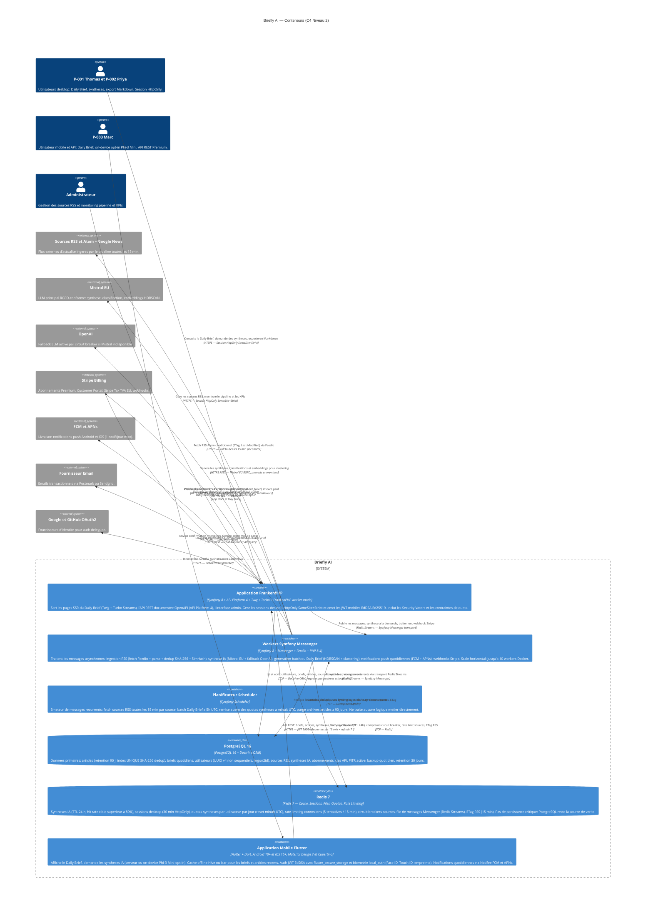

# Diagramme C4 — Niveau 2 : Conteneurs

**Produit :** Briefly AI
**Date :** 2026-07-28
**Niveau C4 :** 2 — Containers (zoom à l'intérieur de Briefly AI : les processus, bases de données et applications qui composent la plateforme)
**Décisions reflétées :** FrankenPHP worker mode, Symfony Messenger + Scheduler, PostgreSQL + Doctrine, Redis 7, Flutter offline-first, JWT EdDSA mobile / Session HttpOnly desktop.

---

## Diagramme

---

## Légende et notes d'architecture

### Conteneurs internes de Briefly AI

| Conteneur | Technologie | Rôle principal | Pattern |
|-----------|-------------|----------------|---------|
| **Application FrankenPHP** | Symfony 8 + API Platform 4 + Twig + Turbo | SSR, API REST, auth, admin | Request-Response + Turbo Streams |
| **Workers Symfony Messenger** | Symfony 8 + Messenger + FeedIo | Traitements async : ingestion, IA, brief, push | Message-driven (consumers) |
| **Planificateur Scheduler** | Symfony Scheduler | Déclenchement récurrent (cron-like) | Scheduler (pas de logique métier) |
| **PostgreSQL 16** | PostgreSQL + Doctrine ORM | Source de vérité : toutes les données primaires | RDBMS + PITR |
| **Redis 7** | Redis Streams + TTL | Cache, sessions, quotas, files, rate limiting | Cache-aside + TTL + Rate limiter |
| **Application Mobile Flutter** | Flutter + Dart (Android + iOS) | Client mobile offline-first + on-device AI | BLoC / Riverpod + cache Hive/Isar |

### Responsabilités par conteneur

#### Application FrankenPHP (processus HTTP)

Le conteneur central pour les interactions synchrones :

- **SSR Twig + Turbo** : rendu côté serveur des pages publiques (Daily Brief SEO-friendly) avec mises à jour partielles temps réel via Turbo Streams (SSE).
- **API Platform 4** : endpoints REST consommés par Flutter et les intégrateurs API Premium. Sérialisation JSON, pagination curseur, OpenAPI 3.1 auto-générée sur `/api/docs`.
- **Sécurité** : sessions HttpOnly desktop, JWT EdDSA mobile (access 15 min + refresh 7 j stocké en secure storage Flutter), Security Voters (deny by default), rate limiting Redis sur `/login` (5 tentatives / 15 min + CAPTCHA au-delà).
- **Admin** : interface d'administration des sources RSS, monitoring pipeline, KPIs (Symfony EasyAdmin ou interface dédiée Twig).
- **Stripe** : création des sessions Checkout et génération des liens Customer Portal. Les webhooks entrants sont **délégués** aux Workers Messenger via Redis Streams (découplage).

#### Workers Symfony Messenger (processus async)

Tous les traitements à forte latence ou à résilience indépendante sont isolés dans des workers :

- **Ingestion** : FeedFetcher (FeedIo + ETag conditionnel) → FeedParser → ArticleDeduplicator (SHA-256 URL + SimHash titre ±2h) → PostgreSQL.
- **Synthèse IA** : vérification cache Redis → appel Mistral EU → fallback OpenAI (circuit breaker) → mise en cache Redis (TTL 24h) → persistance PostgreSQL.
- **Daily Brief batch** : clustering HDBSCAN (embeddings Mistral) → sélection 3 histoires → persistance Brief → déclenchement notifications push.
- **Stripe webhooks** : validation signature HMAC SHA-256 → mise à jour plan utilisateur → confirmation Redis quota.
- **Scale** : jusqu'à 10 workers Docker horizontaux, indépendants par type de message (ingestion ≠ IA ≠ notifications).

#### Planificateur Scheduler (déclencheur)

Symfony Scheduler émet des messages récurrents vers le transport Redis Streams :

| Message | Fréquence | Destinataire |
|---------|-----------|-------------|
| `FetchSourceMessage(sourceId)` | Toutes les 15 min par source | Worker ingestion |
| `GenerateDailyBriefMessage` | 5h UTC quotidien | Worker brief |
| `ResetQuotasMessage` | Minuit UTC quotidien | Worker quotas |
| `PurgeArchivedArticlesMessage` | Quotidien | Worker archivage |

#### PostgreSQL 16 (source de vérité)

- **Articles** : url_canonical (SHA-256 fingerprint, index UNIQUE), titre, contenu, source_id, ETag, Last-Modified, fetch_at, domaine classifié. Rétention 90 jours, archivage blob froid ou suppression RGPD.
- **Utilisateurs** : UUID v4 non séquentiels, email (pseudonymisé en logs), hash Argon2id (128 MiB RAM, t=3, p=1), plan, refresh_token, clé API Premium.
- **PITR activé**, backup quotidien (snapshot), rétention 30 jours. RPO < 1 h.

#### Redis 7 (cache distribué et files)

Redis remplit six rôles distincts — aucune donnée critique n'y est stockée sans réplication PostgreSQL :

| Rôle | Clé | TTL |
|------|-----|-----|
| Cache synthèses IA | `summary:{hash(article_id,niveau)}` | 24 h |
| Sessions desktop | `session:{session_id}` | 30 min (glissant) |
| Quotas synthèses Free | `quota:user:{user_id}:{date}` | Jusqu'à minuit UTC |
| Rate limiting login | `rl:login:{ip}` | 15 min |
| Circuit breaker source | `cb:source:{source_id}` | Configurable |
| ETag RSS | `etag:source:{source_id}` | 15 min |

#### Application Mobile Flutter (client offline-first)

- **Cache offline** : Hive ou Isar stocke localement les briefs et articles lus récemment (FR-040).
- **Auth** : JWT EdDSA dans `flutter_secure_storage` (Keychain iOS / Keystore Android). Biométrie (`local_auth`) déverrouille le refresh token local sans ré-authentification serveur (FR-032).
- **On-device AI** : Phi-3 Mini (quantisé 4 bits, ~2 Go) chargeable optionnellement pour la synthèse concise — zéro flux réseau, 100 % local. Clairement présenté comme opt-in (FR-042).
- **Notifications** : Notifee écoute FCM (Android) et APNs (iOS). L'utilisateur choisit son heure de notification (défaut 7h30, FR-009).

### Protocoles et sécurité des interfaces

| Interface | Protocole | Authentification | Confidentialité |
|-----------|-----------|-----------------|----------------|
| Browser → FrankenPHP | HTTPS TLS 1.3 | Session HttpOnly SameSite=Strict | HSTS max-age=31536000, CSP L3, COOP, COEP |
| Flutter → API Platform | HTTPS TLS 1.3 | JWT EdDSA Bearer (access 15 min) | JWT signé Ed25519 — pas dans localStorage |
| Workers → Mistral EU | HTTPS TLS 1.3 | Clé API serveur (secrets Docker) | Prompts anonymisés — aucun ID utilisateur |
| FrankenPHP → Stripe | HTTPS TLS 1.3 | Clé API Stripe (secrets Docker) | PCI DSS délégué |
| Stripe → FrankenPHP | HTTPS POST | Signature HMAC SHA-256 vérifiée | Webhook délégué aux Workers |
| Workers → FCM/APNs | HTTPS TLS 1.3 | Service account FCM / certificat APNs | Payload minimal (pas de données sensibles) |
| Scheduler → Workers | Redis Streams | Pas d'auth inter-conteneur (réseau Docker privé) | Réseau Docker isolé |

### Décisions d'architecture visibles à ce niveau

- **FrankenPHP en worker mode** : le processus PHP reste en mémoire entre les requêtes — élimination du cold start PHP-FPM, réduction latence P95 < 200 ms.
- **Séparation FrankenPHP / Workers** : les workers peuvent scaler horizontalement sans impacter les requêtes HTTP utilisateur.
- **Redis comme bus de messages** : Symfony Messenger utilise Redis Streams comme transport — pas de broker externe (RabbitMQ/SQS) pour maintenir la simplicité (contrainte Res2 : pas de DevOps dédié).
- **Pas de JWT côté desktop** : les sessions HttpOnly protègent contre le vol de token via XSS — différence délibérée mobile vs desktop (FR-030, FR-031).
- **On-device AI isolé** : Phi-3 Mini tourne uniquement dans l'app Flutter, aucun flux vers le backend pour ce mode — pas représenté par une flèche réseau dans le diagramme.
