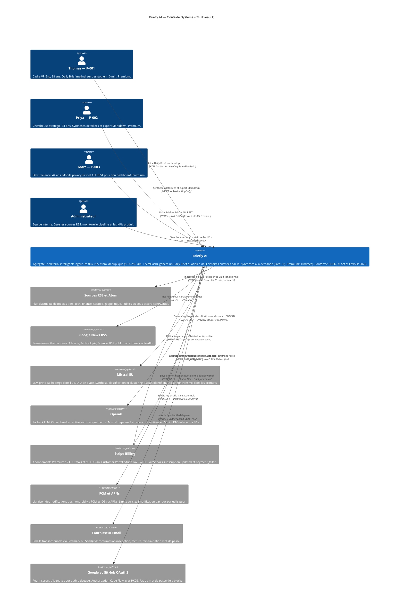

# Diagramme C4 — Niveau 1 : Contexte Système

**Produit :** Briefly AI
**Date :** 2026-07-28
**Niveau C4 :** 1 — Context (vue macroscopique : acteurs, système central, systèmes externes)
**Décisions reflétées :** Symfony 8 + API Platform 4 + FrankenPHP, Flutter, Mistral EU + fallback OpenAI, Stripe Billing, auth OAuth2 + JWT EdDSA + Argon2id, FCM/APNs, RGPD, OWASP 2025.

---

## Diagramme



---

## Légende et notes d'architecture

### Acteurs

| Acteur | Profil | Canal principal | Plan cible | KPI de rétention |
|--------|--------|-----------------|------------|-----------------|
| **P-001 Thomas** | Cadre VP Engineering, 38 ans | Web desktop (7h30–8h, quotidien) | Premium | DAU/WAU ≥ 71 % (5j/7) |
| **P-002 Priya** | Chercheuse stratégie, 31 ans | Web desktop (sessions profondes, vendredi) | Premium | Feature export ≥ 1/semaine |
| **P-003 Marc** | Développeur freelance, 44 ans | Mobile Android (GrapheneOS) + API REST | Premium | Appels API ≥ 5/semaine |
| **Administrateur** | Équipe interne | Interface admin web | — | — |

### Briefly AI — périmètre du système central

La boîte "Briefly AI" encapsule l'intégralité de la plateforme à ce niveau. Elle recouvre :

- **Pipeline d'ingestion** : collecte RSS/Atom toutes les 15 min, déduplication SHA-256 URL + SimHash titre (fenêtre ±2h).
- **Moteur IA** : Mistral EU (primaire) avec fallback OpenAI, cache Redis 24 h, quotas Free/Premium (3 synthèses/jour Free).
- **Daily Brief** : sélection algorithmique de 3 histoires majeures, clustering HDBSCAN, génération batch 5h UTC, rendu SSR Twig.
- **Comptes et facturation** : OAuth2 délégué, JWT EdDSA mobile, session HttpOnly desktop, Stripe Billing, RGPD complet.
- **API REST** : API Platform 4, documentée OpenAPI 3.1, réservée aux utilisateurs Premium (Bearer token, 100 req/h).

Le détail des conteneurs internes est développé dans le diagramme Niveau 2 (c4-container.md).

### Systèmes externes

| Système | Rôle dans Briefly AI | Contrainte clé |
|---------|---------------------|----------------|
| **Sources RSS / Atom** | Alimentation principale du pipeline d'ingestion | CGU RSS à respecter ; contractualisation sources premium obligatoire (jurisprudence NYT vs OpenAI) |
| **Google News RSS** | Sous-canaux thématiques supplémentaires | Pas d'API officielle — flux RSS public uniquement |
| **Mistral EU** | LLM primaire : synthèse, classification, embeddings clustering | DPA en place, hébergement UE, aucun identifiant utilisateur dans les prompts (RGPD + AI Act) |
| **OpenAI** | LLM fallback automatique | Activé uniquement par circuit breaker (3 erreurs / 5 min), transparent pour l'utilisateur |
| **Stripe Billing** | Monétisation : abonnements, Customer Portal, TVA EU | PCI DSS entièrement délégué — pas de stockage carte en propre |
| **FCM / APNs** | Notifications push mobiles | Règle stricte B5 : 1 notification/jour max par utilisateur |
| **Fournisseur Email** | Emails transactionnels (inscription, facture, reset) | DPA requise, hébergement EU préféré |
| **Google / GitHub OAuth2** | Authentification déléguée (alternative à email/mdp) | PKCE obligatoire, aucun mot de passe tiers stocké |

### Principes architecturaux visibles à ce niveau

| Principe | Manifestation dans le diagramme |
|----------|--------------------------------|
| **Confiance zéro LLM** | Aucun identifiant utilisateur transmis à Mistral ou OpenAI — prompts anonymisés |
| **Résilience LLM** | Circuit breaker Mistral → OpenAI transparent, RTO < 30 s |
| **Monétisation déléguée** | Stripe gère le cycle de vie abonnement complet — PCI DSS délégué |
| **Signal vs bruit** | 1 notification push/jour max (contrainte B5 — positionnement Briefly AI) |
| **SEO natif** | Daily Brief en page publique SSR (Twig) — indexable sans JavaScript |
| **Privacy by design** | Mistral EU + prompts sans données personnelles + mode on-device opt-in (P-003) |
| **Webhooks entrants Stripe** | Relation bidirectionnelle : Briefly envoie vers Stripe (REST) ET reçoit de Stripe (webhooks HMAC) |

### Flux principaux résumés

```
P-001/P-002 (desktop)
  → HTTPS Session HttpOnly
  → Briefly AI (SSR Twig + API Platform)
  → PostgreSQL + Redis

P-003 (mobile)
  → HTTPS JWT EdDSA
  → Briefly AI (API Platform REST)
  → [on-device Phi-3 Mini opt-in, aucun flux externe]

Sources RSS/Atom
  → FeedIo ETag conditionnel (15 min)
  → Briefly AI (Workers Messenger)
  → Dedup SHA-256 + SimHash
  → PostgreSQL

Daily Brief (batch 5h UTC)
  → Briefly AI (Scheduler + Workers)
  → Clustering HDBSCAN (Mistral EU)
  → Sélection 3 histoires
  → Notification push FCM/APNs (1/jour max)

Synthèse à la demande
  → Briefly AI
  → Vérif quota Redis (Free: 3/j)
  → Mistral EU [ou OpenAI fallback]
  → Cache Redis 24h
```
