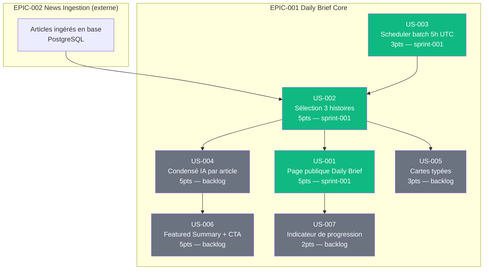

# EPIC-001 : Daily Brief Core

## Description

Le Daily Brief Core est le coeur de valeur de Briefly AI : transformer le flux d'actualités ingérées en un condensé quotidien de 3 histoires majeures, présenté avec une mise en scène éditoriale forte (numérotation 01/02/03, horodatage "LAST UPDATED", cartes typées, synthèse IA tracée, indicateur de lecture) accessible publiquement sur le web, généré automatiquement chaque matin à 5h UTC.

## MMF (Minimum Marketable Feature)

Une page web publique affichant automatiquement chaque matin les 3 histoires les plus importantes du jour, numérotées et horodatées, sans authentification — premier contact convaincant qui démontre la promesse "fort signal, faible bruit" de Briefly AI.

## Priorité MoSCoW

**Must Have** — sans ce bloc, le produit n'a pas de raison d'exister.

## Personas concernés

| Persona | Intérêt |
|---------|---------|
| **P-001 Thomas** (cadre dirigeant tech, 38 ans) | Principal bénéficiaire : couvrir son secteur en < 15 min/jour sans redondance |
| **P-002 Priya** (chercheuse stratégie, 31 ans) | Lecture du brief comme point de départ, tracabilité des sources |
| **P-003 Marc** (dev indépendant, privacy-first) | Consommation du brief sans tracker, accès API potentiel |

## User Stories

| ID | Titre | Points | Sprint |
|----|-------|--------|--------|
| US-001 | Page web publique du Daily Brief (Walking Skeleton) | 5 | sprint-001 |
| US-002 | Sélection algorithmique des 3 histoires majeures | 5 | sprint-001 |
| US-003 | Planification automatique du batch 5h UTC | 3 | sprint-001 |
| US-004 | Condensé IA par article avec badge et traçabilité source | 5 | backlog |
| US-005 | Cartes typées par catégorie éditoriale | 3 | backlog |
| US-006 | Featured Summary desktop + CTA "Lire le brief complet" | 5 | backlog |
| US-007 | Indicateur de progression de lecture (ligne émeraude 2px) | 2 | backlog |

**Total EPIC : 28 points**
Sprint 1 (Walking Skeleton) : 13 points
Backlog : 15 points

## Graphe de dépendances Mermaid

_Légende : vert émeraude = Sprint 1 (Walking Skeleton), gris = Backlog_

## Critères de succès de l'EPIC

| Critère | Mesure cible |
|---------|-------------|
| Fraîcheur du brief | Généré avant 6h00 heure locale (batch < 2 min à 5h UTC) |
| Disponibilité publique | Page /brief accessible sans authentification, HTTP 200 |
| Pertinence éditoriale | 3 histoires issues de ≥ 2 clusters thématiques distincts |
| Couverture IA tracée | 100% des condensés IA préfixés "BRIEFLY AI:" + lien source |
| Performance page | Time to First Byte < 400ms (Symfony SSR + Turbo) |
| Fiabilité du batch | Taux d'exécution réussie ≥ 99% sur 30 jours consécutifs |
| Zéro donnée personnelle dans les prompts IA | Audit RGPD : 0 identifiant utilisateur transmis à Mistral |

## Dépendances inter-EPICs

- **EPIC-002 News Ingestion** (dépendance forte) : les articles doivent être ingérés et dédupliqués en base avant que US-002 puisse sélectionner les 3 histoires.
- **EPIC-003 Authentification** (dépendance faible) : US-001 est publique et ne requiert pas d'auth. L'EPIC-003 débloquera des fonctionnalités personnalisées futures.
