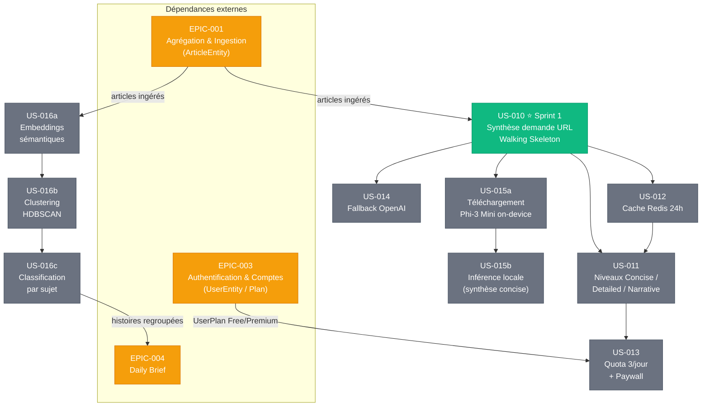

# EPIC-002 : Moteur de Synthèse IA

## Description

Service de synthèse intelligente transformant articles et URL en condensés structurés et traçables. Propose trois niveaux d'analyse adaptés (Concise / Detailed / Narrative), un clustering sémantique des histoires majeures, une classification par sujets, un cache Redis 24h et un provider hybride : Mistral EU (RGPD) en serveur principal, fallback OpenAI, et Phi-3 Mini on-device en opt-in pour les lectures sensibles (P-003). Toute production IA est préfixée "BRIEFLY AI:", accompagnée de points clés et de sources citées, avec un lien "OUVRIR L'ORIGINAL". Quota Free : 3 synthèses/jour ; paywall à la 4e.

## MMF (Minimum Marketable Feature)

**En un clic depuis n'importe quel article ou URL, Briefly génère un condensé structuré (~200 mots) préfixé "BRIEFLY AI:", avec 3 points clés et sources citées** — permettant à Thomas de couvrir son secteur en moins de 15 min/jour sans lecture complète, tout en garantissant la traçabilité de chaque information produite par l'IA.

## Priorité MoSCoW

**Must Have**

## Personas concernés

| Persona | Besoin principal |
|---------|-----------------|
| **P-001 Thomas** | Synthèse rapide (<15 min/jour), signaux faibles, insights partageables et crédibles |
| **P-002 Priya** | Multi-niveaux (Detailed/Narrative), traçabilité sourcée, export structuré, veille transverse |
| **P-003 Marc** | Traitement on-device Phi-3 Mini opt-in, aucune donnée transmise à des serveurs externes |

## User Stories

| ID | Titre | Points | Sprint | Priorité |
|----|-------|--------|--------|----------|
| US-010 | Synthèse IA à la demande sur URL (Walking Skeleton web) | 5 | sprint-001 | Must |
| US-011 | Niveaux de synthèse multi-niveaux (Concise / Detailed / Narrative) | 5 | backlog | Must |
| US-012 | Cache Redis 24h des synthèses générées | 3 | backlog | Must |
| US-013 | Quota gratuit (3 synthèses/jour) et paywall progressif | 5 | backlog | Must |
| US-014 | Fallback provider OpenAI en cas d'indisponibilité Mistral | 3 | backlog | Should |
| US-015a | Téléchargement du modèle Phi-3 Mini on-device (Flutter) | 3 | backlog | Should |
| US-015b | Inférence locale Phi-3 Mini pour synthèse concise (Flutter on-device) | 5 | backlog | Should |
| US-016a | Génération d'embeddings sémantiques pour les articles ingérés | 3 | backlog | Must |
| US-016b | Clustering HDBSCAN des articles par similarité sémantique | 3 | backlog | Must |
| US-016c | Classification automatique des clusters par sujet (taxonomie) | 2 | backlog | Must |

**Total EPIC : 37 story points | 10 US**
**Sprint 1 (Walking Skeleton) : 5 pts | Backlog : 32 pts**

## Graphe de dépendances Mermaid

## Critères de succès de l'EPIC

| # | Critère | Mesure cible |
|---|---------|-------------|
| 1 | **Qualité** | Score de pertinence des synthèses ≥ 4/5 en test utilisateur (NPS synthèse) |
| 2 | **Performance** | Temps de réponse Mistral ≤ 5s (P95) pour une synthèse Concise |
| 3 | **Cache** | Taux de hit Redis ≥ 70% après 48h de production continue |
| 4 | **Traçabilité** | 100% des synthèses : préfixe "BRIEFLY AI:" + sources citées + lien OUVRIR L'ORIGINAL |
| 5 | **Résilience** | Fallback OpenAI déclenché en < 2s, 0 erreur 503 exposée sans message explicite |
| 6 | **Privacy** | Zéro identifiant utilisateur (email, ID, IP) transmis aux providers IA |
| 7 | **Quota** | Paywall déclenché exactement à la 4e synthèse/jour pour comptes Free |
| 8 | **RGPD** | Consentement explicite enregistré avant toute synthèse on-device ; opt-out ≤ 2 clics |
| 9 | **Clustering** | Taux de cohérence thématique HDBSCAN ≥ 80% (validation manuelle 50 clusters) |
