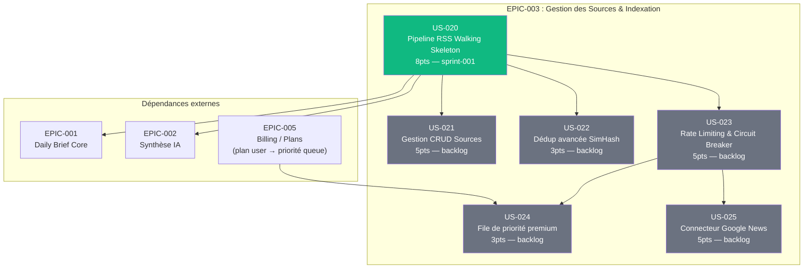

# EPIC-003 : Gestion des Sources & Indexation

## Description

L'ingestion multi-sources est le socle de toute la chaîne de valeur de Briefly AI : sans articles frais et dédupliqués en base, ni Daily Brief ni synthèse IA ne sont possibles. Cet EPIC couvre le pipeline complet — de la découverte et de la configuration des sources RSS/Atom et Google News jusqu'au stockage PostgreSQL — en garantissant la fiabilité (circuit breaker, rate limiting Redis), la pertinence (déduplication SHA-256 + SimHash), et la priorité de traitement des abonnés premium (file Messenger dédiée).

## MMF (Minimum Marketable Feature)

**"Un pipeline RSS opérationnel sur 3 sources publiques — fetch automatique via FeedIo, déduplication SHA-256 et stockage PostgreSQL — déclenché par Symfony Scheduler, permettant à Thomas de recevoir son premier Daily Brief alimenté par de vraies actualités sans aucune intervention manuelle."**

## Priorité MoSCoW

**Must Have** — dépendance directe de EPIC-001 (Daily Brief) et EPIC-002 (Synthèse IA) : sans articles ingérés, aucune histoire ne peut être sélectionnée ni synthétisée.

## Personas concernés

| Persona | Intérêt dans cet EPIC |
|---------|----------------------|
| **P-001 Thomas** (cadre 38 ans) | Fraîcheur et couverture large de son secteur, sources variées (Google News + RSS spécialisés) |
| **P-002 Priya** (chercheuse 31 ans) | Sources premium personnalisées (HBR, MIT Tech Review), rafraîchissement prioritaire, traçabilité |
| **P-003 Marc** (dev 44 ans) | Fiabilité du pipeline, respect des sources sans ban IP, absence de tracking utilisateur dans l'ingestion |

## User Stories

| ID | Titre | Points | Sprint | Priorité |
|----|-------|--------|--------|----------|
| US-020 | Pipeline RSS Walking Skeleton (fetch + dedup SHA-256 + stockage) | 8 | sprint-001 | Must |
| US-021 | Gestion CRUD sources RSS/Atom par l'administrateur | 5 | backlog | Must |
| US-022 | Déduplication avancée par SimHash de titre | 3 | backlog | Should |
| US-023 | Rate limiting Redis + circuit breaker par source | 5 | backlog | Must |
| US-024 | File de priorité Messenger (premium avant gratuit) | 3 | backlog | Should |
| US-025 | Connecteur Google News (sous-canaux À la une / Tech / Science) | 5 | backlog | Should |

**Total EPIC : 29 points**
Sprint 1 (Walking Skeleton) : 8 points
Backlog : 21 points

## Graphe de dépendances Mermaid

_Légende : vert émeraude = Sprint 1 (Walking Skeleton), gris = Backlog. Les flèches signifient "doit être livré avant"._

## Critères de succès de l'EPIC

| Critère | Mesure cible |
|---------|-------------|
| Pipeline automatisé | Au moins 3 sources RSS ingérées automatiquement toutes les 15 min via Symfony Scheduler sans intervention manuelle |
| Déduplication fiable | Taux de doublons < 1 % sur un corpus de test de 10 000 articles (SHA-256 URL + SimHash titre ±2h) |
| Administration fonctionnelle | Un admin ajoute, valide et active une source RSS en < 2 min depuis l'interface Twig/Turbo |
| Résilience des sources | Circuit breaker activé après 5 erreurs consécutives ; back-off exponentiel Redis ; 0 exception non gérée propagée hors du handler Messenger |
| Priorité premium respectée | SLA sources premium < 5 min après déclenchement Scheduler (mesuré sur 7 jours consécutifs) |
| Traçabilité complète | Chaque article stocké référence url canonique, source_id, ETag, Last-Modified et fetch_at (base du lien "OUVRIR L'ORIGINAL") |
| Sécurité OWASP | Seules les URLs HTTPS sont acceptées ; aucun identifiant utilisateur transmis au pipeline d'ingestion ; RGPD : 0 donnée personnelle dans les logs d'ingestion |
