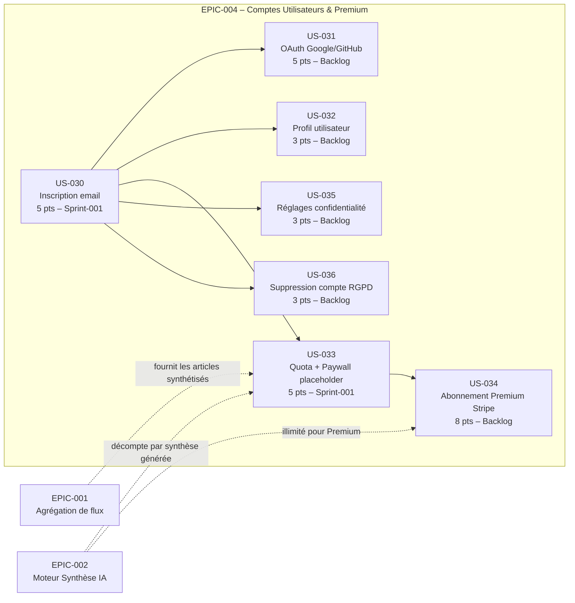

# EPIC-004 : Comptes Utilisateurs & Premium

## Description

Fournir aux utilisateurs de Briefly AI un espace personnel sécurisé couvrant l'intégralité du cycle de vie du compte : inscription et authentification (email/Argon2id + OAuth Google/GitHub), gestion de profil (nom, email, bio professionnelle), abonnement Briefly Premium via Stripe Billing (12 €/mois ou 99 €/an) avec Customer Portal et webhooks async, application du quota free (3 synthèses/jour) via compteur Redis avec paywall déclenché à la 4e synthèse, réglages de confidentialité RGPD à granularité fine (interrupteurs : analytique, recommandations personnalisées, biométrie, indexation moteurs) et suppression de compte irréversible conforme au droit à l'oubli.

## MMF (Minimum Marketable Feature)

**En une phrase de valeur :** Un visiteur peut créer un compte en moins de 2 minutes, consulter son quota de synthèses restant et être invité à passer Briefly Premium dès le dépassement de la limite quotidienne gratuite.

## Priorité MoSCoW

**Must Have**

## Personas concernés

| Persona | Intérêt principal |
|---------|-------------------|
| P-001 Thomas, cadre dirigeant tech 38 ans | Compte rapide, accès illimité via Premium, pas de friction |
| P-002 Priya, chercheuse stratégie 31 ans | Profil pro, Premium pour synthèses illimitées, export RGPD |
| P-003 Marc, dev indépendant 44 ans privacy-first | Réglages confidentialité granulaires, suppression RGPD, biométrie |

## User Stories

| ID | Titre | Points | Sprint |
|----|-------|--------|--------|
| US-030 | Inscription par email avec mot de passe sécurisé | 5 | sprint-001 |
| US-031 | Authentification déléguée Google / GitHub (OAuth2) | 5 | backlog |
| US-032 | Gestion du profil utilisateur | 3 | backlog |
| US-033 | Quota quotidien de synthèses et paywall placeholder | 5 | sprint-001 |
| US-034 | Abonnement Briefly Premium via Stripe Billing | 8 | backlog |
| US-035 | Réglages de confidentialité et préférences RGPD | 3 | backlog |
| US-036 | Suppression de compte conforme RGPD | 3 | backlog |

**Total : 32 points | Sprint-001 : 10 points | Backlog : 22 points**

## Graphe de dépendances Mermaid

## Critères de succès de l'EPIC

| Critère | Mesure | Cible |
|---------|--------|-------|
| **Inscription** | Taux de complétion du formulaire email | ≥ 80 % |
| **Sécurité mots de passe** | Algorithme de hachage | Argon2id (128 MiB, t=3, p=1) — aucune donnée sensible dans les logs |
| **Rate-limit inscription** | Tentatives par IP/heure | 10/h bloqué avec HTTP 429 |
| **Quota free** | Précision du compteur Redis | Bloque exactement à la 4e synthèse quotidienne ; TTL reset à minuit UTC |
| **Premium – conversion** | Flux Stripe Checkout opérationnel | Paiement → activation Premium < 30 s |
| **Webhooks Stripe** | Idempotence | 0 doublon en base sur event_id déjà traité |
| **RGPD – suppression** | Cascade DELETE | 100 % des données personnelles effacées à la confirmation |
| **RGPD – export** | Portabilité JSON | Disponible dans /settings/privacy |
| **Confidentialité** | Application des préférences | Effective sur la prochaine requête après enregistrement |
| **Performance paywall** | Affichage du paywall | Sans rechargement complet (Turbo Frame), < 200 ms |
