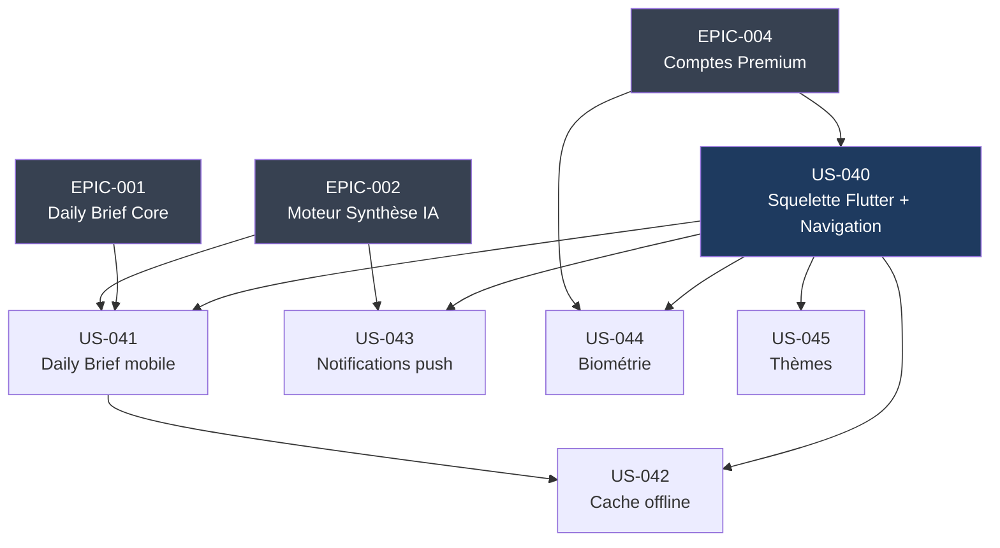

# EPIC-005 : Expérience Mobile Native

## Métadonnées

| Champ | Valeur |
|-------|--------|
| **ID** | EPIC-005 |
| **Statut** | To Do |
| **Priorité MoSCoW** | Should Have |
| **Personas** | P-001 Thomas, P-002 Priya, P-003 Marc |
| **Sprint de démarrage** | Backlog (débloqué après validation du Walking Skeleton web - Sprint 1) |
| **Total Story Points** | 25 pts |

---

## Description

L'EPIC-005 couvre la création de l'application mobile native Flutter (Android + iOS) de Briefly AI. Elle offre aux utilisateurs une expérience optimisée pour le mobile : navigation par onglets, lecture immersive du Daily Brief, cache offline, notifications push quotidiennes, authentification biométrique et thèmes adaptatifs. L'app consomme exclusivement l'API Platform backend (EPIC-001 à EPIC-004) via JWT.

---

## MMF — Minimum Marketable Feature

> **Application Flutter iOS/Android permettant à un utilisateur authentifié de consulter son Daily Brief, sauvegarder des articles en lecture différée et recevoir sa notification push quotidienne.**

Cette tranche minimale délivre la valeur principale (accès au brief en mobilité) sans les fonctionnalités secondaires (biométrie, thèmes avancés).

---

## Périmètre

### Inclus

- Navigation basse 4 onglets : **Flux** (`rss_feed`) / **Explorer** (`explore`) / **Sources** (`settings_input_component`) / **Sauvegardés** (`bookmark`) ; **Profil** (`person`) accessible depuis l'écran Compte
- Barre supérieure : logo Briefly AI, bascule thème (`light_mode`/`dark_mode`), icône notifications
- Lecteur d'article : retour, favori (bookmark), partage natif
- Cache local offline : briefs du jour + articles sauvegardés (Hive / Isar), synchronisation différée
- Notifications push FCM/APNs via Notifee — 1 push/jour maximum (Daily Brief uniquement), opt-in/out
- Biométrie Face ID / Touch ID via `local_auth` + `flutter_secure_storage` (on-device uniquement)
- Thèmes clair (Insight Minimalist) et sombre (Insight Dark), auto-détection système + override manuel
- Consommation de l'API Platform (REST, JWT Bearer)
- Accent émeraude `#10B981` réservé aux badges IA, préfixe "BRIEFLY AI:" sur toute synthèse

### Hors périmètre (v1)

- Breaking news push
- Onboarding in-app (géré par EPIC-002)
- Abonnement in-app billing (géré par EPIC-004)
- Explorer et Sources (shells de navigation présents, contenu traité par EPIC-003)

---

## User Stories

| ID | Titre | Points | Sprint |
|----|-------|--------|--------|
| US-040 | Squelette Flutter + Navigation 4 onglets | 5 | backlog |
| US-041 | Consultation du Daily Brief sur mobile | 5 | backlog |
| US-042 | Sauvegarde d'articles et cache offline | 5 | backlog |
| US-043 | Notifications push Daily Brief (FCM/APNs) | 5 | backlog |
| US-044 | Authentification biométrique (Face ID / Touch ID) | 3 | backlog |
| US-045 | Thèmes clair/sombre (Insight Minimalist / Insight Dark) | 2 | backlog |
| **TOTAL** | | **25 pts** | |

---

## Graphe de dépendances Mermaid

**Ordre de livraison recommandé :**
1. US-040 (fondation)
2. US-041 + US-045 (valeur immédiate)
3. US-042 + US-043 (engagement)
4. US-044 (confort / privacy)

---

## Critères de succès de l'EPIC

| Critère | Mesure | Cible |
|---------|--------|-------|
| Disponibilité stores | App Store + Google Play | Publié v1 |
| Fluidité navigation | Temps de changement d'onglet | < 100 ms |
| Stabilité | Taux de crash (Firebase Crashlytics) | < 0,5 % |
| Adoption | Taux d'ouverture notification Daily Brief | > 40 % |
| Satisfaction | Note stores (après 50 avis) | >= 4,2 / 5 |
| Offline | Articles sauvegardés accessibles sans réseau | 100 % |
| Biométrie | Succès d'authentification biométrique | > 95 % |
| IA traçabilité | Toute synthèse affichée avec "BRIEFLY AI:" + lien source | 100 % |

---

## Contraintes techniques

- **Flutter SDK** : stable channel, null-safety
- **Navigation** : GoRouter (deep links, web URL parity)
- **State management** : Riverpod
- **Cache local** : Hive ou Isar (selon benchmark performance)
- **Push** : `firebase_messaging` (FCM) + `flutter_local_notifications` (Notifee-compatible)
- **Biométrie** : `local_auth` + `flutter_secure_storage` — jamais de données biométriques transmises au serveur
- **Auth** : JWT Bearer (refresh token stocké dans `flutter_secure_storage`)
- **RGPD** : consentement explicite avant activation notifications push et biométrie
- **OWASP** : Certificate pinning, obfuscation release, pas de logs en production

---

## Definition of Done (EPIC)

- [ ] Toutes les US de l'EPIC sont au statut Done
- [ ] Tests widget >= 80 % couverture des écrans principaux
- [ ] Tests d'intégration Flutter passants (golden tests pour thèmes)
- [ ] Audit sécurité : pas de données sensibles dans les logs
- [ ] Build release signé Android (keystore) + iOS (provisioning profile)
- [ ] Review App Store Connect + Google Play Console soumis
- [ ] Documentation API consommée à jour (OpenAPI)
- [ ] RGPD : privacy policy mise à jour (push, biométrie)
