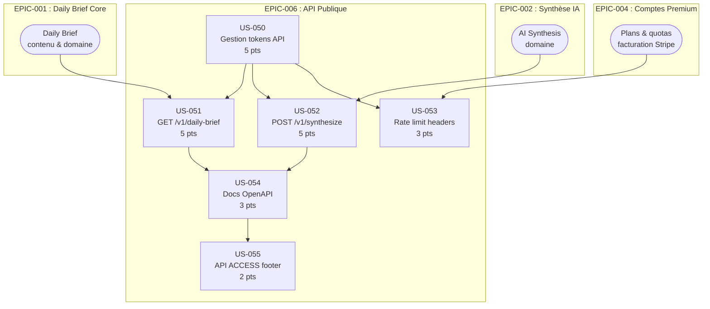

# EPIC-006 : API Publique

## Description

Exposer une API publique documentée (OpenAPI 3.1, générée automatiquement par API Platform 4) permettant aux développeurs et intégrateurs B2B d'accéder programmatiquement au Daily Brief quotidien et aux synthèses IA de Briefly AI, avec authentification par token personnel, rate limiting transparent (headers X-RateLimit-*), quotas différenciés par plan tarifaire et documentation interactive (Swagger UI + page Getting Started).

## MMF (Minimum Marketable Feature)

**En une phrase :** Un développeur disposant d'un token API peut récupérer le Daily Brief du jour en JSON via `GET /v1/daily-brief` et consulter la documentation interactive OpenAPI pour intégrer Briefly AI dans son propre tableau de bord, sans aucune interaction humaine.

## Priorité MoSCoW

**Could have** — Valeur différenciante pour les profils techniques (P-003) et l'écosystème partenaire B2B ; non bloquante pour le lancement grand public.

## Personas concernés

| Persona | Rôle | Besoin principal |
|---------|------|-----------------|
| **P-003** Marc, dev indépendant 44 ans | Intégrateur principal | Dashboard privé sans tracker, accès API programmatique, traitement on-device pour lectures sensibles |
| **Intégrateurs B2B** | Partenaires / revendeurs | Flux JSON structurés, SLA prévisible, quotas documentés, versionnement stable |

## User Stories

| ID | Titre | Story Points | Sprint |
|----|-------|-------------|--------|
| US-050 | Gestion des tokens API | 5 | backlog |
| US-051 | Endpoint GET /v1/daily-brief | 5 | backlog |
| US-052 | Endpoint POST /v1/synthesize | 5 | backlog |
| US-053 | Rate limit headers et quotas par plan | 3 | backlog |
| US-054 | Documentation développeur OpenAPI / Swagger UI | 3 | backlog |
| US-055 | Lien "API ACCESS" pied de page desktop | 2 | backlog |

**Total EPIC :** 23 story points

## Graphe de dépendances Mermaid

## Critères de succès de l'EPIC

1. **Fonctionnel :** `GET /v1/daily-brief` retourne les 3 histoires du jour en JSON avec tous les champs requis (id UUID, rank, title, summary, ai_summary, ai_generated, source_url, published_at, last_updated).
2. **Fonctionnel :** `POST /v1/synthesize` produit une synthèse IA traçable (préfixe "BRIEFLY AI:", champ `ai_generated: true`, `source_url`) dans les quotas du plan, avec résultat caché 24h.
3. **Sécurité :** Tout appel sans token valide retourne HTTP 401. Un token révoqué est rejeté en moins de 1 seconde. Aucun identifiant utilisateur ne transite dans les prompts IA (RGPD).
4. **Rate limiting :** Headers `X-RateLimit-Limit`, `X-RateLimit-Remaining`, `X-RateLimit-Reset`, `X-RateLimit-Plan` présents sur chaque réponse. HTTP 429 avec `Retry-After` sur dépassement.
5. **Quotas :** Free = 100 req/jour sur `/v1/daily-brief`, 3 synthèses/jour. Premium = 1 000 req/jour `/v1/daily-brief`, 200 synthèses/jour.
6. **Documentation :** Swagger UI accessible sans authentification sur `/api/docs`. Spec OpenAPI 3.1 valide (zéro erreur `openapi-generator validate` en CI). Page `/developers` avec getting started.
7. **Versionnement :** Préfixe `/v1/` sur tous les endpoints publics. Header `API-Version: 1` sur chaque réponse. Header `Deprecation` si endpoint déprécié.
8. **Découvrabilité :** Lien "API ACCESS" visible dans le pied de page desktop sur toutes les pages, pointant vers `/developers`.
9. **Qualité :** Tests PHPUnit (couverture ≥ 80% des controllers API), validation OpenAPI en CI, test footer Twig automatisé.
