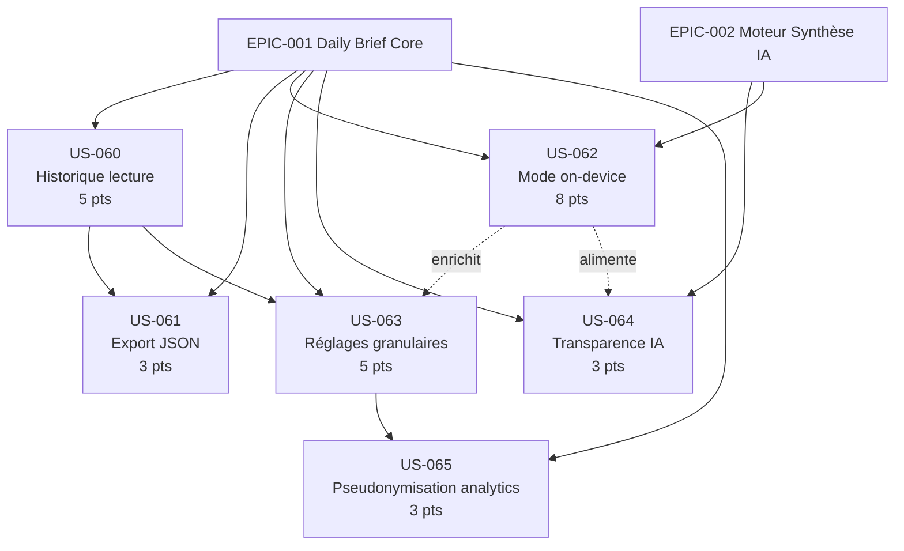

# EPIC-007 : Privacy & On-Device AI

## Description

Permettre à chaque utilisateur de Briefly de maîtriser l'intégralité de ses données personnelles et d'opter pour un traitement IA strictement local (on-device), afin de garantir une confidentialité maximale, la pleine conformité RGPD/AI Act et une confiance éditoriale différenciante.

Périmètre fonctionnel :
- Consultation et suppression de l'historique de lecture (RGPD Art. 17)
- Export JSON de toutes les données personnelles (RGPD Art. 20 — portabilité)
- Mode vie privée avec synthèse on-device opt-in (Phi-3 Mini / Gemma 2B, ~1–2 Go téléchargeables)
- Réglages granulaires : analytics anonymes, recommandations personnalisées, indexation moteurs de recherche
- Page de transparence du traitement IA (AI Act — risque limité)
- Pseudonymisation des données comportementales et analytiques (HMAC-SHA256 + sel rotatif 90 j)

## MMF (Minimum Marketable Feature)

**En une phrase de valeur** : Un utilisateur peut consulter et supprimer son historique de lecture, télécharger ses données en JSON et activer la synthèse on-device, sans qu'aucune donnée personnelle ne soit transmise à un tiers IA — différenciant Briefly comme la plateforme d'actualités la plus respectueuse de la vie privée.

## Priorité MoSCoW

**Should have**

## Personas concernés

| Persona | Bénéfice principal |
|---------|-------------------|
| **P-001** Thomas (cadre dirigeant tech, 38 ans) | Réglages granulaires, transparence IA pour justifier l'usage en entreprise |
| **P-002** Priya (chercheuse stratégie, 31 ans) | Export JSON pour réutilisation, portabilité, traçabilité sourcée |
| **P-003** Marc (dev indépendant, privacy-first, 44 ans) | Mode on-device, historique maîtrisé, pseudonymisation, zéro tracker |

## User Stories

| ID | Titre | Points | Sprint |
|----|-------|--------|--------|
| US-060 | Consulter et supprimer l'historique de lecture | 5 | backlog |
| US-061 | Exporter ses données personnelles en JSON | 3 | backlog |
| US-062 | Activer le mode vie privée avec synthèse on-device | 8 | backlog |
| US-063 | Configurer les réglages granulaires de confidentialité | 5 | backlog |
| US-064 | Consulter la transparence du traitement IA (AI Act) | 3 | backlog |
| US-065 | Pseudonymisation des analytics et données comportementales | 3 | backlog |

**Total estimé** : 27 story points

> Note : EPIC-007 est intégralement hors périmètre Sprint 1 (Walking Skeleton). Priorisation recommandée à partir du Sprint 3–4.

## Graphe de dépendances Mermaid

## Critères de succès de l'EPIC

- [ ] L'utilisateur peut consulter et supprimer son historique complet en < 3 clics (cascade BD vérifiée, log RGPD créé)
- [ ] L'export JSON est conforme RGPD Art. 20 : téléchargeable en < 5 min pour 1 an d'historique, lien signé TTL 24 h
- [ ] Le mode on-device fonctionne hors connexion après téléchargement : vérification SHA-256 du modèle, synthèse générée en < 30 s sur appareil mid-range
- [ ] Zéro identifiant utilisateur transmis aux API IA externes (Mistral, OpenAI fallback) — vérifiable en inspection réseau
- [ ] Les réglages granulaires sont persistants, appliqués immédiatement et synchronisés cross-device (web + Flutter) en < 30 s
- [ ] La page de transparence est conforme AI Act : modèle utilisé, données transmises, finalité, localisation traitement
- [ ] Les données analytiques sont pseudonymisées (HMAC-SHA256 + sel rotatif 90 j) — aucune FK directe `analytics_events` → `users`
- [ ] Score RGPD audit interne : 100 % (consentement, Art. 17 effacement, Art. 20 portabilité, base légale documentée, registre de traitement à jour)
- [ ] Zéro vulnérabilité critique ou haute (OWASP 2025) sur les endpoints de cet EPIC

## Dépendances inter-EPICs

| EPIC | Nature de la dépendance | Sens |
|------|------------------------|------|
| EPIC-001 | Sessions HttpOnly et JWT nécessaires pour identifier l'utilisateur dans tous les endpoints privacy | Bloquant |
| EPIC-002 | Endpoints de synthèse IA existants (pour le basculement cloud/on-device et la transparence) | Bloquant pour US-062, US-064 |
| EPIC-008 | Analytics & personnalisation : la pseudonymisation (US-065) et les opt-out (US-063) impactent les algorithmes de reco | Impact fonctionnel |

## Notes techniques

- **Backend** : Symfony 8 + API Platform 4 + FrankenPHP + PostgreSQL + Redis. Voters Symfony pour ownership. UUID non séquentiels. PHPStan max.
- **Mobile** : Flutter — llama.cpp FFI ou mediapipe_tasks_genai pour inférence on-device. `flutter_secure_storage` pour clé AES-256 du modèle.
- **Conformité** : Pseudonymisation HMAC-SHA256 (sel rotatif 90 j). Cascade PostgreSQL ON DELETE pour le droit à l'oubli. Log RGPD sur chaque opération sensible (suppression, export, modification paramètres).
- **AI Act** : Briefly classé "limited risk" (génération de contenu informatif) → obligation de transparence active.
