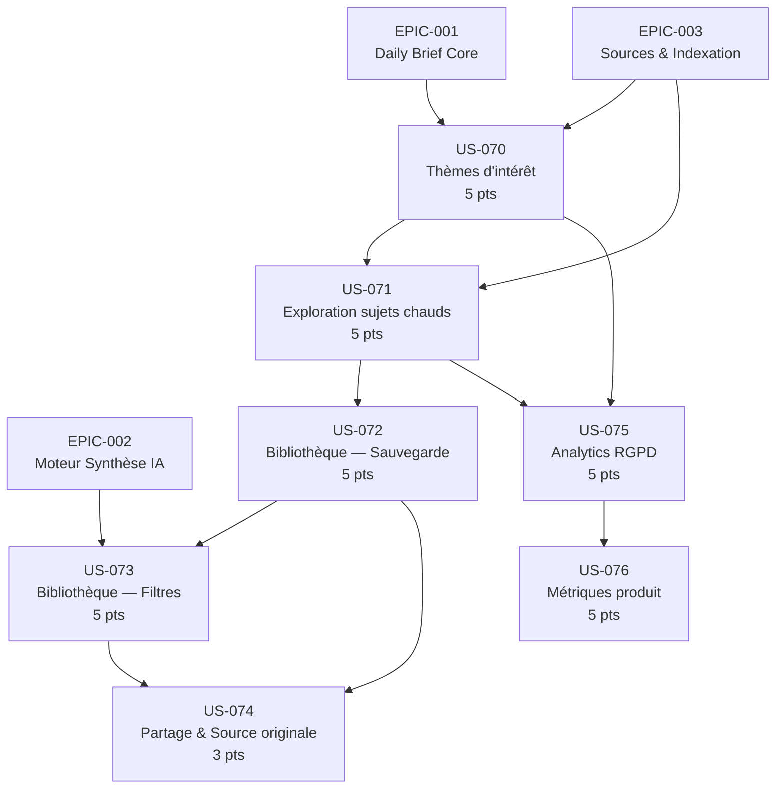

# EPIC-008 : Analytics & Personnalisation

## Description

Donner à chaque utilisateur les outils pour personnaliser son expérience Briefly AI — thèmes d'intérêt, exploration éditoriale par sujets chauds, bibliothèque personnelle et analytics comportementaux RGPD-first — afin de renforcer la valeur perçue, la rétention et la différenciation produit face aux agrégateurs généralistes.

Les données analytiques ne servent jamais le ciblage publicitaire. Toute collecte comportementale est opt-in, avec consentement explicite enregistré et droit à la suppression garanti.

## MMF (Minimum Marketable Feature)

**Valeur en une phrase** : Permettre à l'utilisateur de configurer 3 thèmes d'intérêt qui pondèrent son Daily Brief dès le lendemain, d'explorer les sujets chauds par catégorie et de sauvegarder des articles dans une bibliothèque personnelle filtrable — transformant Briefly AI en veille sur mesure plutôt qu'en flux généraliste.

## Priorité MoSCoW

**Could have**

## Personas concernés

| Persona | Motivation principale |
|---------|----------------------|
| **P-001 Thomas** — cadre dirigeant tech, 38 ans | Personnalisation sectorielle du Daily Brief ; partage d'insights crédibles ; identification de signaux faibles |
| **P-002 Priya** — chercheuse stratégie, 31 ans | Bibliothèque organisée avec filtres et métadonnées ; traçabilité IA ; base de veille personnelle |
| **P-003 Marc** — dev indépendant privacy-first, 44 ans | Analytics de lecture sans profiling publicitaire ; maîtrise totale de ses données |

## User Stories incluses

| ID | Titre | Points | Sprint |
|----|-------|--------|--------|
| US-070 | Configuration de 3 thèmes d'intérêt pour le Daily Brief | 5 | backlog |
| US-071 | Exploration des sujets chauds par catégorie | 5 | backlog |
| US-072 | Sauvegarde d'articles dans la bibliothèque personnelle | 5 | backlog |
| US-073 | Filtrage et organisation de la bibliothèque personnelle | 5 | backlog |
| US-074 | Partage d'article et accès à la source originale | 3 | backlog |
| US-075 | Tableau de bord analytique respectueux RGPD | 5 | backlog |
| US-076 | Métriques produit — rétention et engagement | 5 | backlog |

**Total : 33 points — 2 sprints estimés (vélocité 20-40 pts/sprint)**

## Graphe de dépendances Mermaid

## Critères de succès de l'EPIC

1. **Adoption de la personnalisation** : ≥ 60 % des utilisateurs actifs configurent au moins 1 thème d'intérêt dans les 7 jours suivant la mise en production.
2. **Bibliothèque utilisée** : ≥ 30 % des utilisateurs actifs sauvegardent au moins 1 article par semaine ; ≥ 50 % utilisent les filtres au moins une fois.
3. **Exploration adoptée** : ≥ 25 % des sessions incluent une navigation dans les sujets chauds.
4. **Conformité RGPD** : 0 donnée personnelle transmise à des fins publicitaires ; consentement opt-in enregistré avant toute collecte comportementale ; droit à la suppression effectif en cascade (< 72 h).
5. **Performance** : endpoints personnalisation P95 < 200 ms ; bibliothèque P95 < 300 ms sous charge nominale.
6. **Rétention** : amélioration mesurable du taux de rétention J7 (+≥ 10 %) et J30 (+≥ 8 %) pour les utilisateurs ayant activé au moins 1 thème, vs groupe contrôle.
7. **Qualité IA tracée** : badge "AI SUMMARY" affiché sur 100 % des synthèses dans la bibliothèque ; lien "OUVRIR L'ORIGINAL" présent sur 100 % des entrées avec source disponible.
