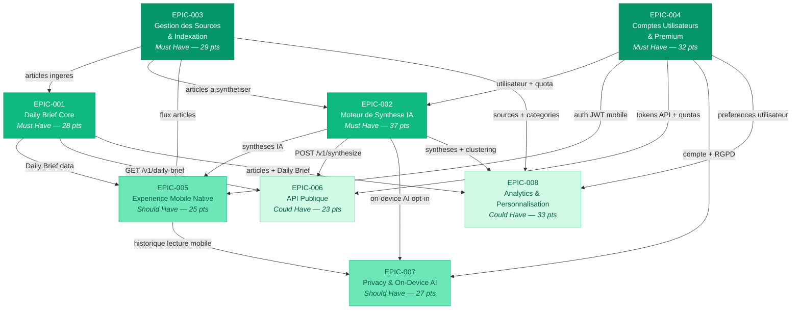

# Matrice des Dependances Inter-EPIC — Briefly AI

> Derniere mise a jour : 2026-07-28

---

## Graphe de Dependances (Mermaid)



---

## Legende

| Couleur | Signification |
|---------|--------------|
| Vert fonce | EPIC fondation (prerequis de tous les autres) |
| Vert | EPIC Must Have (Walking Skeleton + core product) |
| Vert clair | EPIC Should Have (valeur differenciante) |
| Vert pale | EPIC Could Have (enrichissement) |

---

## Matrice de Dependances Directes

| EPIC | Depend de | Bloque par (si absent) |
|------|-----------|------------------------|
| EPIC-001 Daily Brief Core | EPIC-003 | Pas d'articles a afficher |
| EPIC-002 Synthese IA | EPIC-003, EPIC-004 | Pas d'articles / pas de quota utilisateur |
| EPIC-003 Sources & Indexation | — | Fondation independante |
| EPIC-004 Comptes & Premium | — | Fondation independante |
| EPIC-005 Mobile | EPIC-001, EPIC-002, EPIC-003, EPIC-004 | Toute la stack web doit etre stable |
| EPIC-006 API Publique | EPIC-001, EPIC-002, EPIC-004 | Pas de data a exposer / pas d'auth API |
| EPIC-007 Privacy & On-Device | EPIC-004, EPIC-002, EPIC-005 | Pas de compte / pas de synthese a isoler |
| EPIC-008 Analytics & Perso | EPIC-001, EPIC-002, EPIC-003, EPIC-004 | Pas de contenu / pas d'utilisateur |

---

## Ordre de Realisation Recommande

### Phase 1 — Walking Skeleton (Sprint 001)

Parallelisme possible entre EPIC-003 et EPIC-004 (aucune dependance mutuelle).
EPIC-001 et EPIC-002 demarrent des que EPIC-003 a un premier batch d'articles.

```
Sprint 001
├── EPIC-003 (US-020 : Pipeline RSS)        ← fondation contenu
├── EPIC-004 (US-030, US-033 : Auth + Quota) ← fondation utilisateur
├── EPIC-001 (US-001, US-002, US-003)        ← after US-020
└── EPIC-002 (US-010)                        ← after US-001 + US-030
```

### Phase 2 — Core Product (Sprints 002–004)

Completion des Must Have avant d'ouvrir les Should Have.

```
Sprint 002–003
├── EPIC-001 (US-004, US-005, US-006, US-007) ← enrichissement Daily Brief
├── EPIC-002 (US-011, US-012, US-013, US-014) ← niveaux + cache + quota + fallback
├── EPIC-003 (US-021, US-022, US-023)          ← CRUD sources + SimHash + rate limit
└── EPIC-004 (US-031, US-032, US-034, US-035, US-036) ← OAuth + profil + Stripe
```

### Phase 3 — Mobile & Differenciation (Sprints 004–006)

EPIC-005 et EPIC-007 demarrent quand la stack web est stable et testee.

```
Sprint 004–005
├── EPIC-005 (US-040 → US-045) ← Flutter (debloquer US-040 en premier)
├── EPIC-007 (US-060 → US-065) ← Privacy (apres EPIC-004 complet)
└── EPIC-003 (US-024, US-025)  ← Files prioritaires + Google News
```

### Phase 4 — API & Analytics (Sprints 006–008)

EPIC-006 et EPIC-008 en dernier : ils consomment la valeur produite par toutes les phases precedentes.

```
Sprint 006–008
├── EPIC-006 (US-050 → US-055) ← API Publique (apres EPIC-001 + EPIC-002 stables)
├── EPIC-002 (US-015, US-016)  ← On-device + clustering semantique
└── EPIC-008 (US-070 → US-076) ← Analytics & Personnalisation
```

---

## Dependances Techniques Critiques (US vers US)

### Dependances bloquantes Sprint 001

| US | Depend de | Nature de la dependance |
|----|-----------|------------------------|
| US-002 (Selection algo) | US-020 (Pipeline RSS) | Besoin d'articles en base PostgreSQL |
| US-001 (Page Daily Brief) | US-002 (Selection algo) | Besoin du BriefSelectorService |
| US-003 (Scheduler 5h) | US-002 (Selection algo) | Appelle BriefGenerationHandler |
| US-010 (Synthese IA) | US-001 (Page Daily Brief) | Endpoint web parent |
| US-010 (Synthese IA) | US-030 (Inscription) | Rate limit par session/user |
| US-033 (Quota Redis) | US-030 (Inscription) | Besoin de l'UUID utilisateur |

### Dependances bloquantes inter-EPIC (post-Sprint 001)

| US | Depend de | Nature |
|----|-----------|--------|
| US-013 (Quota Free) | US-030 (Auth) | UserEntity + Plan |
| US-016 (Clustering) | US-020 (Pipeline RSS) | Articles en base |
| US-034 (Stripe Premium) | US-030 (Auth) | Customer stripe lie au User |
| US-040 (Flutter skeleton) | EPIC-001 stable | API Daily Brief consommable |
| US-041 (Brief mobile) | US-040 + US-001 | Endpoint GET /brief disponible |
| US-051 (GET /v1/daily-brief) | US-050 (Tokens API) | Auth API requise |
| US-052 (POST /v1/synthesize) | US-050 + US-010 | Endpoint synthese + auth API |
| US-062 (On-device AI) | US-040 (Flutter) + US-030 (Auth) | Mobile uniquement en v1 |
| US-060 (Historique lecture) | US-030 (Auth) + US-041 (Brief mobile) | Tracking lecture cross-device |

---

## Risques de Dependances

| Risque | EPIC(s) impacte(s) | Mitigation |
|--------|-------------------|------------|
| EPIC-003 en retard (sources RSS instables) | EPIC-001, EPIC-002, EPIC-005, EPIC-008 | Fixtures statiques d'articles de test descouplees du fetch reel |
| EPIC-004 (Stripe) retard integration | EPIC-002 (quota), EPIC-006 (API) | Quota quota "fictif" en base sans Stripe pour les premiers sprints |
| EPIC-005 (Flutter) sous-estime | EPIC-007 (Privacy mobile) | US-040 (fondation Flutter) doit etre en Sprint 004 au plus tard |
| EPIC-002 (Mistral EU) limite de quota | EPIC-001 (US-004, US-006), EPIC-006 | Mock MistralApiClient en test, key API dediee par environnement |
| EPIC-016 (clustering Python FastAPI) | EPIC-001 (Daily Brief selection) | Microservice Python deployable independamment ; fallback classification simple si indisponible |
