# Task Board — Sprint 001 Walking Skeleton

> **Sprint Goal** : Livrer le Walking Skeleton de Briefly AI : pipeline RSS reel → selection algorithmique → Daily Brief public, enrichi d'une synthese Mistral a la demande, avec inscription securisee et quota Redis.

**Sprint** : 2026-07-28 → 2026-08-10 | **Velocite cible** : 36 points

---

## Legende Statuts

| Icone | Statut | Description |
|-------|--------|-------------|
| 🔲 | A faire | Pas encore commence |
| 🔄 | En cours | Developpement en cours |
| 👀 | Review | Code review / QA |
| ✅ | Done | Criteres DoD valides |
| 🚫 | Bloque | Impediment identifie |

---

## Kanban — Niveau User Stories

### 🔲 A faire

| US | Titre | EPIC | Points | Assignee | Depend de |
|----|-------|------|--------|----------|-----------|
| US-020 | Pipeline RSS Walking Skeleton (fetch + dedup SHA-256 + stockage) | EPIC-003 | 8 | — | — |
| US-030 | Inscription par email avec mot de passe securise | EPIC-004 | 5 | — | — |
| US-002 | Selection algorithmique des 3 histoires majeures du Daily Brief | EPIC-001 | 5 | — | US-020 |
| US-001 | Page web publique du Daily Brief (Walking Skeleton) | EPIC-001 | 5 | — | US-020, US-002 |
| US-010 | Synthese IA a la demande sur URL (Walking Skeleton web) | EPIC-002 | 5 | — | US-001, US-030 |
| US-033 | Quota quotidien de syntheses et paywall placeholder | EPIC-004 | 5 | — | US-030, US-010 |
| US-003 | Planification automatique du batch Daily Brief — 5h UTC | EPIC-001 | 3 | — | US-002 |

**Total A faire : 36 pts / 7 US**

---

## Kanban — Niveau Tâches techniques

### 🔲 A faire — US-020 : Pipeline RSS

| ID | Type | Description courte | Heures | Depend de |
|----|------|--------------------|--------|-----------|
| T-020-01 | [DB] | Entity Source + SourceRepositoryInterface | 2h | — |
| T-020-02 | [DB] | Entity Article + ArticleRepositoryInterface + UNIQUE content_hash | 2h | — |
| T-020-03 | [DB] | Migration tables sources + articles | 1h | T-020-01, T-020-02 |
| T-020-04 | [DB] | Fixtures 3 sources RSS (TechCrunch, TheVerge, ArsTechnica) | 1h | T-020-03 |
| T-020-05 | [BE] | ArticleDTO + SourceFetcherInterface | 1h | T-020-01, T-020-02 |
| T-020-06 | [BE] | FeedIoSourceFetcher (adapter FeedIo 6.x + SHA-256) | 3h | T-020-05 |
| T-020-07 | [BE] | DoctrineArticleRepository + DoctrineSourceRepository | 2h | T-020-02, T-020-03 |
| T-020-08 | [BE] | FetchSourceMessage + FetchSourceHandler (Messenger) | 2h | T-020-06, T-020-07 |
| T-020-09 | [BE] | FetchAllSourcesCommand + Scheduler 15 min | 2h | T-020-07, T-020-08 |
| T-020-10 | [FE-WEB] | AdminArticleController GET /admin/articles (ROLE_ADMIN) | 1.5h | T-020-07 |
| T-020-11 | [FE-WEB] | Twig admin/articles/index (liste paginee 50/p) | 1.5h | T-020-10 |
| T-020-12 | [TEST] | Tests unit FeedIoSourceFetcher (RSS valide, 503, XML invalide) | 2h | T-020-06 |
| T-020-13 | [TEST] | Tests integ DoctrineArticleRepository (dedup ON CONFLICT) | 1.5h | T-020-07 |
| T-020-14 | [TEST] | Tests integ FetchSourceHandler (nominal + erreurs) | 2h | T-020-08, T-020-12 |
| T-020-15 | [TEST] | WebTestCase GET /admin/articles (200 + 403 sans role) | 1h | T-020-11 |
| T-020-16 | [DOC] | PHPDoc entities + interfaces + services US-020 | 0.5h | T-020-09 |
| T-020-17 | [REV] | Code review US-020 | 1.5h | T-020-16 |

### 🔲 A faire — US-002 : Selection algorithmique

| ID | Type | Description courte | Heures | Depend de |
|----|------|--------------------|--------|-----------|
| T-002-01 | [DB] | Entities DailyBrief + BriefStory | 2h | US-020/T-020-03 |
| T-002-02 | [DB] | Migration daily_briefs + brief_stories | 1h | T-002-01 |
| T-002-03 | [BE] | Interfaces DailyBriefRepositoryInterface + ArticleCandidateRepositoryInterface | 1h | — |
| T-002-04 | [BE] | BriefSelectorService (scoring composite fraicheur+cluster+source+longueur) | 3h | T-002-03 |
| T-002-05 | [BE] | DoctrineArticleRepository::findCandidatesForBrief() | 2h | T-002-01, T-002-02 |
| T-002-06 | [BE] | DailyBriefRepository::upsertForToday() (ON CONFLICT idempotent) | 1.5h | T-002-02 |
| T-002-07 | [BE] | GenerateDailyBriefMessage + GenerateDailyBriefHandler | 2h | T-002-04, T-002-06 |
| T-002-08 | [BE] | BriefGenerationFailedEvent | 0.5h | T-002-07 |
| T-002-09 | [TEST] | Tests unit BriefSelectorService (nominal, 2 clusters, idempotence) | 2.5h | T-002-04 |
| T-002-10 | [TEST] | Tests integ ArticleRepository + DailyBriefRepository | 2h | T-002-05, T-002-06 |
| T-002-11 | [TEST] | Tests integ GenerateDailyBriefHandler (0 articles → event) | 1.5h | T-002-07 |
| T-002-12 | [DOC] | PHPDoc BriefSelectorService + interfaces | 0.5h | T-002-08 |
| T-002-13 | [REV] | Code review US-002 | 1.5h | T-002-12 |

### 🔲 A faire — US-001 : Page publique Daily Brief

| ID | Type | Description courte | Heures | Depend de |
|----|------|--------------------|--------|-----------|
| T-001-01 | [BE] | DailyBriefRepository::findLatest() (today priority, fallback J-1, null si vide) | 1.5h | US-002/T-002-02 |
| T-001-02 | [BE] | BriefController::index() GET /brief (ViewModel + null handling + 503) | 1.5h | T-001-01 |
| T-001-03 | [BE] | BriefController::home() GET / → redirect 301 /brief | 0.5h | T-001-02 |
| T-001-04 | [FE-WEB] | base.html.twig (HTML5 + design-tokens.css + Turbo + Stimulus) | 2h | — |
| T-001-05 | [FE-WEB] | templates/brief/index.html.twig (01/02/03 + LAST UPDATED + SEO meta) | 2.5h | T-001-02, T-001-04 |
| T-001-06 | [FE-WEB] | Empty state + 503.html.twig (sans stacktrace, Retry-After: 60) | 1h | T-001-05 |
| T-001-07 | [FE-WEB] | SecurityHeadersSubscriber (CSP, HSTS, X-Frame-Options, COOP, COEP) | 1.5h | — |
| T-001-08 | [TEST] | Tests unit BriefController (nominal, J-1, vide→200, erreur→503) | 2h | T-001-02 |
| T-001-09 | [TEST] | Tests integ findLatest() (today, J-1, null) | 1h | T-001-01 |
| T-001-10 | [TEST] | WebTestCase GET /brief (200, meta SEO, 3 histoires, headers securite) | 2h | T-001-05, T-001-07 |
| T-001-11 | [TEST] | WebTestCase erreurs (empty state 200, redirect / → /brief) | 1h | T-001-06 |
| T-001-12 | [DOC] | PHPDoc BriefController + DailyBriefRepository + ViewModel | 0.5h | T-001-03 |
| T-001-13 | [REV] | Code review US-001 | 1.5h | T-001-12 |

### 🔲 A faire — US-003 : Scheduler batch 5h UTC

| ID | Type | Description courte | Heures | Depend de |
|----|------|--------------------|--------|-----------|
| T-003-01 | [BE] | BriefScheduleProvider (ScheduleProviderInterface, CronExpressionTrigger "0 5 * * *") | 2h | US-002/T-002-07 |
| T-003-02 | [BE] | Redis Lock dans GenerateDailyBriefHandler (TryLock TTL 600s + mode degrade) | 2h | US-002/T-002-07 |
| T-003-03 | [BE] | GenerateDailyBriefCommand (bin/console briefly:generate-daily-brief --date=) | 2h | US-002/T-002-07 |
| T-003-04 | [BE] | Logging JSON Monolog (brief.batch_start/success/failed + duration_ms) | 1h | T-003-02 |
| T-003-05 | [OPS] | Config Messenger retry (max 3, backoff expo) + worker Docker compose | 1h | — |
| T-003-06 | [TEST] | Tests unit BriefScheduleProvider (cron "0 5 * * *", 7j/7) | 1h | T-003-01 |
| T-003-07 | [TEST] | Tests unit Handler+Lock (nominal, lock pris → skip, Redis KO → degrade) | 1.5h | T-003-02 |
| T-003-08 | [TEST] | Tests unit GenerateDailyBriefCommand (exit 0, dispatch, --date) | 1h | T-003-03 |
| T-003-09 | [DOC] | PHPDoc BriefScheduleProvider + GenerateDailyBriefCommand | 0.5h | T-003-04 |
| T-003-10 | [REV] | Code review US-003 | 1h | T-003-09 |

### 🔲 A faire — US-010 : Synthese IA a la demande

| ID | Type | Description courte | Heures | Depend de |
|----|------|--------------------|--------|-----------|
| T-010-01 | [DB] | Entity SynthesisResult (url_hash, content, key_points JSONB, sources JSONB) | 1.5h | — |
| T-010-02 | [DB] | Migration synthesis_results + index url_hash | 0.5h | T-010-01 |
| T-010-03 | [BE] | SynthesisServiceInterface + SynthesisRequest/SynthesisResponse DTOs | 1h | — |
| T-010-04 | [BE] | MistralApiClient (HttpClient, timeout 15s, prompt ~200 mots + 3 key points) | 3h | T-010-03 |
| T-010-05 | [BE] | SynthesisService (validation SSRF + fetch URL + Mistral + persist) | 2.5h | T-010-03, T-010-04 |
| T-010-06 | [BE] | API Platform SynthesisResource POST /api/v1/synthesis (validation, 422, 503) | 2h | T-010-05 |
| T-010-07 | [FE-WEB] | Turbo Frame synthesis-result + bouton GENERATE AI SUMMARY | 1.5h | US-001/T-001-04 |
| T-010-08 | [FE-WEB] | Stimulus synthesis_controller.js (fetch POST, skeleton 10s, update frame) | 1.5h | T-010-07 |
| T-010-09 | [FE-WEB] | Twig synthesis_result.html.twig (BRIEFLY AI: + 3 key points + OUVRIR) | 1h | T-010-07 |
| T-010-10 | [TEST] | Tests unit SynthesisService (nominal, SSRF bloque, partiel, timeout) | 2h | T-010-05 |
| T-010-11 | [TEST] | Tests unit MistralApiClient mocke (parsing, timeout, assert 0 PII) | 1.5h | T-010-04 |
| T-010-12 | [TEST] | ApiTestCase POST /api/v1/synthesis (200, 422 URL invalide, 503 Mistral KO) | 2h | T-010-06 |
| T-010-13 | [DOC] | PHPDoc SynthesisService + MistralApiClient + interfaces | 0.5h | T-010-06 |
| T-010-14 | [REV] | Code review US-010 | 1.5h | T-010-13 |

### 🔲 A faire — US-030 : Inscription email

| ID | Type | Description courte | Heures | Depend de |
|----|------|--------------------|--------|-----------|
| T-030-01 | [DB] | Entity User (UUID v7, email UNIQUE, password_hash, consent_at) + UserRepositoryInterface | 2h | — |
| T-030-02 | [DB] | Migration table users + UNIQUE email + index | 0.5h | T-030-01 |
| T-030-03 | [BE] | RegistrationFormType (email, fullName, password, consentCgu + constraints OWASP) | 2h | T-030-01 |
| T-030-04 | [BE] | RegistrationController GET/POST /register (Argon2id, consent_at UTC, session, redirect) | 2h | T-030-03 |
| T-030-05 | [BE] | Rate limiting Redis /register (10 req/h/IP → HTTP 429 + Retry-After) | 1.5h | — |
| T-030-06 | [BE] | Security.yaml (firewall, entity provider User::email, login /login, logout) | 1h | T-030-01 |
| T-030-07 | [FE-WEB] | Twig register/index.html.twig (form + CGU + flash + lien /login) | 1.5h | T-030-04 |
| T-030-08 | [FE-WEB] | Stimulus password_toggle_controller.js (toggle type password/text) | 1h | T-030-07 |
| T-030-09 | [FE-WEB] | Template dashboard/index.html.twig stub (flash "Bienvenue", ROLE_USER) | 0.5h | T-030-06 |
| T-030-10 | [TEST] | Tests unit RegistrationController (succes, email double, mdp faible) | 2h | T-030-04 |
| T-030-11 | [TEST] | Tests integ User + Argon2id (hash format, consent_at UTC, UUID v7, UNIQUE) | 1.5h | T-030-01 |
| T-030-12 | [TEST] | WebTestCase POST /register (nominal, duplicate, mdp faible, CGU, 429) | 2h | T-030-07 |
| T-030-13 | [TEST] | WebTestCase CSRF /register (sans token → rejet) | 0.5h | T-030-07 |
| T-030-14 | [DOC] | PHPDoc User + RegistrationController + UserRepositoryInterface | 0.5h | T-030-04 |
| T-030-15 | [REV] | Code review US-030 | 1.5h | T-030-14 |

### 🔲 A faire — US-033 : Quota Redis + paywall placeholder

| ID | Type | Description courte | Heures | Depend de |
|----|------|--------------------|--------|-----------|
| T-033-01 | [BE] | QuotaService (Redis INCR + EXPIREAT minuit UTC, cle sans PII) | 2.5h | US-030/T-030-01 |
| T-033-02 | [BE] | QuotaServiceUnavailableException (domaine) | 0.5h | T-033-01 |
| T-033-03 | [BE] | QuotaStateProcessor API Platform (HTTP 429 + X-Quota-Remaining: 0, 503 Redis KO) | 2h | T-033-01, US-010/T-010-06 |
| T-033-04 | [FE-WEB] | Turbo Frame quota-indicator header (N / 3 syntheses utilisees) | 1.5h | US-001/T-001-04 |
| T-033-05 | [FE-WEB] | Turbo Frame paywall-modal (HTTP 429 → modale CTA Premium placeholder) | 1.5h | T-033-04 |
| T-033-06 | [FE-WEB] | Message incitation 3e synthese (remaining=0 → CTA Briefly Premium disabled) | 1h | T-033-04 |
| T-033-07 | [TEST] | Tests unit QuotaService (INCR, EXPIREAT minuit UTC, 4e → false, reset date) | 2h | T-033-01 |
| T-033-08 | [TEST] | Tests unit QuotaStateProcessor (200, 429+header, 503 Redis KO) | 1.5h | T-033-03 |
| T-033-09 | [TEST] | Tests integ QuotaService + Redis reel (INCR atomique, EXPIREAT UTC, reset date) | 2h | T-033-01 |
| T-033-10 | [TEST] | WebTestCase paywall-modal (HTTP 429 + Turbo Frame + X-Quota-Remaining: 0) | 1h | T-033-05 |
| T-033-11 | [DOC] | PHPDoc QuotaService + QuotaStateProcessor (note RGPD UUID only) | 0.5h | T-033-03 |
| T-033-12 | [REV] | Code review US-033 | 1.5h | T-033-11 |

---

### 🔄 En cours

| ID | US | Description | Assignee | Depuis |
|----|----|-------------|----------|--------|
| — | | | | |

---

### 👀 Review

| ID | US | Description | Reviewer | PR |
|----|----|-----------|-----------|----|
| — | | | | |

---

### ✅ Done

| ID | US | Description | Date |
|----|----|-----------|----|
| — | | | |

---

### 🚫 Bloque

| ID | US | Description | Impediment | Owner |
|----|----|-----------|-----------|----|
| — | | | | |

---

## Metriques Sprint 001

| Metrique | Valeur |
|----------|--------|
| Total tâches | 84 |
| Total heures estimees | 140.5h |
| Taches A faire | 84 |
| Taches En cours | 0 |
| Taches en Review | 0 |
| Taches Done | 0 |
| Taches Bloquees | 0 |
| Points planifies | 36 |
| Points livres | — |
| US planifiees | 7 |
| US livrees | — |
| Taux de completion | 0% |

### Capacite Sprint

| Parametre | Valeur |
|-----------|--------|
| Duree sprint | 10 jours ouvrés |
| Developpeurs full-time | 2 |
| Heures/jour/dev (net dev) | 7h |
| Capacite totale brute | 140h |
| Ceremonies (-8h) | 132h nets |
| Heures estimees | 140.5h |
| Delta | +8.5h (~6%) |

> **Action requise si J+3 en retard** : retirer US-003 (13h) du scope Sprint 1. La génération manuelle `bin/console briefly:generate-daily-brief` remplace le scheduler pour la demo.

---

## Burndown Chart (manuel)

| Jour | Heures Restantes | Ideal |
|------|-----------------|-------|
| J+0  | 140.5h | 140.5h |
| J+1  | — | 126.5h |
| J+2  | — | 112.4h |
| J+3  | — | 98.4h |
| J+4  | — | 84.3h |
| J+5  | — | 70.3h |
| J+6  | — | 56.2h |
| J+7  | — | 42.2h |
| J+8  | — | 28.1h |
| J+9  | — | 14.1h |
| J+10 | — | 0h |

---

## Graphe global de dependances des tâches

```mermaid
graph TD
    subgraph US020["US-020 Pipeline RSS"]
        T2001[T-020-01 Entity Source] --> T2003[T-020-03 Migration]
        T2002[T-020-02 Entity Article] --> T2003
        T2003 --> T2004[T-020-04 Fixtures]
        T2001 --> T2005[T-020-05 ArticleDTO]
        T2002 --> T2005
        T2005 --> T2006[T-020-06 FeedIoFetcher]
        T2002 --> T2007[T-020-07 Doctrine Repos]
        T2003 --> T2007
        T2006 --> T2008[T-020-08 Messenger Handler]
        T2007 --> T2008
        T2007 --> T2009[T-020-09 Command+Scheduler]
        T2008 --> T2009
        T2007 --> T2010[T-020-10 AdminController]
        T2010 --> T2011[T-020-11 Twig admin]
    end

    subgraph US002["US-002 Selection"]
        T2003 --> T0201[T-002-01 Entities Brief]
        T0201 --> T0202[T-002-02 Migration Brief]
        T0203[T-002-03 Interfaces] --> T0204[T-002-04 BriefSelectorService]
        T0202 --> T0205[T-002-05 findCandidates]
        T0202 --> T0206[T-002-06 upsertForToday]
        T0204 --> T0207[T-002-07 Message+Handler]
        T0206 --> T0207
        T0207 --> T0208[T-002-08 FailedEvent]
    end

    subgraph US001["US-001 Page Brief"]
        T0202 --> T0101[T-001-01 findLatest]
        T0101 --> T0102[T-001-02 BriefController]
        T0102 --> T0103[T-001-03 redirect /]
        T0104[T-001-04 base.html.twig]
        T0102 --> T0105[T-001-05 brief/index.twig]
        T0104 --> T0105
        T0105 --> T0106[T-001-06 empty+503]
        T0107[T-001-07 SecurityHeaders]
    end

    subgraph US003["US-003 Scheduler"]
        T0207 --> T0301[T-003-01 BriefScheduleProvider]
        T0207 --> T0302[T-003-02 Redis Lock]
        T0207 --> T0303[T-003-03 Command console]
        T0302 --> T0304[T-003-04 Logging JSON]
    end

    subgraph US030["US-030 Inscription"]
        T3001[T-030-01 Entity User] --> T3002[T-030-02 Migration users]
        T3001 --> T3003[T-030-03 FormType]
        T3003 --> T3004[T-030-04 RegistrationController]
        T3001 --> T3006[T-030-06 Security config]
        T3004 --> T3007[T-030-07 Twig register]
        T3007 --> T3008[T-030-08 Stimulus toggle]
        T3006 --> T3009[T-030-09 Dashboard stub]
    end

    subgraph US010["US-010 Synthese IA"]
        T1003[T-010-03 Interfaces DTO] --> T1004[T-010-04 MistralApiClient]
        T1003 --> T1005[T-010-05 SynthesisService]
        T1004 --> T1005
        T1005 --> T1006[T-010-06 API Platform Resource]
        T0104 --> T1007[T-010-07 Turbo Frame synthesis]
        T1007 --> T1008[T-010-08 Stimulus synthesis]
        T1007 --> T1009[T-010-09 Twig synthesis result]
    end

    subgraph US033["US-033 Quota"]
        T3001 --> T3301[T-033-01 QuotaService]
        T3301 --> T3303[T-033-03 QuotaStateProcessor]
        T1006 --> T3303
        T0104 --> T3304[T-033-04 Turbo Frame quota]
        T3304 --> T3305[T-033-05 paywall-modal]
    end
```

---

## Liens Utiles

- Sprint Goal : `sprints/sprint-001-walking_skeleton/sprint-goal.md`
- Taches par US : `sprints/sprint-001-walking_skeleton/tasks/`
- Definition of Done : `definition-of-done.md`
- Backlog Index : `backlog/index.md`
- Design Tokens : `design/design-tokens.css`
