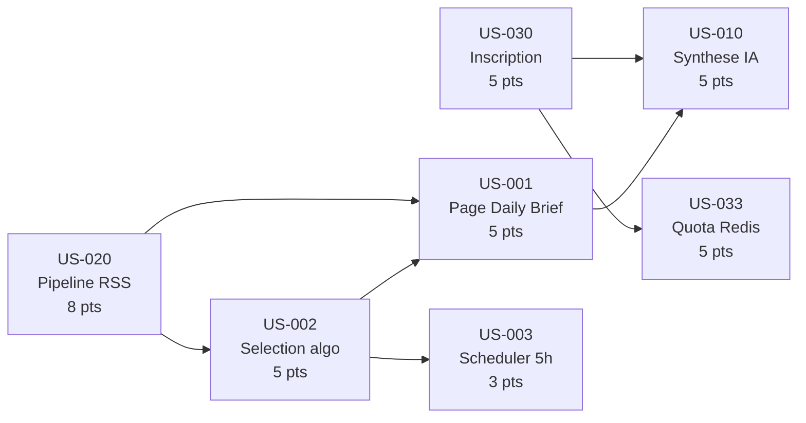

# Task Board — Sprint 001 Walking Skeleton

> **Sprint Goal** : Livrer le Walking Skeleton de Briefly AI : pipeline RSS reel -> selection algorithmique -> Daily Brief public, enrichi d'une synthese Mistral a la demande, avec inscription securisee et quota Redis.

**Sprint** : 2026-07-28 → 2026-08-10 | **Velocite cible** : 36 points

---

> **Note** : Ce board liste les User Stories du sprint. La decomposition en taches techniques (T-XXX-YY) est generee via `/project:decompose-tasks 001` et stockee dans `tasks/`.

---

## Legende Statuts

| Icone | Statut | Description |
|-------|--------|-------------|
| 🔲 | A faire | Pas encore commence |
| 🔄 | En cours | Developpement en cours |
| 👀 | Review | Code review / QA |
| ✅ | Done | Criteres DoD valides |
| 🚫 | Bloque | Impediment identifie |

---

## Kanban Sprint 001

### 🔲 A faire

| US | Titre | EPIC | Points | Assignee | Depend de |
|----|-------|------|--------|----------|-----------|
| US-020 | Pipeline RSS Walking Skeleton (fetch + dedup SHA-256 + stockage) | EPIC-003 | 8 | — | — |
| US-030 | Inscription par email avec mot de passe securise | EPIC-004 | 5 | — | — |
| US-002 | Selection algorithmique des 3 histoires majeures du Daily Brief | EPIC-001 | 5 | — | US-020 |
| US-001 | Page web publique du Daily Brief (Walking Skeleton) | EPIC-001 | 5 | — | US-020, US-002 |
| US-010 | Synthese IA a la demande sur URL (Walking Skeleton web) | EPIC-002 | 5 | — | US-001, US-030 |
| US-033 | Quota quotidien de syntheses et paywall placeholder | EPIC-004 | 5 | — | US-030 |
| US-003 | Planification automatique du batch Daily Brief — 5h UTC | EPIC-001 | 3 | — | US-002 |

**Total A faire : 36 pts / 7 US**

---

### 🔄 En cours

| US | Titre | EPIC | Points | Assignee | Depuis |
|----|-------|------|--------|----------|--------|
| — | | | | | |

---

### 👀 Review

| US | Titre | EPIC | Points | Reviewer | PR |
|----|-------|------|--------|----------|----|
| — | | | | | |

---

### ✅ Done

| US | Titre | EPIC | Points | Date |
|----|-------|------|--------|------|
| — | | | | |

---

### 🚫 Bloque

| US | Titre | EPIC | Points | Impediment | Owner |
|----|-------|------|--------|------------|-------|
| — | | | | | |

---

## Burndown Chart (manuel)

| Jour | Points Restants | Points Ideal |
|------|----------------|--------------|
| J+0  | 36 | 36 |
| J+1  | — | 33.3 |
| J+2  | — | 30.6 |
| J+3  | — | 27.9 |
| J+4  | — | 25.2 |
| J+5  | — | 22.5 |
| J+6  | — | 19.8 |
| J+7  | — | 17.1 |
| J+8  | — | 14.4 |
| J+9  | — | 11.7 |
| J+10 | — | 9.0 |
| J+11 | — | 6.3 |
| J+12 | — | 3.6 |
| J+13 | — | 0 |

---

## Graphe de Dependances des US

---

## Velocity & Metriques

| Metrique | Valeur |
|----------|--------|
| Points planifies | 36 |
| Points livres | — |
| US planifiees | 7 |
| US livrees | — |
| Taux de completion | — |

---

## Liens Utiles

- Sprint Goal : `sprints/sprint-001-walking_skeleton/sprint-goal.md`
- Taches techniques : `sprints/sprint-001-walking_skeleton/tasks/`
- Definition of Done projet : `definition-of-done.md`
- Backlog Index : `backlog/index.md`
