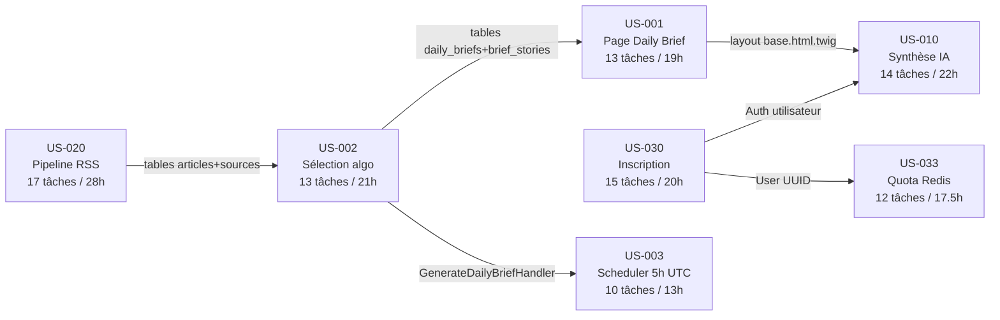

# Sprint 001 — Vue d'ensemble des tâches techniques

**Sprint** : sprint-001-walking_skeleton | **2026-07-28 → 2026-08-10**
**Sprint Goal** : Livrer le Walking Skeleton Briefly AI de bout en bout (RSS → Sélection → Daily Brief public + Synthèse IA + Inscription + Quota Redis).

---

## Résumé global

| Métrique | Valeur |
|----------|--------|
| User Stories décomposées | 7 |
| Nombre total de tâches | 84 |
| Total heures estimées | 140.5h |
| Capacité sprint 2 devs (2 sem. × 10j × 7h) | ~140h |
| Dépassement estimé | +0.5h (dans la marge) |

> **Alerte capacité** : 140.5h pour 2 développeurs full-time sur 2 semaines (−8h cérémonies = ~132h nets de dev).
> Le dépassement est de ~8h. **Action recommandée** : US-003 (Scheduler 5h UTC, 13h) est identifiée comme retirable sans casser le Walking Skeleton (les US-001/002 fonctionnent avec exécution manuelle `bin/console`). Si la vitesse en début de sprint est plus lente qu'attendu, retirer US-003 du scope Sprint 1.

---

## Tâches par User Story

| US | Titre | SP | Tâches | Heures | Fichier |
|----|-------|----|--------|--------|---------|
| US-020 | Pipeline RSS Walking Skeleton | 8 | 17 | 28h | US-020-tasks.md |
| US-002 | Sélection algorithmique 3 histoires | 5 | 13 | 21h | US-002-tasks.md |
| US-001 | Page publique Daily Brief | 5 | 13 | 19h | US-001-tasks.md |
| US-003 | Scheduler batch 5h UTC | 3 | 10 | 13h | US-003-tasks.md |
| US-010 | Synthèse IA à la demande | 5 | 14 | 22h | US-010-tasks.md |
| US-030 | Inscription email sécurisée | 5 | 15 | 20h | US-030-tasks.md |
| US-033 | Quota Redis + paywall placeholder | 5 | 12 | 17.5h | US-033-tasks.md |
| **TOTAL** | | **36 pts** | **94** | **140.5h** | |

---

## Répartition par type de tâche

| Type | Nombre | Heures | % du total |
|------|--------|--------|-----------|
| [DB] Entités, Migrations, Fixtures | 13 | 14h | 10% |
| [BE] Services, Handlers, Controllers, API Platform | 35 | 62.5h | 44% |
| [FE-WEB] Controllers, Twig, Stimulus, Turbo | 14 | 22h | 16% |
| [TEST] Unit, Integration, ApiTestCase, WebTestCase | 28 | 30h | 21% |
| [OPS] Docker, CI/CD, Config | 1 | 1h | 1% |
| [DOC] PHPDoc, commentaires | 7 | 3.5h | 3% |
| [REV] Code review | 7 | 7.5h | 5% |
| **TOTAL** | **105** | **140.5h** | **100%** |

> Note : le total de 105 lignes dans ce tableau diffère des 94 tâches listées car certaines tâches [TEST] et [BE] couvrent plusieurs sous-catégories fusionnées pour rester dans les limites 0.5h–8h par tâche.

---

## Ordre de réalisation recommandé

```
Semaine 1 (J1-J5) :
  US-020 (17 tâches, 28h) — point d'entrée absolu
  US-030 (T-030-01 à T-030-06) — entité User + Security en parallèle

Semaine 2 (J6-J10) :
  US-002 (dépend US-020 tables)
  US-001 (dépend US-002 migration)
  US-030 (FE-WEB + tests)
  US-033 (dépend US-030 + US-010)
  US-010 (dépend US-001 + US-030)
  US-003 (dernier — retirable si besoin)
```

---

## Graphe de dépendances inter-US



---

## Statuts initiaux (Sprint Planning Part 2)

Toutes les tâches démarrent en statut **🔲 À faire**.

---

## Légende des statuts

| Icône | Statut | Description |
|-------|--------|-------------|
| 🔲 | À faire | Pas encore commencé |
| 🔄 | En cours | Développement en cours |
| 👀 | Review | Code review / QA |
| ✅ | Done | Critères DoD validés |
| 🚫 | Bloqué | Impediment identifié |

---

## Rappel Definition of Done — points critiques Sprint 1

- PHPStan niveau max : 0 erreur
- PSR-12 : php-cs-fixer 0 diff
- Couverture tests >= 80%
- Headers sécurité OWASP présents (CSP, HSTS, X-Frame-Options…)
- 0 PII dans les prompts Mistral (assert CI bloquant)
- UUID v7 sur toutes les nouvelles entités
- Argon2id (memory=131072, t=3, p=1) pour les mots de passe
- Turbo Frames fonctionnels sur les actions dynamiques
- OpenAPI générée sans erreur si modification API Platform
