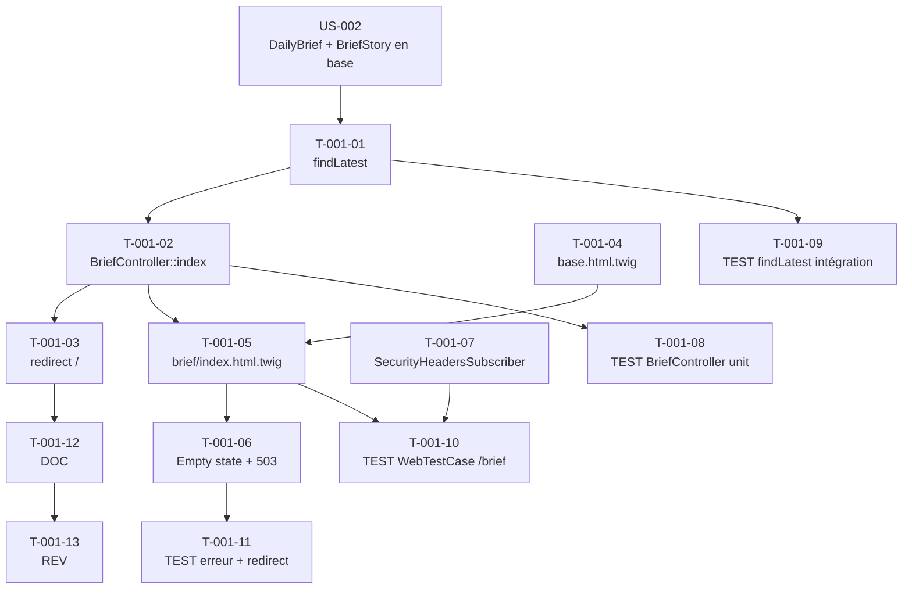

# US-001 — Tâches techniques : Page web publique du Daily Brief

**User Story** : En tant que P-001 Thomas, visiteur non authentifié, je veux accéder à une page web publique affichant les 3 histoires majeures du jour numérotées 01/02/03.
**Story Points** : 5 | **Sprint** : sprint-001
**Dépendances entrantes** : US-020 (articles en base), US-002 (DailyBrief + BriefStories créés)

---

## Tâches

| ID | Type | Description | Heures | Dépend de | Statut |
|----|------|-------------|--------|-----------|--------|
| T-001-01 | [BE] | `DailyBriefRepository::findLatest()` : requête PostgreSQL retournant le DailyBrief avec `status = 'ready'` le plus récent (date du jour en priorité, sinon J-1) JOIN FETCH sur 3 BriefStories + Article ; retourne `null` si table vide | 1.5h | US-002/T-002-02 | 🔲 |
| T-001-02 | [BE] | `BriefController::index()` (GET `/brief`, publique, IS_AUTHENTICATED_ANONYMOUSLY) : appelle `findLatest()`, construit un ViewModel `DailyBriefViewModel`, passe à la vue Twig ; gère cas null (empty state), catch `\Exception` → 503 + log ERROR | 1.5h | T-001-01 | 🔲 |
| T-001-03 | [BE] | `BriefController::home()` (GET `/`) : redirect 301 vers `/brief` (SEO) | 0.5h | T-001-02 | 🔲 |
| T-001-04 | [FE-WEB] | Layout Twig `templates/base.html.twig` : structure HTML5 avec tokens design-tokens.css, balise `<title>`, imports Turbo Drive + Stimulus, zone ``, meta viewport, zone messages flash ; header avec logo BRIEFLY + lien /brief | 2h | — | 🔲 |
| T-001-05 | [FE-WEB] | Template `templates/brief/index.html.twig` : affichage "DAILY BRIEF", horodatage "LAST UPDATED DD MMM YYYY HH:MM UTC", 3 blocs numérotés "01"/"02"/"03" (titre + source.name + extrait ≤280 chars), lien "OUVRIR L'ORIGINAL" (`rel="noopener noreferrer"`), SEO meta tags (`<title>`, `<meta name="description">`, `og:title`, `og:description`, `og:url`) | 2.5h | T-001-02, T-001-04 | 🔲 |
| T-001-06 | [FE-WEB] | États spéciaux dans le template : empty state "Brief en cours de préparation — revenez dans quelques instants" (200, table vide), page erreur 503 générique via `templates/errors/503.html.twig` (sans stacktrace, header `Retry-After: 60`) | 1h | T-001-05 | 🔲 |
| T-001-07 | [FE-WEB] | Subscriber Symfony `SecurityHeadersSubscriber` (ou config NelmioSecurityBundle) : headers `Content-Security-Policy`, `Strict-Transport-Security`, `X-Frame-Options: DENY`, `X-Content-Type-Options: nosniff`, `Referrer-Policy`, `Cross-Origin-Opener-Policy`, `Permissions-Policy` sur toutes les réponses | 1.5h | — | 🔲 |
| T-001-08 | [TEST] | Tests unitaires `BriefController` : nominal (DailyBrief today → 200 + ViewModel correct), brief J-1 (aucun today → J-1 affiché), table vide (null → 200 + message empty state), exception DB → 503 + log ERROR | 2h | T-001-02 | 🔲 |
| T-001-09 | [TEST] | Tests intégration `DailyBriefRepository::findLatest()` : retourne today si status=ready, retourne J-1 si today absent, retourne null si table vide | 1h | T-001-01 | 🔲 |
| T-001-10 | [TEST] | `WebTestCase` GET `/brief` : HTTP 200 + Content-Type text/html, présence "DAILY BRIEF" + "LAST UPDATED", 3 blocs (01/02/03), meta SEO présentes, lien "OUVRIR L'ORIGINAL" avec rel="noopener noreferrer", headers sécurité présents | 2h | T-001-05, T-001-07 | 🔲 |
| T-001-11 | [TEST] | `WebTestCase` scénarios erreur : table vide → 200 + message "Brief en cours de préparation" (pas de stacktrace), GET `/` → 301 vers `/brief` | 1h | T-001-06 | 🔲 |
| T-001-12 | [DOC] | PHPDoc `BriefController`, `DailyBriefRepository::findLatest()`, `DailyBriefViewModel` | 0.5h | T-001-03 | 🔲 |
| T-001-13 | [REV] | Code review US-001 (route publique non protégée, headers sécurité présents, pas de stacktrace exposée, Turbo Drive fonctionnel, SEO meta complets) | 1.5h | T-001-12 | 🔲 |

**Total US-001 : 13 tâches — 19h**

---

## Graphe de dépendances

---

## Notes techniques

- `DailyBriefViewModel` (src/Presentation/ViewModel/) : DTO de présentation uniquement, pas d'entité Doctrine dans les templates Twig.
- Turbo Drive : pas de Turbo Frame ni Stream sur cette page en Sprint 1 — la navigation SPA-like est automatique avec Turbo Drive (import dans `base.html.twig`).
- L'extrait des articles = `raw_content` tronqué à 280 caractères dans le ViewModel (logique de troncature dans le ViewModel, pas dans le template).
- `SecurityHeadersSubscriber` s'applique à TOUTES les réponses du projet, pas seulement `/brief` — le placer dans `src/Infrastructure/Http/`.
- La dépendance sur US-002 est sur la migration (tables créées), pas sur les données : les tests peuvent tourner avec fixtures de DailyBrief.
