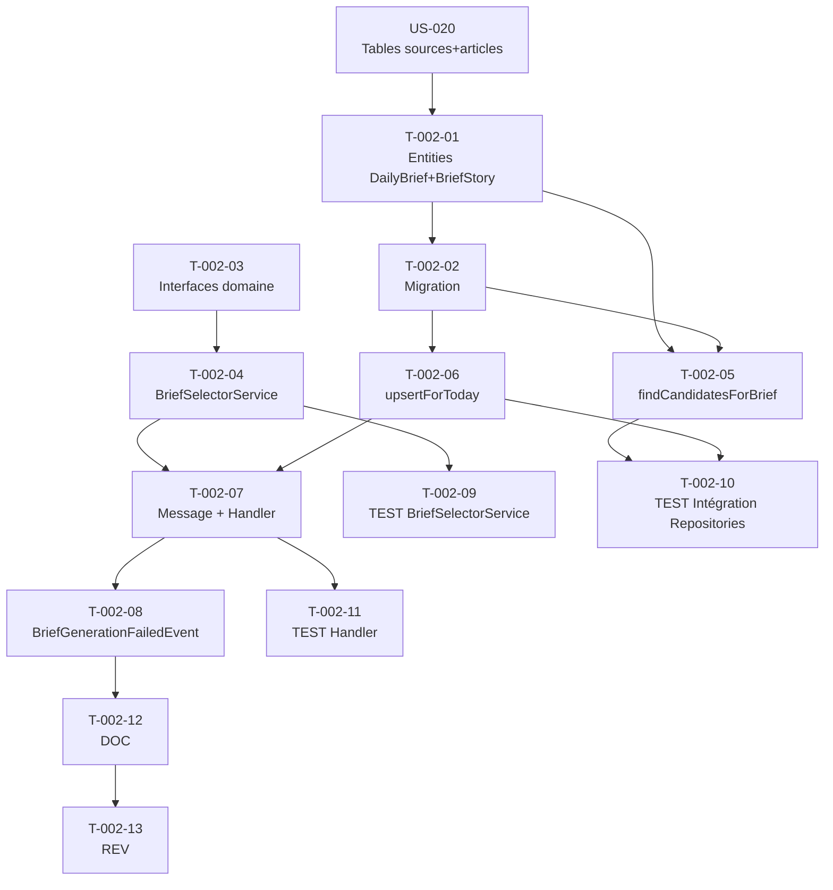

# US-002 — Tâches techniques : Sélection algorithmique des 3 histoires majeures

**User Story** : En tant que P-001 Thomas, je veux que le système sélectionne automatiquement les 3 histoires majeures du jour parmi les articles ingérés.
**Story Points** : 5 | **Sprint** : sprint-001
**Dépendances entrantes** : US-020 (articles en base)

---

## Tâches

| ID | Type | Description | Heures | Dépend de | Statut |
|----|------|-------------|--------|-----------|--------|
| T-002-01 | [DB] | Entité Doctrine `DailyBrief` (id UUID, date DATE, status ENUM pending/ready/error, updated_at TIMESTAMPTZ) + entité `BriefStory` (id UUID, brief_id FK, article_id FK, position SMALLINT 1-3, selection_score FLOAT) | 2h | US-020/T-020-03 | 🔲 |
| T-002-02 | [DB] | Migration Doctrine : tables `daily_briefs` + `brief_stories`, UNIQUE sur `(brief_id, position)`, index sur `daily_briefs.date` et `daily_briefs.status` | 1h | T-002-01 | 🔲 |
| T-002-03 | [BE] | Interfaces domaine : `DailyBriefRepositoryInterface` (findForDate, upsertForToday) + `ArticleCandidateRepositoryInterface` (findCandidatesForBrief) | 1h | — | 🔲 |
| T-002-04 | [BE] | `BriefSelectorService::selectTopStories(DateTimeImmutable $date): void` — algorithme de scoring composite : fraîcheur (0-40 pts, décroissant sur 24h), cluster distinct (+30 pts), source premium (+20 pts sinon +10), longueur >800 mots (+10 pts) ; sélection top 3 avec clusters distincts | 3h | T-002-03 | 🔲 |
| T-002-05 | [BE] | `DoctrineArticleRepository::findCandidatesForBrief(DateTimeImmutable $since)` : query articles des 24h, `is_full_text_accessible = true`, triés par score_hint pour limite SQL raisonnable | 2h | T-002-01, T-002-02 | 🔲 |
| T-002-06 | [BE] | `DailyBriefRepository::upsertForToday()` : INSERT INTO daily_briefs ON CONFLICT (date) DO UPDATE + DELETE/INSERT des BriefStories liées (idempotence complète) | 1.5h | T-002-02 | 🔲 |
| T-002-07 | [BE] | `GenerateDailyBriefMessage` (DTO Messenger : date_target DateString, sans données personnelles) + `GenerateDailyBriefHandler` (injecte `BriefSelectorService` + repositories, gère BriefGenerationFailedEvent si 0 articles) | 2h | T-002-04, T-002-06 | 🔲 |
| T-002-08 | [BE] | `BriefGenerationFailedEvent` (dispatché via Symfony EventDispatcher quand 0 articles disponibles) | 0.5h | T-002-07 | 🔲 |
| T-002-09 | [TEST] | Tests unitaires `BriefSelectorService` : nominal (3 clusters distincts → 3 BriefStories, scores > 0), 2 clusters seulement (2 stories + WARNING log), idempotence (re-run même date → UPDATE pas INSERT) | 2.5h | T-002-04 | 🔲 |
| T-002-10 | [TEST] | Tests intégration `DoctrineArticleRepository::findCandidatesForBrief()` + `DailyBriefRepository::upsertForToday()` (ON CONFLICT vérifié, updated_at rafraîchi) | 2h | T-002-05, T-002-06 | 🔲 |
| T-002-11 | [TEST] | Tests intégration `GenerateDailyBriefHandler` : 0 articles disponibles → `BriefGenerationFailedEvent` dispatché + log ERROR, timeout DB → message Messenger marqué failed | 1.5h | T-002-07 | 🔲 |
| T-002-12 | [DOC] | PHPDoc `BriefSelectorService`, interfaces `DailyBriefRepositoryInterface` + `ArticleCandidateRepositoryInterface`, algorithme de scoring commenté | 0.5h | T-002-08 | 🔲 |
| T-002-13 | [REV] | Code review US-002 (algorithme scoring isolé du domaine infrastructure, idempotence validée, pas de données personnelles dans les queries) | 1.5h | T-002-12 | 🔲 |

**Total US-002 : 13 tâches — 21h**

---

## Graphe de dépendances

---

## Notes techniques

- `BriefSelectorService` est une classe de domaine pur : aucune import Doctrine, aucun import Symfony. Il reçoit des `Article[]` déjà chargés via les interfaces.
- Sprint 1 : `cluster_id` des articles est `null` (non encore calculé). Le scoring cluster est désactivé (0 bonus) mais le code est écrit pour l'activer dès qu'EPIC-002 alimente le champ.
- Idempotence garantie : l'upsert efface les `BriefStories` existantes pour la date avant de réinsérer, ce qui est atomique dans une transaction.
- `selection_score` persisté pour futures analytics (EPIC-008).
