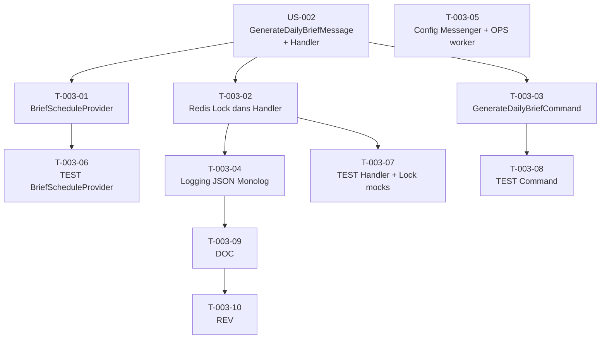

# US-003 — Tâches techniques : Planification automatique du batch Daily Brief — 5h UTC

**User Story** : En tant que P-001 Thomas, je veux que le Daily Brief soit automatiquement régénéré chaque matin à 5h00 UTC sans intervention humaine.
**Story Points** : 3 | **Sprint** : sprint-001
**Dépendances entrantes** : US-002 (`GenerateDailyBriefHandler` + `GenerateDailyBriefMessage` existants)

---

## Tâches

| ID | Type | Description | Heures | Dépend de | Statut |
|----|------|-------------|--------|-----------|--------|
| T-003-01 | [BE] | `BriefScheduleProvider` implémentant `ScheduleProviderInterface` : retourne un `RecurringMessage` avec `CronExpressionTrigger("0 5 * * *")` dispatçant `GenerateDailyBriefMessage` pour la date du jour UTC | 2h | US-002/T-002-07 | 🔲 |
| T-003-02 | [BE] | Intégration Redis Lock dans `GenerateDailyBriefHandler` : `TryLock` avec clé `briefly.daily_brief_generation` TTL 600s ; si lock non acquis → log INFO "brief.lock_already_acquired: skipped" + return ; si Redis KO → log WARNING + exécution sans lock (mode dégradé) | 2h | US-002/T-002-07 | 🔲 |
| T-003-03 | [BE] | `GenerateDailyBriefCommand` (`bin/console briefly:generate-daily-brief [--date=YYYY-MM-DD]`) : dispatche `GenerateDailyBriefMessage` et log `{"event": "brief.manual_trigger", "operator": "console"}` ; retourne exit code 0 si succès | 2h | US-002/T-002-07 | 🔲 |
| T-003-04 | [BE] | Logging structuré JSON Monolog (canal `briefly.scheduler`) : `brief.batch_start` (INFO), `brief.batch_success` (INFO + `duration_ms`), `brief.batch_failed` (ERROR), `brief.max_retries_exceeded` (ERROR) avec date sans données personnelles | 1h | T-003-02 | 🔲 |
| T-003-05 | [OPS] | Config Messenger `retry_strategy` dans `config/packages/messenger.yaml` : max 3 tentatives, backoff exponentiel (5 min, 10 min, 20 min), dead_letter_queue `failed` ; config worker dans `compose.override.yaml` (`messenger:consume async --time-limit=3600`) | 1h | — | 🔲 |
| T-003-06 | [TEST] | Tests unitaires `BriefScheduleProvider` : cron expression "0 5 * * *" correcte, message type `GenerateDailyBriefMessage`, trigger 7j/7 | 1h | T-003-01 | 🔲 |
| T-003-07 | [TEST] | Tests unitaires `GenerateDailyBriefHandler` avec Lock mocké : nominal (lock acquis → service exécuté → lock libéré), lock déjà acquis (TryLock false → log + return, service non appelé), Redis KO (LockStorageException → mode dégradé + WARNING log + service exécuté) | 1.5h | T-003-02 | 🔲 |
| T-003-08 | [TEST] | Tests unitaires `GenerateDailyBriefCommand` : exit code 0 sur succès, message dispatché, log `brief.manual_trigger` présent, option `--date=YYYY-MM-DD` acceptée | 1h | T-003-03 | 🔲 |
| T-003-09 | [DOC] | PHPDoc `BriefScheduleProvider`, `GenerateDailyBriefCommand`, commentaires Monolog dans `GenerateDailyBriefHandler` | 0.5h | T-003-04 | 🔲 |
| T-003-10 | [REV] | Code review US-003 (lock TryLock non bloquant validé, mode dégradé Redis testé, retry strategy config correcte, 0 données personnelles dans les messages Messenger) | 1h | T-003-09 | 🔲 |

**Total US-003 : 10 tâches — 13h**

---

## Graphe de dépendances

---

## Notes techniques

- `TryLock` (non bloquant) est obligatoire : `acquireLock()` bloquant provoquerait un blocage en cas de second trigger simultané.
- Le worker Docker doit être déclaré avec `--time-limit=3600` pour se relancer proprement (FrankenPHP restart automatique).
- La config Messenger retry doit placer les messages épuisés dans `failed` (Doctrine transport) pour inspection manuelle.
- Le Scheduler Symfony 7.x nécessite `symfony/scheduler` installé et `MESSENGER_TRANSPORT_DSN` configuré.
- US-003 est marqué "retirable en dernier recours" dans les risques sprint — ne pas bloquer US-001/US-002 sur cette US.
