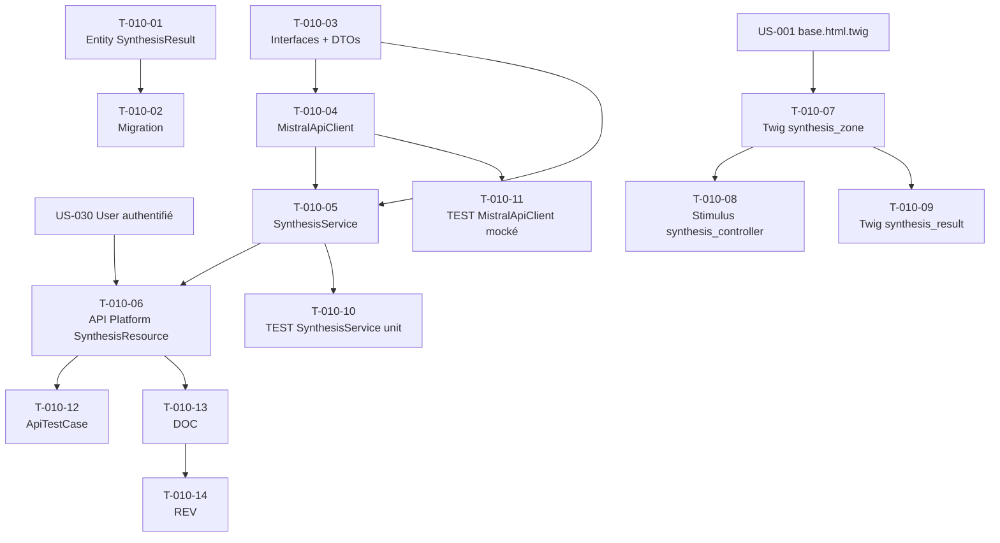

# US-010 — Tâches techniques : Synthèse IA à la demande sur URL

**User Story** : En tant que P-001 Thomas, je veux générer une synthèse IA d'un article depuis son URL en un clic.
**Story Points** : 5 | **Sprint** : sprint-001
**Dépendances entrantes** : US-001 (page brief existante + layout), US-030 (utilisateur authentifié)

---

## Tâches

| ID | Type | Description | Heures | Dépend de | Statut |
|----|------|-------------|--------|-----------|--------|
| T-010-01 | [DB] | Entité Doctrine `SynthesisResult` (id UUID, url_hash VARCHAR64, level VARCHAR16 default 'standard', content TEXT, key_points JSONB, sources JSONB, created_at TIMESTAMPTZ) sans FK utilisateur (RGPD — UUID seul) | 1.5h | — | 🔲 |
| T-010-02 | [DB] | Migration table `synthesis_results` + index sur `url_hash` et `created_at` | 0.5h | T-010-01 | 🔲 |
| T-010-03 | [BE] | Interfaces domaine : `SynthesisServiceInterface::synthesize(SynthesisRequest): SynthesisResponse` + `SynthesisRequest` DTO (url: string) + `SynthesisResponse` DTO (content, keyPoints[], sources[], originalUrl, isPartial: bool) | 1h | — | 🔲 |
| T-010-04 | [BE] | `MistralApiClient` (Infrastructure — `src/Infrastructure/Ai/`) : Symfony HttpClient, timeout 15s, prompt système contrôlant la sortie (~200 mots, 3 points clés numérotés 01/02/03, sources citées, langue article), JAMAIS de PII dans le prompt (assert CI) ; catch `TransportExceptionInterface` → `SynthesisUnavailableException` | 3h | T-010-03 | 🔲 |
| T-010-05 | [BE] | `SynthesisService` (Application — `src/Application/Synthesis/`) : validation SSRF de l'URL (filter_var FILTER_VALIDATE_URL + rejet IP privées RFC1918), fetch contenu HTTP (Symfony HttpClient), appel `MistralApiClient`, calcul `url_hash` SHA-256, persistence via `SynthesisResultRepository`, retourne `SynthesisResponse` préfixée "BRIEFLY AI:" | 2.5h | T-010-03, T-010-04 | 🔲 |
| T-010-06 | [BE] | API Platform `SynthesisResource` (POST `/api/v1/synthesis`) : `SynthesisRequest` en input, validation contrainte `@Assert\Url` + `@Assert\NotBlank`, `QuotaStateProcessor` en pré-processing (hook US-033), retour `SynthesisResponse` (JSON), HTTP 422 si URL invalide, HTTP 503 si Mistral KO, headers CSRF via config API Platform | 2h | T-010-05 | 🔲 |
| T-010-07 | [FE-WEB] | Twig partial `templates/brief/synthesis_zone.html.twig` : Turbo Frame `synthesis-result-{article_id}` contenant bouton "GENERATE AI SUMMARY" (data-action="synthesis#generate") | 1.5h | US-001/T-001-04 | 🔲 |
| T-010-08 | [FE-WEB] | Stimulus Controller `synthesis_controller.js` : action `generate()` — POST JSON vers `/api/v1/synthesis`, affiche skeleton loading (10s max timeout JS), met à jour le Turbo Frame avec le résultat ou le message d'erreur | 1.5h | T-010-07 | 🔲 |
| T-010-09 | [FE-WEB] | Twig partial `templates/brief/synthesis_result.html.twig` : affichage bloc "BRIEFLY AI:" + condensé + 3 points clés (01/02/03) + sources + lien "OUVRIR L'ORIGINAL" + mention "Contenu partiel" si `isPartial=true` | 1h | T-010-07 | 🔲 |
| T-010-10 | [TEST] | Tests unitaires `SynthesisService` : nominal (URL valide → `SynthesisResponse` avec "BRIEFLY AI:" prefix), SSRF bloqué (IP privée → exception sans appel Mistral), contenu partiel (paywall → `isPartial=true`), timeout Mistral → `SynthesisUnavailableException` | 2h | T-010-05 | 🔲 |
| T-010-11 | [TEST] | Tests unitaires `MistralApiClient` mocké (mock Symfony HttpClient) : parsing réponse JSON correcte, timeout → `SynthesisUnavailableException`, assert PII-free (aucun email/UUID user dans le prompt envoyé) | 1.5h | T-010-04 | 🔲 |
| T-010-12 | [TEST] | `ApiTestCase` POST `/api/v1/synthesis` : nominal 200 + `SynthesisResponse` schema valide, URL invalide 422, URL IP privée 422, Mistral KO 503 sans stacktrace ; vérification `synthesis_results` persisté en base | 2h | T-010-06 | 🔲 |
| T-010-13 | [DOC] | PHPDoc `SynthesisService`, `MistralApiClient`, `SynthesisServiceInterface`, `SynthesisRequest/Response` DTOs ; note sur l'absence de PII dans les prompts | 0.5h | T-010-06 | 🔲 |
| T-010-14 | [REV] | Code review US-010 (SSRF protection validée, PII absent des prompts Mistral, timeout 15s testé, url_hash sans données personnelles, API Platform schema valide) | 1.5h | T-010-13 | 🔲 |

**Total US-010 : 14 tâches — 22h**

---

## Graphe de dépendances

---

## Notes techniques

- PII protection (CI bloquant) : une assertion dans les tests vérifie que le prompt envoyé à Mistral ne contient aucun UUID utilisateur, email ou IP. Le `url_hash` (SHA-256) est utilisé à la place de l'URL brute dans les logs.
- SSRF : avant tout appel HTTP vers l'URL fournie par l'utilisateur, résoudre le hostname et rejeter toute IP RFC1918 (10.x.x.x, 192.168.x.x, 172.16-31.x.x) et loopback.
- Sprint 1 : pas de cache Redis (US-012), pas de fallback OpenAI (US-014), pas de quota (US-033 gère le quota dans le `QuotaStateProcessor` injecté dans la resource).
- `key_points` et `sources` stockés en JSONB PostgreSQL pour flexibilité future.
- La persistence est systématique (sans cache) pour traçabilité analytics Sprint 1.
