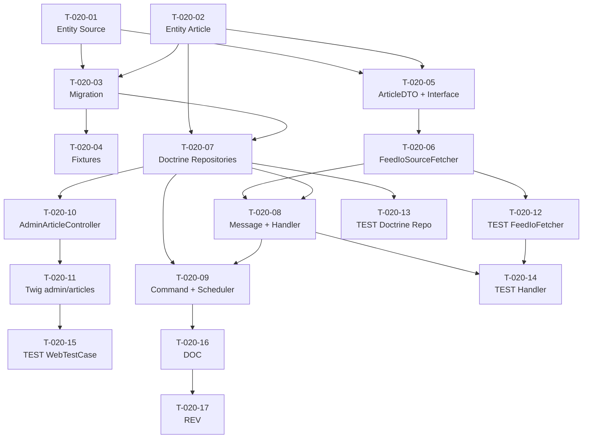

# US-020 — Tâches techniques : Pipeline RSS Walking Skeleton

**User Story** : En tant que P-001 Thomas, je veux que le système récupère et stocke automatiquement les articles de sources RSS fiables.
**Story Points** : 8 | **Sprint** : sprint-001
**Dépendances entrantes** : aucune (point d'entrée du sprint)

---

## Tâches

| ID | Type | Description | Heures | Dépend de | Statut |
|----|------|-------------|--------|-----------|--------|
| T-020-01 | [DB] | Entité Doctrine `Source` (id UUID, name, url, feed_type ENUM rss/atom, status ENUM active/inactive, last_fetched_at, last_error_at, etag, last_modified) + interface `SourceRepositoryInterface` dans le domaine | 2h | — | 🔲 |
| T-020-02 | [DB] | Entité Doctrine `Article` (id UUID, source_id FK, title, url, content_hash VARCHAR64 UNIQUE, published_at, raw_content TEXT, fetch_at, cluster_id VARCHAR64 nullable, is_full_text_accessible BOOLEAN) + interface `ArticleRepositoryInterface` | 2h | — | 🔲 |
| T-020-03 | [DB] | Migration Doctrine : création tables `sources` + `articles`, contrainte UNIQUE sur `articles.content_hash`, index sur `articles.published_at` et `articles.source_id` | 1h | T-020-01, T-020-02 | 🔲 |
| T-020-04 | [DB] | Fixtures Doctrine 3 sources RSS actives : TechCrunch (`https://techcrunch.com/feed/`), The Verge (`https://www.theverge.com/rss/index.xml`), Ars Technica (`https://feeds.arstechnica.com/arstechnica/index`) | 1h | T-020-03 | 🔲 |
| T-020-05 | [BE] | `ArticleDTO` (DTO de transfert : title, url, canonical_url, raw_content, published_at) + `SourceFetcherInterface::fetch(Source): ArticleDTO[]` dans le domaine | 1h | T-020-01, T-020-02 | 🔲 |
| T-020-06 | [BE] | `FeedIoSourceFetcher` (Infrastructure) : adapter FeedIo 6.x — HTTP GET avec User-Agent "BrieflyAI/1.0", parse Atom/RSS, normalisation URL (suppression UTM/fragment/trailing-slash), calcul SHA-256 content_hash, catch exception par source | 3h | T-020-05 | 🔲 |
| T-020-07 | [BE] | `DoctrineArticleRepository` (INSERT INTO articles ON CONFLICT content_hash DO NOTHING) + `DoctrineSourceRepository` (findAllActive, updateLastFetchedAt, updateLastErrorAt) | 2h | T-020-02, T-020-03 | 🔲 |
| T-020-08 | [BE] | `FetchSourceMessage` (DTO Messenger : source_id UUID) + `FetchSourceHandler` (consomme le message, appelle `SourceFetcherInterface`, persiste via `ArticleRepositoryInterface`, catch par source sans propagation) | 2h | T-020-06, T-020-07 | 🔲 |
| T-020-09 | [BE] | `FetchAllSourcesCommand` (console `briefly:fetch-all-sources`) + `#[AsScheduledTask(every: '15 minutes')]` Symfony Scheduler — publie un `FetchSourceMessage` par source active dans la queue `async` | 2h | T-020-07, T-020-08 | 🔲 |
| T-020-10 | [FE-WEB] | `AdminArticleController::index()` (GET `/admin/articles`, ROLE_ADMIN) + pagination 50/page via KnpPaginator ou Doctrine paginator | 1.5h | T-020-07 | 🔲 |
| T-020-11 | [FE-WEB] | Template Twig `admin/articles/index.html.twig` : tableau paginé (title, source.name, published_at, content_hash snippet), lien vers source originale | 1.5h | T-020-10 | 🔲 |
| T-020-12 | [TEST] | Tests unitaires `FeedIoSourceFetcher` : RSS valide → ArticleDTO[] correct, HTTP 503 → exception catchée, XML invalide → FeedException catchée, URL normalisée + SHA-256 calculé | 2h | T-020-06 | 🔲 |
| T-020-13 | [TEST] | Tests intégration `DoctrineArticleRepository` : insertion nominale, ON CONFLICT DO NOTHING (0 doublon sur même content_hash), count invariant sur re-run | 1.5h | T-020-07 | 🔲 |
| T-020-14 | [TEST] | Tests intégration `FetchSourceHandler` : nominal (articles insérés + last_fetched_at mis à jour), source HTTP 503 (last_error_at mis à jour, worker libéré), sources multiples traitées indépendamment | 2h | T-020-08, T-020-12 | 🔲 |
| T-020-15 | [TEST] | `WebTestCase` GET `/admin/articles` : 200 + liste paginée (ROLE_ADMIN), 403 sans rôle, pagination page 2 | 1h | T-020-11 | 🔲 |
| T-020-16 | [DOC] | PHPDoc sur `Source`, `Article` entities, `SourceFetcherInterface`, `ArticleRepositoryInterface`, `FetchSourceHandler` | 0.5h | T-020-09 | 🔲 |
| T-020-17 | [REV] | Code review US-020 (architecture hexagonale respectée, pas de FeedIo dans le domaine, SHA-256 correct, ON CONFLICT validé) | 1.5h | T-020-16 | 🔲 |

**Total US-020 : 17 tâches — 28h**

---

## Graphe de dépendances

---

## Notes techniques

- `content_hash` = SHA-256 de l'URL canonique (pas du contenu brut) — décision US-020 conversation.
- Architecture hexagonale : `FeedIo` est dans `src/Infrastructure/Feed/`, jamais importé dans `src/Domain/`.
- `cluster_id` initialisé à `null` en Sprint 1 — pré-calculé par EPIC-002 (US-016) dans un sprint ultérieur.
- `is_full_text_accessible` initialisé à `true` par défaut en Sprint 1 (simplifié).
- La commande `briefly:fetch-all-sources` et le `#[AsScheduledTask]` cohabitent : la commande peut être invoquée manuellement en dehors du cycle Scheduler.
