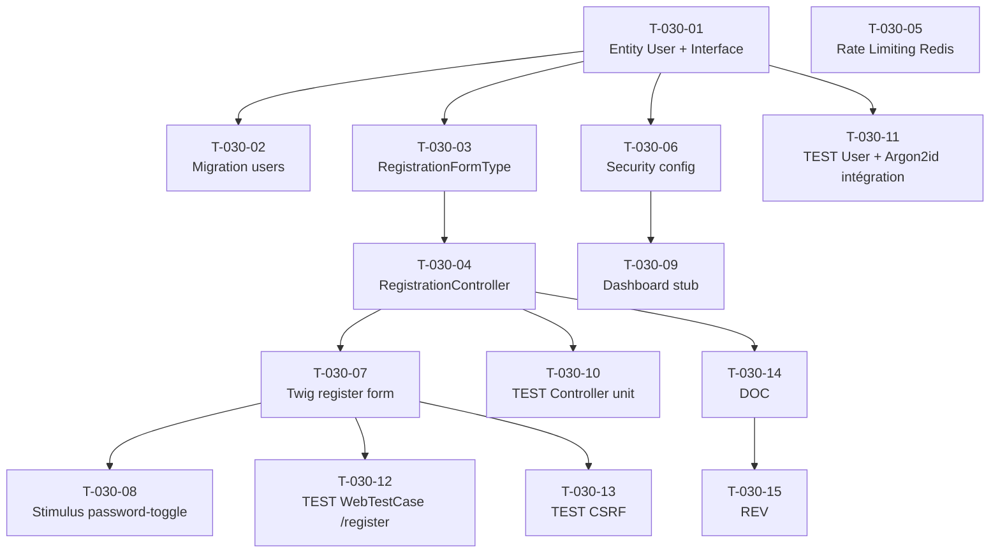

# US-030 — Tâches techniques : Inscription par email avec mot de passe sécurisé

**User Story** : En tant que tout visiteur non authentifié, je veux créer un compte avec mon adresse email et un mot de passe fort.
**Story Points** : 5 | **Sprint** : sprint-001
**Dépendances entrantes** : aucune (US indépendante)

---

## Tâches

| ID | Type | Description | Heures | Dépend de | Statut |
|----|------|-------------|--------|-----------|--------|
| T-030-01 | [DB] | Entité Doctrine `User` implémentant `UserInterface` + `PasswordAuthenticatedUserInterface` (id UUID v7, email VARCHAR255 UNIQUE NOT NULL, password_hash VARCHAR255, full_name VARCHAR255, created_at TIMESTAMPTZ, consent_at TIMESTAMPTZ) + `UserRepositoryInterface` dans le domaine | 2h | — | 🔲 |
| T-030-02 | [DB] | Migration table `users` : UNIQUE sur `email`, index sur `email`, ON DELETE CASCADE préparé pour les futures FK ; type UUID v7 (extension `pgcrypto` si nécessaire) | 0.5h | T-030-01 | 🔲 |
| T-030-03 | [BE] | `RegistrationFormType` : champs `email` (EmailType), `fullName` (TextType), `plainPassword` (PasswordType, mapped:false), `consentCgu` (CheckboxType, mapped:false) + contraintes Validator : `NotBlank`, `Email`, `UniqueEntity(email)`, `Length(min:12)`, `Regex` (majuscule + minuscule + chiffre + caractère spécial) | 2h | T-030-01 | 🔲 |
| T-030-04 | [BE] | `RegistrationController::register()` (GET/POST `/register`) : instancie `User`, hashe avec `UserPasswordHasher` Argon2id (memory=131072, time=3, parallelism=1), horodate `consent_at` UTC, persiste via `UserRepository`, ouvre session via `UserAuthenticator`, flash "Bienvenue sur Briefly AI !", redirect 302 `/dashboard` | 2h | T-030-03 | 🔲 |
| T-030-05 | [BE] | Rate limiting Redis sur `/register` : `RateLimiterFactory` (sliding window, 10 requêtes/1h/IP) via `config/packages/rate_limiter.yaml` ; `EventSubscriber` ou middleware contrôlant le rate limit avant traitement du POST ; réponse HTTP 429 + header `Retry-After` | 1.5h | — | 🔲 |
| T-030-06 | [BE] | Config Symfony Security `security.yaml` : firewall `main` (lazy, form_login), provider `users_in_memory` remplacé par `entity` (User::class, email), login path `/login`, default_target `/dashboard`, logout `/logout` | 1h | T-030-01 | 🔲 |
| T-030-07 | [FE-WEB] | Template `templates/registration/register.html.twig` : formulaire (email, fullName, password + toggle, consentCgu checkbox), lien CGU + politique de confidentialité (`/legal/cgu`, `/legal/privacy`), lien "Déjà un compte ? Se connecter", affichage erreurs de validation par champ, message flash succès | 1.5h | T-030-04 | 🔲 |
| T-030-08 | [FE-WEB] | Stimulus Controller `password_toggle_controller.js` : action `toggle()` bascule `input[type="password"]` ↔ `input[type="text"]`, met à jour aria-label et icône ; 0 requête réseau lors du toggle | 1h | T-030-07 | 🔲 |
| T-030-09 | [FE-WEB] | Page `/dashboard` stub : template `templates/dashboard/index.html.twig`, affichage message flash "Bienvenue sur Briefly AI !", lien vers `/brief`, nécessite ROLE_USER | 0.5h | T-030-06 | 🔲 |
| T-030-10 | [TEST] | Tests unitaires `RegistrationController` : inscription réussie (User créé, password_hash Argon2id, consent_at non null, redirect 302), email dupliqué (formulaire renvoyé 200, message UniqueEntity, 0 INSERT), mot de passe faible < 12 chars (erreur validation 200, 0 INSERT) | 2h | T-030-04 | 🔲 |
| T-030-11 | [TEST] | Tests intégration `User` + `UserPasswordHasher` : vérification que `password_hash` commence par `$argon2id$`, `consent_at` renseigné en UTC, UUID v7 généré (non séquentiel), contrainte UNIQUE email vérifiée en DB | 1.5h | T-030-01 | 🔲 |
| T-030-12 | [TEST] | `WebTestCase` POST `/register` : nominal (User créé, redirect /dashboard, flash présent), email dupliqué (200 + message erreur sans fuite), mot de passe faible (422 + message spécifique), case CGU non cochée (erreur validation), rate limit 11e requête → HTTP 429 + Retry-After | 2h | T-030-07 | 🔲 |
| T-030-13 | [TEST] | `WebTestCase` CSRF : POST `/register` sans token CSRF → HTTP 422 (ou 400), token invalide → rejet ; vérification que le token est bien présent dans le rendu du formulaire | 0.5h | T-030-07 | 🔲 |
| T-030-14 | [DOC] | PHPDoc `User` entity, `RegistrationController`, `UserRepositoryInterface`, `RegistrationFormType` (contraintes documentées) | 0.5h | T-030-04 | 🔲 |
| T-030-15 | [REV] | Code review US-030 (Argon2id config vérifiée, consent_at UTC présent, UUID v7 non séquentiel, CSRF actif, rate limit 429 testé, 0 données dans les logs) | 1.5h | T-030-14 | 🔲 |

**Total US-030 : 15 tâches — 20h**

---

## Graphe de dépendances

---

## Notes techniques

- UUID v7 : utiliser `symfony/uid` (`Uuid::v7()`). La migration doit utiliser `gen_random_uuid()` PostgreSQL ou laisser Doctrine gérer.
- Argon2id params : `memory_cost: 131072` (128 MiB), `time_cost: 3`, `threads: 1` dans `config/packages/security.yaml` sous `password_hashers`.
- Pas de vérification email (lien de confirmation) en Sprint 1 — accès immédiat après inscription. Planifié en v1.1.
- Les pages `/legal/cgu` et `/legal/privacy` sont des stubs statiques Twig en Sprint 1 (non ticketées séparément).
- Le `UserAuthenticator` ouvre la session directement après inscription, évitant une double redirection vers `/login`.
- RGPD : `consent_at` horodaté UTC en base = preuve légale du consentement RGPD lors de l'inscription.
