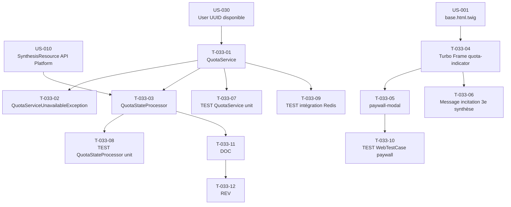

# US-033 — Tâches techniques : Quota quotidien de synthèses et paywall placeholder

**User Story** : En tant que P-001 Thomas avec un compte free, je veux voir en temps réel le nombre de synthèses restantes et recevoir un message clair quand j'atteins la limite.
**Story Points** : 5 | **Sprint** : sprint-001
**Dépendances entrantes** : US-030 (User authentifié avec UUID), US-010 (SynthesisResource API Platform)

---

## Tâches

| ID | Type | Description | Heures | Dépend de | Statut |
|----|------|-------------|--------|-----------|--------|
| T-033-01 | [BE] | `QuotaService::consumeOrDeny(string $userUuid): bool` (Application) : clé Redis `quota:synthesis:{uuid}:{YYYY-MM-DD-UTC}` ; INCR si valeur ≤ 3 → retourne true ; si valeur > 3 → retourne false sans INCR ; EXPIREAT positionné à la prochaine minuit UTC (calcul dynamique du timestamp) ; retourne le compteur courant via `QuotaService::getRemaining(string $userUuid): int` | 2.5h | US-030/T-030-01 | 🔲 |
| T-033-02 | [BE] | `QuotaServiceUnavailableException` (domaine — `src/Domain/Quota/`) : levée quand Redis est inaccessible (catch `RedisException` dans `QuotaService`) | 0.5h | T-033-01 | 🔲 |
| T-033-03 | [BE] | `QuotaStateProcessor` implémentant `ProcessorInterface` API Platform : décorateur du processor de `SynthesisResource`  ; vérifie `QuotaService::consumeOrDeny()` avant toute génération IA ; si false → HTTP 429 + header `X-Quota-Remaining: 0` + corps `{"error": "quota_exceeded", "remaining": 0}` ; si `QuotaServiceUnavailableException` → HTTP 503 sans bypass | 2h | T-033-01, US-010/T-010-06 | 🔲 |
| T-033-04 | [FE-WEB] | Turbo Frame `quota-indicator` dans `templates/base.html.twig` (header) : endpoint GET `/api/v1/quota` retournant `{"used": N, "limit": 3, "remaining": R}` ; template Twig affichant "N / 3 synthèses utilisées" ; rafraîchissement du frame après chaque génération (Turbo Stream ou re-fetch) | 1.5h | US-001/T-001-04 | 🔲 |
| T-033-05 | [FE-WEB] | Turbo Frame `paywall-modal` : déclenché par la réponse HTTP 429 dans le Stimulus Controller `synthesis` ; template `templates/quota/paywall_modal.html.twig` avec message "Vous avez utilisé vos 3 synthèses gratuites aujourd'hui", CTA "Passer à Briefly Premium — 12€/mois" (bouton désactivé `disabled` Sprint 1 — placeholder) | 1.5h | T-033-04 | 🔲 |
| T-033-06 | [FE-WEB] | Message d'incitation à la 3e synthèse dans `templates/brief/synthesis_result.html.twig` : quand `remaining = 0` après génération, afficher "Accès illimité avec Briefly Premium – 12€/mois" + lien "Découvrir Briefly Premium" (`disabled` Sprint 1) | 1h | T-033-04 | 🔲 |
| T-033-07 | [TEST] | Tests unitaires `QuotaService` avec Redis mock : 1re synthèse → INCR → 1 → true, 3e → INCR → 3 → true, 4e tentative → false + clé Redis reste à 3, reset minuit UTC (nouvelle date → nouvelle clé → INCR 1), EXPIREAT pointant minuit UTC + 1 sec (vérification calcul timestamp) | 2h | T-033-01 | 🔲 |
| T-033-08 | [TEST] | Tests unitaires `QuotaStateProcessor` avec QuotaService mocké : quota OK → processor délégué → 200, quota dépassé → 429 + header `X-Quota-Remaining: 0`, QuotaServiceUnavailableException → 503 sans générer de synthèse | 1.5h | T-033-03 | 🔲 |
| T-033-09 | [TEST] | Tests intégration `QuotaService` avec Redis réel (test container ou Redis de test) : INCR atomique, EXPIREAT à minuit UTC correct (timestamp), reset au changement de date UTC, concurrence (2 requêtes simultanées → compteur = 2) | 2h | T-033-01 | 🔲 |
| T-033-10 | [TEST] | `WebTestCase` : génération 4e synthèse → HTTP 429 + Turbo Frame `paywall-modal` injecté, header `X-Quota-Remaining: 0` présent, clé Redis non incrémentée après le rejet | 1h | T-033-05 | 🔲 |
| T-033-11 | [DOC] | PHPDoc `QuotaService`, `QuotaStateProcessor`, `QuotaServiceUnavailableException` ; note RGPD (clé Redis contient UUID uniquement, jamais email/IP) | 0.5h | T-033-03 | 🔲 |
| T-033-12 | [REV] | Code review US-033 (clé Redis sans données personnelles validée, EXPIREAT minuit UTC testé, mode fail-safe 503 Redis KO, CTA Premium placeholder non fonctionnel confirmé) | 1.5h | T-033-11 | 🔲 |

**Total US-033 : 12 tâches — 17.5h**

---

## Graphe de dépendances

---

## Notes techniques

- RGPD critique : la clé Redis `quota:synthesis:{uuid}:{date}` ne contient que l'UUID (non réversible vers l'email). Aucune FK vers `users` ni dans Redis ni en base.
- `EXPIREAT` calcul : `new DateTimeImmutable('tomorrow 00:00:00', new DateTimeZone('UTC'))->getTimestamp()` — vérifier en DST.
- Fail-safe : Redis KO → HTTP 503 (pas de bypass du quota). La synthèse n'est jamais générée si le quota ne peut être vérifié.
- Le `QuotaStateProcessor` est un décorateur injecté AVANT le processor de génération Mistral, pas un Event Listener.
- Sprint 1 : le CTA Stripe est rendu `disabled` dans le HTML (`<button disabled>` ou `<a href="#" aria-disabled="true">`). Stripe implémenté en US-034.
- Endpoint GET `/api/v1/quota` retourne le `remaining` calculé (3 - used) pour le Turbo Frame header. Authentification requise (ROLE_USER).
