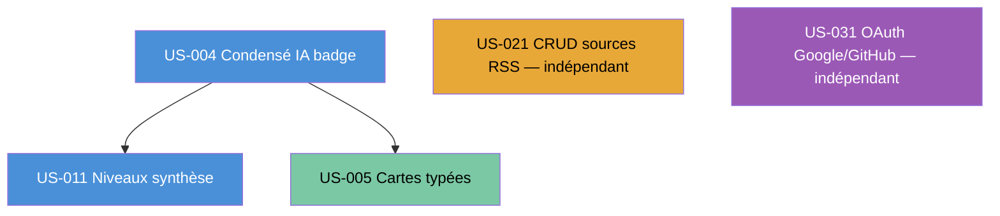

# Sprint 002 — Enrichissement

## Sprint Goal

> **Enrichir le Daily Brief avec des condensés IA par article et des cartes typées par catégorie, offrir plusieurs niveaux de synthèse, ouvrir l'authentification sociale OAuth et donner à l'admin le contrôle des sources RSS — passant du Walking Skeleton à une expérience produit complète.**

---

## Dates

| Evénement | Date |
|-----------|------|
| Début Sprint | 2026-08-11 |
| Fin Sprint | 2026-08-24 |
| Review / Rétro | 2026-08-24 |

---

## Périmètre (User Stories en scope)

| ID | Titre | EPIC | Points | Persona |
|----|-------|------|--------|---------|
| US-004 | Condensé IA par article avec badge et traçabilité source | EPIC-001 | 5 | P-001 |
| US-011 | Niveaux de synthèse (concis / standard / détaillé) | EPIC-002 | 5 | P-001 |
| US-005 | Cartes typées par catégorie éditoriale | EPIC-001 | 3 | P-001 |
| US-021 | CRUD des sources RSS (back-office admin) | EPIC-003 | 5 | P-004 Sophie Admin |
| US-031 | Authentification OAuth Google / GitHub | EPIC-004 | 5 | P-001/02/03 |

**Total Sprint 2 : 23 story points**

### Ordre de réalisation recommandé

**Justification de l'ordre :**
- US-004 en premier : la couche de condensé IA (prompt Mistral + cache Redis sha256 + badge) est le socle partagé par US-011 (qui étend les niveaux) et US-005 (qui exploite la catégorie d'article).
- US-011 juste après US-004 : les niveaux concis/standard/détaillé réutilisent le `SummaryService` créé pour US-004 ; livrer les deux en séquence évite un double-refactoring.
- US-005 après US-004 : les cartes typées dépendent des templates de brief déjà enrichis par les condensés IA.
- US-021 indépendant : le CRUD admin (back-office) n'a aucune dépendance sur les US d'enrichissement ; peut être développé en parallèle dès J1.
- US-031 indépendant : l'OAuth n'a aucune dépendance fonctionnelle sur les autres US du sprint ; peut être développé en parallèle sur une branche dédiée.

---

## Cérémonies

### Sprint Planning — Part 1 (QUOI) — 2h

**Animateur** : Tech Lead (Scrum Master)
**Participants** : PO + équipe dev

- Présentation et validation du Sprint Goal par le PO
- Revue de chaque US : critères d'acceptance Gherkin, questions de clarification
- Confirmation que les US respectent la Definition of Ready (INVEST + 3C + 5 scénarios Gherkin)
- Engagement collectif sur le périmètre (23 pts)

**Questions à lever en Part 1 :**
- Credentials OAuth Google (Client ID/Secret) disponibles pour l'environnement de dev ?
- Credentials OAuth GitHub (App ID/Secret) disponibles pour l'environnement de dev ?
- Clé Mistral dédiée dev pour les condensés IA (US-004/011) disponible ?
- Compte admin de test (P-004 Sophie) créé et accessible en base de dev ?
- Templates Stitch sprint-002 référencés et accessibles (projet `7076573032400883843`) ?

### Sprint Planning — Part 2 (COMMENT) — 2h

**Animateur** : Tech Lead
**Participants** : équipe dev

- Décomposition de chaque US en tâches techniques (`/project:decompose-tasks 002`)
- Estimation des tâches en heures (0,5h — 8h max)
- Graphe de dépendances inter-tâches (Mermaid)
- Identification des risques techniques (voir section Risques)
- Construction du Task Board initial

### Daily Scrum — 15 min (chaque jour ouvré)

**Format** : Stand-up synchrone (ou asynchrone écrit si équipe distribuée)

1. Qu'ai-je fait hier qui fait avancer le Sprint Goal ?
2. Que vais-je faire aujourd'hui ?
3. Quels obstacles m'en empêchent ?

**Rôle Tech Lead** : observer, noter les blocages, supprimer les impediments dans l'heure.

### Sprint Review — 2h (2026-08-24)

**Participants** : équipe + PO + stakeholders

Démonstrations livrées :
1. Daily Brief avec condensé IA par article : badge « BRIEFLY AI: » + traçabilité source visible (US-004)
2. Sélecteur de niveau de synthèse (concis / standard / détaillé) fonctionnel (US-011)
3. Cartes typées par catégorie éditoriale affichées sur le Brief (US-005)
4. Back-office admin : liste / création / édition / suppression de sources RSS avec validation SSRF (US-021)
5. Login OAuth Google et GitHub fonctionnel, session desktop + token mobile EdDSA/ES256 (US-031)

**Critère de succès** : toute la chaîne fonctionne de bout en bout en live demo, sans scripts de contournement. Le Daily Brief post-Sprint 2 doit être perceptiblement plus riche et plus rapide à consommer que le Walking Skeleton du Sprint 1.

### Rétrospective — 1h30 (2026-08-24, après la Review)

**Animateur** : Tech Lead (Scrum Master)
**Technique** : Étoile de Mer (Starfish)

**Directive Fondamentale :**
> "Peu importe ce que nous découvrons, nous comprenons et croyons sincèrement
> que tout le monde a fait le meilleur travail possible, compte tenu de ce qu'il
> savait à ce moment-là, de ses compétences et aptitudes, des ressources
> disponibles et de la situation du moment."
> — Norm Kerth, *Project Retrospectives*

Format :
- 5 min : rappel de la directive, création de la sécurité psychologique
- 15 min : chacun complète l'Étoile de Mer (Start / Stop / Continue / Plus de / Moins de)
- 20 min : regroupement et lecture collective
- 30 min : vote par points (dot voting) sur les 2-3 thèmes prioritaires
- 20 min : plan d'action SMART pour Sprint 3 (responsable + échéance)

**Actions minimales à définir en rétro :**
- 1 action sur le processus (ex. : revue de qualité des condensés IA)
- 1 action sur l'outillage ou la technique (ex. : monitoring quota Mistral)
- 1 action sur la collaboration (ex. : partage des screens Stitch en début de US UI)

### Affinage Backlog (Backlog Refinement) — en continu

**Durée** : max 10% de la capacité du sprint (environ 4h sur 2 semaines)
**Timing recommandé** : deux sessions de 2h en milieu de sprint (J+4 et J+8)

Objectif pour Sprint 3 :
- Raffiner US-006 (Featured Summary CTA), US-007 (Indicateur progression lecture), US-012 (Cache Redis synthèses), US-022 (Déduplication SimHash), US-032 (Profil utilisateur)
- Vérifier INVEST + 5 scénarios Gherkin min sur chaque US
- Estimer les US non estimées

---

## Definition of Done — Sprint 2

> Pour être marquée DONE, chaque US du Sprint 2 doit satisfaire TOUS les critères suivants (DoD Sprint 1 reconduite + critères additionnels Sprint 2).

### Code
- [ ] Code écrit et fonctionnel (pas de stub vide)
- [ ] PSR-12 respecté (PHP CS Fixer : 0 diff)
- [ ] PHPStan niveau max : 0 erreur
- [ ] Architecture hexagonale : pas de fuite d'infrastructure dans le domaine
- [ ] Pas de code mort, pas de TODO non ticketé
- [ ] UUID v4 non séquentiels sur toutes les nouvelles entités (cf ADR-006)

### Tests
- [ ] Couverture de code >= 80% (unitaires + intégration)
- [ ] PHPUnit : Unit + Integration + ApiTestCase pour les endpoints
- [ ] Tests passants en CI (GitHub Actions)
- [ ] 0 test commenté, 0 test skip non justifié

### Sécurité OWASP (obligatoire Sprint 2)
- [ ] Voters Symfony sur chaque opération protégée (admin ROLE_ADMIN sur US-021)
- [ ] CSRF actif sur tous les formulaires Twig
- [ ] Rate limiting Redis sur /login et /oauth/callback
- [ ] Headers sécurité : CSP, HSTS, X-Frame-Options, X-Content-Type-Options
- [ ] OAuth : tokens stockés avec EdDSA/ES256 pour mobile — jamais HS256 (cf règle 11-security)
- [ ] OAuth : session sécurisée desktop (httpOnly, secure, sameSite=strict)
- [ ] 0 donnée personnelle (email, nom, IP) dans les prompts Mistral (assert CI bloquant) — INV-6
- [ ] Cache Redis keyed sur sha256(url) uniquement — aucun identifiant utilisateur
- [ ] Validation SSRF stricte sur toutes les URLs de sources RSS soumises par l'admin (US-021)
- [ ] Fallback OpenAI activable par variable d'environnement si quota Mistral dépassé (US-004/011)
- [ ] 0 secret en dur (variables d'environnement uniquement)

### Vertical Slice
- [ ] Symfony Controller → Service domaine → Repository Doctrine → PostgreSQL
- [ ] Turbo Frames/Streams fonctionnels sur les actions dynamiques
- [ ] API Platform endpoint(s) documenté(s) (OpenAPI générée sans erreur)

### UI Stitch (critère additionnel Sprint 2 — INV-7 / ADR-011)
- [ ] Toute US comportant une interface visuelle correspond à l'écran Stitch référencé (projet `7076573032400883843`)
- [ ] Conformité WCAG 2.1 AA (badges IA : texte + icône, jamais couleur seule — INV-4)
- [ ] Lighthouse Performance >= 90 sur les pages modifiées (Chrome headless en CI)
- [ ] Aucune valeur de design (couleur, typographie, espacement) codée en dur hors des tokens versionnés (`design/design-tokens.md`)

### RGPD (minimal Sprint 2)
- [ ] 0 email, nom ou identifiant utilisateur transmis aux LLM (Mistral / OpenAI)
- [ ] Quota Redis sans FK utilisateur dans les clés (UUID uniquement)
- [ ] 0 identifiant utilisateur dans les messages Messenger
- [ ] Données OAuth (access_token provider) stockées chiffrées au repos ou non persistées

### Documentation
- [ ] PHPDoc sur les services et interfaces publics
- [ ] Critères d'acceptance Gherkin passés en revue (US marquée DONE = scénarios validés)

### Review
- [ ] Code review approuvée par >= 1 pair
- [ ] Pas de commentaire bloquant ouvert

### CI/CD
- [ ] Pipeline CI verte (test + PHPStan + CS Fixer + Lighthouse)
- [ ] Pas de régression sur les US précédemment DONE (Sprint 1)

---

## Hypothèse Produit Validée par ce Sprint

> **Hypothèse** : Un utilisateur (P-001 Thomas) qui accède au Daily Brief enrichi — condensés IA par article, cartes typées par catégorie, niveaux de synthèse choisis — et qui peut s'inscrire via son compte Google ou GitHub en moins de 30 s, percevra une valeur « fort signal, faible bruit » nettement supérieure au Walking Skeleton et acceptera de revenir J+1 et J+7.

**Métriques de validation (à mesurer en Review) :**
- Toute la chaîne condensé IA → badge → carte typée fonctionne de bout en bout
- Temps de génération d'un condensé IA (Mistral) < 3 s (P95)
- Cache Redis sha256 : taux de hit >= 60% en démo (articles revus)
- Sélecteur de niveau (concis/standard/détaillé) change la réponse sans rechargement complet
- Login OAuth Google ou GitHub < 30 s, de zéro à session active
- Admin peut ajouter une source RSS valide en < 2 min, sans erreur SSRF
- Lighthouse Performance >= 90 sur `/brief` après les enrichissements

---

## Risques Identifiés Sprint 2

| Risque | Probabilité | Impact | Mitigation |
|--------|-------------|--------|------------|
| Quota Mistral EU atteint en dev (condensés US-004 + US-011 en parallèle) | Moyen | Élevé | Fallback OpenAI par variable d'env ; mock `MistralApiClient` dans les tests CI |
| OAuth Google : domaine de callback non whitelisté sur la console GCP | Moyen | Élevé | Vérifier credentials et redirect URIs dès J1 (voir pre-sprint-checklist) |
| OAuth GitHub : App ID non créé ou secret expiré | Faible | Élevé | Idem — checklist pré-sprint obligatoire |
| Validation SSRF insuffisante sur US-021 (injection URL interne) | Faible | Critique | Voter `ROLE_ADMIN` + blocklist RFC-1918 + allowlist schémas http/https uniquement |
| Régression Sprint 1 (Pipeline RSS / Inscription) lors des refactorings OAuth | Moyen | Moyen | Tests de régression PHPUnit complets + CI bloquante avant merge |
| Lighthouse < 90 après ajout des condensés IA (JS supplémentaire) | Moyen | Moyen | Lazy-load Turbo Frames pour les condensés ; critère CI bloquant |
| Capacité équipe (23 pts + dettes Sprint 1 éventuelles) | Faible | Moyen | US-005 (3 pts) retirable en dernier recours sans casser les autres US |
