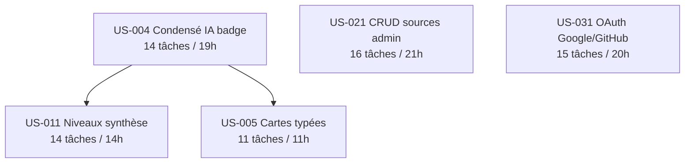

# Tâches — Sprint 002 Enrichissement

> **Sprint Goal** : Enrichir le Daily Brief avec des condensés IA par article et des cartes typées par catégorie, offrir plusieurs niveaux de synthèse, ouvrir l'authentification sociale OAuth et donner à l'admin le contrôle des sources RSS.

**Période** : 2026-08-11 → 2026-08-24 | **Vélocité cible** : 23 points

---

## Vue d'ensemble par US

| US | Titre | Points | Tâches | Heures | Ordre |
|----|-------|--------|--------|--------|-------|
| [US-004](./US-004-tasks.md) | Condensé IA par article (badge BRIEFLY AI:) | 5 | 14 | 19h | 1er |
| [US-011](./US-011-tasks.md) | Niveaux de synthèse (Concise / Detailed / Narrative) | 5 | 14 | 14h | 2e (après US-004) |
| [US-005](./US-005-tasks.md) | Cartes typées par catégorie éditoriale | 3 | 11 | 11h | 3e (après US-004) |
| [US-021](./US-021-tasks.md) | CRUD des sources RSS (back-office admin) | 5 | 16 | 21h | Parallèle dès J1 |
| [US-031](./US-031-tasks.md) | Authentification OAuth Google / GitHub | 5 | 15 | 20h | Parallèle dès J1 |

**Total Sprint 2 : 70 tâches — 85h estimées — 23 story points**

---

## Répartition par type de tâche

| Type | Tâches | Heures | % heures |
|------|--------|--------|----------|
| [DB] | 10 | 8h | 9% |
| [BE] | 30 | 44h | 52% |
| [FE-WEB] | 13 | 16.5h | 19% |
| [TEST] | 13 | 15.5h | 18% |
| [DOC] | 5 | 2.5h | 3% |
| [REV] | 5 | 5.5h | 6% |
| **TOTAL** | **70** | **85h** | **100%** |

---

## Dépendances inter-US

> US-021 et US-031 sont indépendantes — peuvent être développées en parallèle dès le premier jour du sprint.

---

## Fichiers de tâches

- [US-004 — Condensé IA badge](./US-004-tasks.md) — 14 tâches, 19h
- [US-011 — Niveaux de synthèse](./US-011-tasks.md) — 14 tâches, 14h
- [US-005 — Cartes typées catégorie](./US-005-tasks.md) — 11 tâches, 11h
- [US-021 — CRUD sources admin](./US-021-tasks.md) — 16 tâches, 21h
- [US-031 — OAuth Google / GitHub](./US-031-tasks.md) — 15 tâches, 20h

---

## Conventions

| Élément | Format | Exemple |
|---------|--------|---------|
| ID tâche | T-[US]-[Numéro 2 chiffres] | T-004-07 |
| Taille | 0.5h – 8h max | 2.5h |
| Statut | 🔲 / 🔄 / 👀 / ✅ / 🚫 | 🔲 À faire |
| Type | [DB] / [BE] / [FE-WEB] / [TEST] / [DOC] / [REV] | [BE] |

---

## Risques techniques identifiés

| Risque | US | Tâche(s) concernée(s) | Mitigation |
|--------|----|-----------------------|------------|
| Quota Mistral atteint (condensés + classification + niveaux en parallèle) | US-004, US-005, US-011 | T-004-04, T-005-03, T-011-04 | Mock `MistralApiClient` dans les tests CI ; fallback OpenAI pour US-004 |
| OAuth Google : redirect URI non whitelistée en dev (console GCP) | US-031 | T-031-03, T-031-07 | Vérifier credentials J1 (pre-sprint-checklist.md) |
| Migration `synthesis_results.level` déjà créée en US-010 (doublon) | US-011 | T-011-01 | Vérifier la migration existante avant de lancer T-011-01 |
| SSRF insuffisant sur US-021 (injection URL interne) | US-021 | T-021-07 | `SsrfSafeUrlConstraint` RFC-1918 blocklist + test dédié |
| Régression Sprint 1 (pipeline RSS, inscription) lors des enrichissements | Toutes | — | Suite tests PHPUnit complète + CI bloquante avant merge |

---

## Definition of Done rappel (Sprint 2)

Chaque tâche [REV] valide que sa US satisfait :
- Code fonctionnel + PSR-12 + PHPStan max
- Couverture >= 80% (unit + intégration)
- 0 PII dans les prompts Mistral (assert CI bloquant)
- CSRF actif sur tous les formulaires POST
- Voters Symfony sur les opérations protégées
- Twig `| e` sur tout contenu IA (XSS)
- Design tokens (pas de valeurs codées en dur)
- Pipeline CI verte (PHPStan + CS Fixer + Tests + Lighthouse >= 90)
