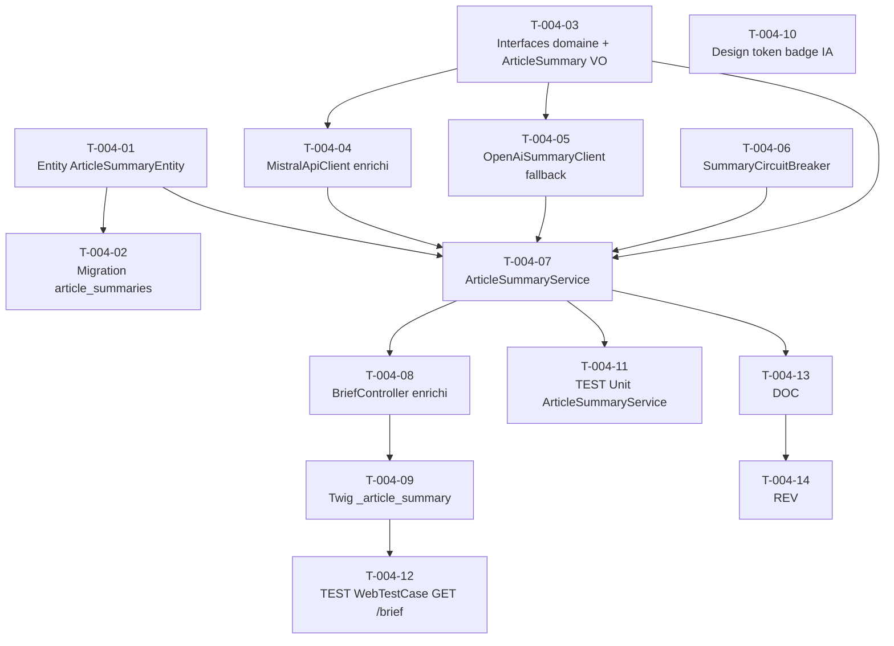

# US-004 — Tâches techniques : Condensé IA par article avec badge et traçabilité source

**User Story** : En tant que P-001 Thomas, je veux voir un condensé IA de 3 à 4 puces au début de chaque article du Daily Brief, avec le badge "BRIEFLY AI:" et l'icône auto_awesome, accompagné d'un lien "OUVRIR L'ORIGINAL".
**Story Points** : 5 | **Sprint** : sprint-002-enrichissement
**EPIC** : EPIC-001 Daily Brief Core
**Dépendances** : US-001 (BriefController existant), US-002 (articles en base), sprint 1 mergé

---

## Tâches

| ID | Type | Description | Heures | Dépend de | Statut |
|----|------|-------------|--------|-----------|--------|
| T-004-01 | [DB] | Entité Doctrine `ArticleSummaryEntity` (id UUID v4, article_id UUID FK → articles.id, content JSONB, key_points JSONB, model_version VARCHAR64, cached_at TIMESTAMPTZ, expires_at TIMESTAMPTZ) + `ArticleSummaryRepositoryInterface` dans le domaine | 1.5h | — | 🔲 |
| T-004-02 | [DB] | Migration table `article_summaries` + index sur `article_id` et `expires_at` | 0.5h | T-004-01 | 🔲 |
| T-004-03 | [BE] | Interfaces domaine : `SummaryClientInterface::summarize(string $articleText, string $articleId): ArticleSummary` + `ArticleSummary` VO (articleId: UUID, keyPoints: string[], modelVersion: string, createdAt: \DateTimeImmutable) | 1h | — | 🔲 |
| T-004-04 | [BE] | Enrichissement `MistralApiClient` : ajout méthode `summarize()` — prompt système imposant 3-4 puces ≤ 120 chars chacune, retour `ArticleSummary` ; JAMAIS de PII dans le prompt (assert CI : `assertNotContains` sur user_id/email/ip) | 2h | T-004-03 | 🔲 |
| T-004-05 | [BE] | `OpenAiSummaryClient` (`src/Infrastructure/Synthesis/Ai/`) implémentant `SummaryClientInterface` : fallback GPT-4o-mini, même contrat que Mistral, timeout 15s, catch `TransportExceptionInterface` → `SummaryUnavailableException` | 1.5h | T-004-03 | 🔲 |
| T-004-06 | [BE] | `SummaryCircuitBreaker` (`src/Infrastructure/Synthesis/`) : compteur Redis (`briefly:cb:{provider}`, TTL 60s), open après 2 timeouts successifs → fallback automatique vers provider suivant | 1.5h | — | 🔲 |
| T-004-07 | [BE] | `ArticleSummaryService` (`src/Application/Summary/`) : 1) cache check Redis clé `briefly:summary:{sha256(article_id)}` TTL 86400s ; 2) si miss → appel `MistralApiClient` (via circuit breaker) ; 3) si circuit ouvert → `OpenAiSummaryClient` ; 4) si tous KO → extrait RSS brut (≤280 chars) + badge "RÉSUMÉ AUTOMATIQUE INDISPONIBLE" ; 5) cache set + persist `ArticleSummaryRepository` | 2.5h | T-004-03, T-004-04, T-004-05, T-004-06 | 🔲 |
| T-004-08 | [BE] | Enrichissement `BriefController` (`src/Presentation/Web/`) : appel `ArticleSummaryService::getSummary()` pour chacune des 3 histoires avant le rendu Twig ; passage du `ArticleSummary` (ou fallback) au template | 1h | T-004-07 | 🔲 |
| T-004-09 | [FE-WEB] | Twig partial `templates/components/_article_summary.html.twig` : bloc "BRIEFLY AI:" (badge émeraude #10B981, icône `auto_awesome`), `<ul>` 3-4 puces `{{ bullet | e }}`, lien "OUVRIR L'ORIGINAL" `href="{{ article.sourceUrl }}" rel="noopener noreferrer" target="_blank"` ; bloc dégradé si badge INDISPONIBLE | 1.5h | T-004-08 | 🔲 |
| T-004-10 | [FE-WEB] | Design token badge IA dans `assets/styles/tokens.css` : `--color-ai-badge: #10B981;` réservé aux éléments IA (badge BRIEFLY AI:) ; documenter dans `design/design-tokens.md` | 0.5h | — | 🔲 |
| T-004-11 | [TEST] | Tests unitaires `ArticleSummaryService` (mock SummaryClientInterface + Redis) : nominal cache miss → Mistral → cache set ; cache hit → 0 appel Mistral ; PII-free (assertNotContains user_id/email/ip dans prompt) ; circuit breaker ouvert → fallback OpenAI ; tous KO → extrait brut + badge INDISPONIBLE ; XSS Mistral (`<script>`) → contenu stocké brut + échappé Twig `| e` | 2h | T-004-07 | 🔲 |
| T-004-12 | [TEST] | `WebTestCase` GET `/brief` : chaque histoire présente un bloc `.briefly-ai-badge`, 3-4 `<li>` dans `.summary-bullets`, lien `[rel="noopener noreferrer"]`, aucun `<script>` exécutable dans le rendu ; test Panther si disponible | 2h | T-004-09 | 🔲 |
| T-004-13 | [DOC] | PHPDoc `ArticleSummaryService`, `SummaryClientInterface`, `ArticleSummary` VO, `SummaryCircuitBreaker` ; note sur l'absence de PII dans les prompts (référence obligation RGPD) | 0.5h | T-004-07 | 🔲 |
| T-004-14 | [REV] | Code review US-004 : PII-free vérifié en CI, XSS échappé Twig `| e`, circuit breaker testé, clé cache sans identifiant utilisateur, lien `noopener noreferrer`, badge émeraude exclusif aux blocs IA | 1h | T-004-13 | 🔲 |

**Total US-004 : 14 tâches — 19h**

---

## Graphe de dépendances

---

## Notes techniques

- **Cache Redis** : clé `briefly:summary:{sha256(article_id)}` (UUID article, pas d'identifiant utilisateur). TTL 86400s (24h). Symfony Cache PSR-16.
- **PII** : test CI bloquant `assertNotContains($userId, $prompt)` — le prompt contient uniquement le texte de l'article. L'`article_id` (UUID non-séquentiel) est utilisé pour le cache key, jamais l'email ou la session.
- **XSS** : la réponse Mistral est stockée brute en JSONB et échappée via `| e` dans Twig. Aucun `raw` filter sur le contenu IA.
- **Fallback** : extrait RSS brut = champ `description` de l'article, tronqué à 280 chars. Badge "RÉSUMÉ AUTOMATIQUE INDISPONIBLE" (pas de couleur émeraude).
- **rel="noopener noreferrer"** : obligatoire sur tous les liens externes (OWASP A01).
- **Existant sprint 1** : `MistralApiClient` (`src/Infrastructure/Synthesis/Ai/`) existe déjà — enrichir avec `summarize()` plutôt que de créer un nouveau client.
