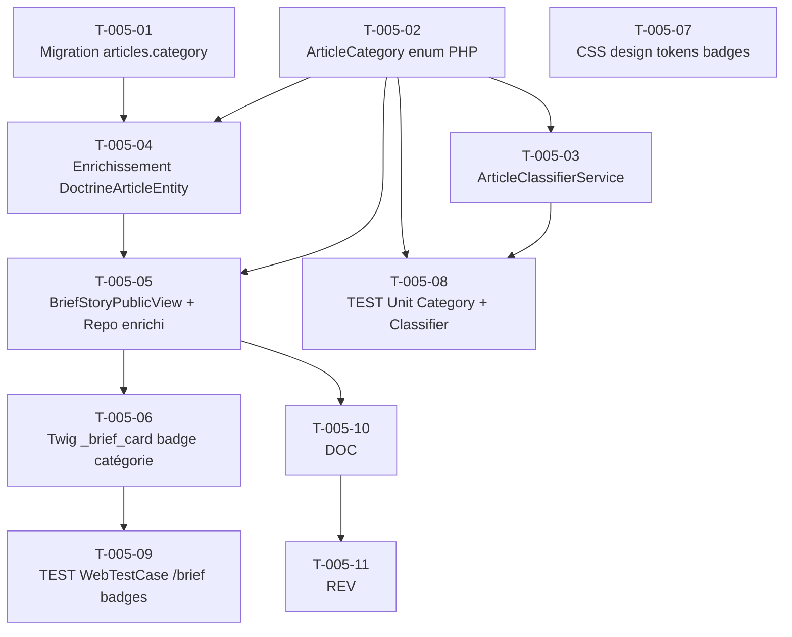

# US-005 — Tâches techniques : Cartes typées par catégorie éditoriale

**User Story** : En tant que P-001 Thomas, je veux que chaque histoire du Daily Brief affiche un badge de catégorie éditoriale visible (AI INSIGHT, GEOPOLITICS, PRODUCTIVITY, RESEARCH, SUSTAINABILITY) afin de repérer en un coup d'œil les sujets qui concernent mon secteur.
**Story Points** : 3 | **Sprint** : sprint-002-enrichissement
**EPIC** : EPIC-001 Daily Brief Core
**Dépendances** : US-002 (articles en base), sprint 1 mergé (BriefStory, BriefStoryPublicView, DailyBriefRepository existants)

---

## Tâches

| ID | Type | Description | Heures | Dépend de | Statut |
|----|------|-------------|--------|-----------|--------|
| T-005-01 | [DB] | Migration : ajout colonne `articles.category ENUM('ai_insight','geopolitics','productivity','research','sustainability') NOT NULL DEFAULT 'productivity'` sur table `articles` existante + index sur `category` | 0.5h | — | 🔲 |
| T-005-02 | [BE] | `ArticleCategory` enum PHP 8.1 (`src/Domain/Feed/ArticleCategory.php`) : cases `AI_INSIGHT`, `GEOPOLITICS`, `PRODUCTIVITY`, `RESEARCH`, `SUSTAINABILITY` + méthodes `label(): string` (libellés affichés) et `badgeColor(): string` (nom du design token CSS, ex: `'violet'`) | 1h | — | 🔲 |
| T-005-03 | [BE] | `ArticleClassifierService` (`src/Application/Feed/`) : appel Mistral zéro-shot (liste fermée 5 catégories), seuil confiance ≥ 0.5 ; si score < 0.5 → fallback règles mots-clés (liste par catégorie) ; si aucune règle → `PRODUCTIVITY` par défaut ; log `INFO category.fallback_applied {article_id, category}` (sans PII) | 2h | T-005-02 | 🔲 |
| T-005-04 | [BE] | Enrichissement `DoctrineArticleEntity` : ajout champ `category` mappé sur le nouvel enum Doctrine + mise à jour `ArticleDTO` et `ArticleRepositoryInterface` si nécessaire | 0.5h | T-005-01, T-005-02 | 🔲 |
| T-005-05 | [BE] | Enrichissement `BriefStoryPublicView` (`src/Domain/Brief/`) : ajout champ `category: ArticleCategory` ; enrichissement `DoctrineBriefPublicViewRepository` — JOIN `articles.category` dans la requête + levée `InvalidCategoryException` si valeur inconnue (exclusion de la BriefStory concernée, les 2 autres restent affichées) | 1h | T-005-02, T-005-04 | 🔲 |
| T-005-06 | [FE-WEB] | Template Twig `templates/components/_brief_card.html.twig` (existant à enrichir) : ajout bloc `{{ story.category.label }}` ; responsive (visible viewport < 768px, sans troncature) | 1.5h | T-005-05 | 🔲 |
| T-005-07 | [FE-WEB] | Design tokens CSS badges catégories dans `assets/styles/tokens.css` : `.badge--ai_insight { --badge-color: var(--color-violet); }`, `.badge--geopolitics { --badge-color: var(--color-red); }`, `.badge--productivity { --badge-color: var(--color-blue); }`, `.badge--research { --badge-color: var(--color-orange); }`, `.badge--sustainability { --badge-color: var(--color-green-dark); }` — NE PAS utiliser `#10B981` (réservé badge IA) ; documenter dans `design/design-tokens.md` | 0.5h | — | 🔲 |
| T-005-08 | [TEST] | Tests unitaires `ArticleCategory` (label et badgeColor pour les 5 cases) + `ArticleClassifierService` : nominal → catégorie correcte retournée, score < 0.5 → fallback règles, aucune règle → PRODUCTIVITY par défaut ; `InvalidCategoryException` levée sur valeur inconnue 'BREAKING_NEWS' | 1.5h | T-005-02, T-005-03 | 🔲 |
| T-005-09 | [TEST] | `WebTestCase` GET `/brief` : chaque histoire contient exactement 1 `.badge`, libellé parmi les 5 valeurs attendues, attribut `class` contient `badge--{category}`, texte badge lisible sur viewport 375px (pas de `display:none`, pas de `color:transparent`) ; `assertSelectorTextContains('.badge', 'AI INSIGHT')` Panther si disponible | 1.5h | T-005-06 | 🔲 |
| T-005-10 | [DOC] | PHPDoc `ArticleCategory` enum, `ArticleClassifierService`, `InvalidCategoryException` ; mise à jour commentaires `BriefStoryPublicView` | 0.5h | T-005-05 | 🔲 |
| T-005-11 | [REV] | Code review US-005 : enum exhaustif (5 cases), fallback `PRODUCTIVITY` testé, couleur émeraude absente des badges catégorie, token CSS par catégorie (pas de valeurs codées en dur), `InvalidCategoryException` logguée sans PII | 1h | T-005-10 | 🔲 |

**Total US-005 : 11 tâches — 11h**

---

## Graphe de dépendances

---

## Notes techniques

- **Colonne ENUM PostgreSQL** : la migration ajoute la colonne sur la table `articles` existante. DEFAULT `'productivity'` pour les articles déjà en base sans catégorie.
- **Pas de classification à la demande** : `ArticleClassifierService` est appelé lors de l'ingestion (dans `FetchSourceHandler` ou post-ingestion hook) — US-005 consomme le résultat déjà persisté en base (pas d'appel Mistral à l'affichage).
- **Émeraude #10B981 réservé** : les badges catégorie utilisent des tokens distincts (violet, rouge, bleu, orange, vert foncé). L'émeraude est strictement réservé au badge "BRIEFLY AI:" (US-004).
- **InvalidCategoryException** : si une valeur inconnue est en base (migration partielle, corruption), la `BriefStory` concernée est exclue du brief ; les 2 autres restent affichées. Le log ERROR contient `article_id` (UUID) et la valeur invalide — sans données personnelles.
- **Accessibilité WCAG 2.1 AA** : badge texte + couleur, pas couleur seule. Le libellé ("AI INSIGHT" etc.) est toujours présent, la couleur est discriminante mais non exclusive.
