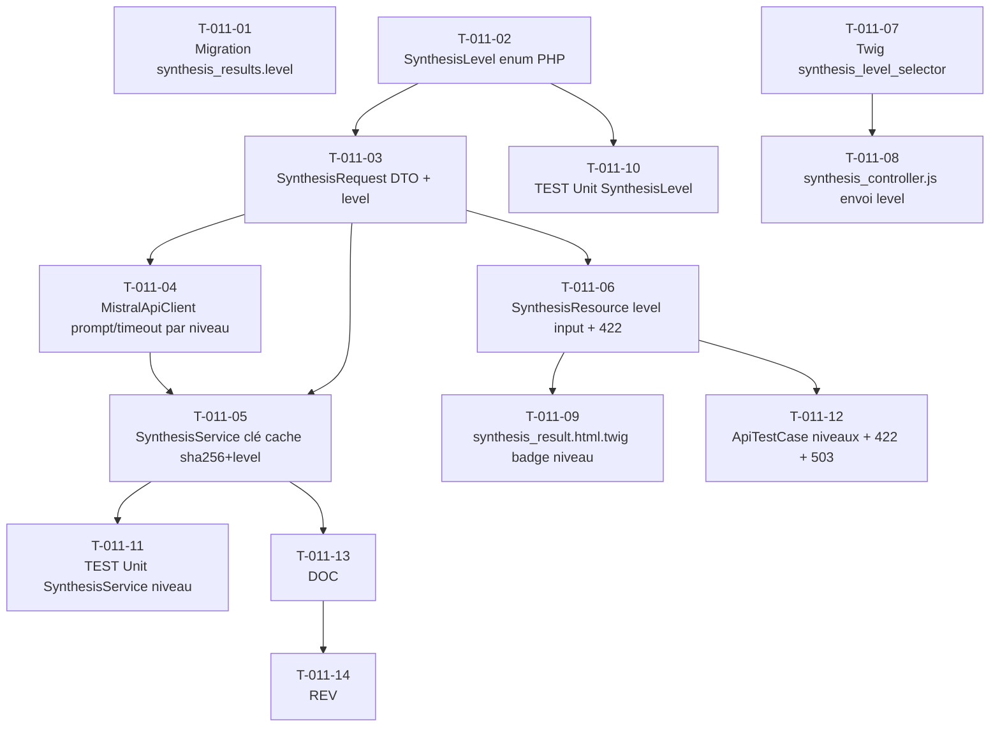

# US-011 — Tâches techniques : Niveaux de synthèse (Concise / Detailed / Narrative)

**User Story** : En tant que P-002 Priya, je veux choisir le niveau de synthèse (Concise / Detailed / Narrative) avant de générer, afin d'adapter la profondeur d'analyse à mon contexte.
**Story Points** : 5 | **Sprint** : sprint-002-enrichissement
**EPIC** : EPIC-002 Moteur de Synthèse IA
**Dépendances** : US-010 (SynthesisService existant, SynthesisResult en base, MistralApiClient existant, SynthesisResource API Platform existante) — sprint 1 mergé

---

## Tâches

| ID | Type | Description | Heures | Dépend de | Statut |
|----|------|-------------|--------|-----------|--------|
| T-011-01 | [DB] | Migration : ajout colonne `synthesis_results.level VARCHAR(16) NOT NULL DEFAULT 'concise'` + index sur `level` (si pas déjà présent depuis US-010 — vérifier la migration existante avant de créer) | 0.5h | — | 🔲 |
| T-011-02 | [BE] | `SynthesisLevel` enum PHP 8.1 (`src/Domain/Synthesis/SynthesisLevel.php`) : cases `CONCISE`, `DETAILED`, `NARRATIVE` + méthode `promptInstructions(): string` (prompt système distinct par niveau) + méthode `timeoutSeconds(): int` (15 / 30 / 45) + `fromString(string $value): self` (lève `InvalidSynthesisLevelException` si invalide) | 1h | — | 🔲 |
| T-011-03 | [BE] | Mise à jour `SynthesisRequest` DTO (`src/Domain/Synthesis/`) : ajout champ `level: SynthesisLevel` avec défaut `SynthesisLevel::CONCISE` ; rétrocompatible (les clients existants sans `level` obtiennent Concise) | 0.5h | T-011-02 | 🔲 |
| T-011-04 | [BE] | Mise à jour `MistralApiClient` (`src/Infrastructure/Synthesis/Ai/`) : sélection du prompt système via `$request->level->promptInstructions()` ; timeout dynamique via `$request->level->timeoutSeconds()` ; log `model_version` et `level` (sans PII) ; les 3 prompts distincts sont définis dans `SynthesisLevel::promptInstructions()` | 2h | T-011-02, T-011-03 | 🔲 |
| T-011-05 | [BE] | Mise à jour `SynthesisService` (`src/Application/Synthesis/`) : clé cache Redis devient `sha256($url . '_' . $level->value)` (3 clés distinctes par URL) ; passage du `level` dans `SynthesisResult` persisté en base ; timeout HttpClient adapté via `$level->timeoutSeconds()` | 1h | T-011-03, T-011-04 | 🔲 |
| T-011-06 | [BE] | Mise à jour `SynthesisResource` (`src/Presentation/ApiResource/SynthesisResource.php`) : ajout champ `level` dans le DTO d'entrée avec contrainte `@Assert\Choice(choices: ['concise','detailed','narrative'])` + `@Assert\NotBlank(allowNull: true)` ; HTTP 422 si valeur inconnue ; badge `level` dans la réponse JSON | 1h | T-011-03 | 🔲 |
| T-011-07 | [FE-WEB] | Twig partial `templates/brief/synthesis_level_selector.html.twig` : sélecteur radio/tabs "Concise / Detailed / Narrative" au-dessus du bouton "GENERATE AI SUMMARY" ; attribut `data-synthesis-target="level"` pour le Stimulus controller ; label niveau sélectionné mis en évidence (aria-pressed) | 1.5h | — | 🔲 |
| T-011-08 | [FE-WEB] | Mise à jour `synthesis_controller.js` (`assets/controllers/`) : lecture du radio sélectionné (`this.levelTarget.value`), envoi du champ `level` dans le POST JSON vers `/api/v1/synthesis` ; badge niveau affiché dans le Turbo Frame résultat après génération | 1h | T-011-07 | 🔲 |
| T-011-09 | [FE-WEB] | Mise à jour `templates/brief/synthesis_result.html.twig` : ajout badge discret `{{ synthesis.level }}` (ex: "Detailed") dans le bloc BRIEFLY AI: | 0.5h | T-011-06 | 🔲 |
| T-011-10 | [TEST] | Tests unitaires `SynthesisLevel` : `promptInstructions()` retourne des chaînes non vides et distinctes pour les 3 cases ; `timeoutSeconds()` retourne 15/30/45 ; `fromString('ultra')` lève `InvalidSynthesisLevelException` ; validation Symfony rejette `level='ultra'` avec message attendu | 1h | T-011-02 | 🔲 |
| T-011-11 | [TEST] | Tests unitaires `SynthesisService` niveau : 3 synthèses pour la même URL avec niveaux différents → 3 clés cache distinctes `sha256(url_concise)`, `sha256(url_detailed)`, `sha256(url_narrative)` ; timeout mock vérifié (15s concise, 45s narrative) ; cache hit sur clé exacte (niveau identique = cache hit, niveau différent = miss) | 1.5h | T-011-05 | 🔲 |
| T-011-12 | [TEST] | `ApiTestCase` POST `/api/v1/synthesis` : niveau concise → réponse JSON avec `level:'concise'`, badge présent ; niveau invalide `level:'ultra'` → HTTP 422, message "level must be one of: concise, detailed, narrative", 0 appel Mistral ; timeout narrative simulé → HTTP 503 + message "Synthèse Narrative indisponible pour ce contenu — essayez le niveau Detailed", log loggué sans PII | 1.5h | T-011-06 | 🔲 |
| T-011-13 | [DOC] | PHPDoc `SynthesisLevel` enum (documentation des prompts et timeouts), `SynthesisRequest` DTO mis à jour, `MistralApiClient` (section niveaux) | 0.5h | T-011-05 | 🔲 |
| T-011-14 | [REV] | Code review US-011 : 3 clés cache distinctes (sha256 url+level), timeouts corrects (15/30/45s), HTTP 422 sur level invalide, prompts distincts non vides, badge niveau affiché, rétrocompatibilité sans `level` (défaut Concise) | 1h | T-011-13 | 🔲 |

**Total US-011 : 14 tâches — 14h**

---

## Graphe de dépendances

---

## Notes techniques

- **Rétrocompatibilité** : `SynthesisRequest` sans `level` = `SynthesisLevel::CONCISE`. Aucun client existant cassé.
- **Clé cache** : `sha256(url . '_' . level->value)` — 3 entrées cache distinctes par URL. Conforme DoD : clé sans identifiant utilisateur.
- **Prompts** (à définir avec Tech Lead en refinement) :
  - Concise : ~200 mots, 3 points clés numérotés 01/02/03, langue de l'article
  - Detailed : ~500 mots, 5 points clés, contexte élargi, sources citées
  - Narrative : ~800 mots, prose éditoriale "fort signal, faible bruit", angle d'analyse, sources en fin de synthèse
- **Timeouts** : 15s concise / 30s detailed / 45s narrative — timeout HTTP via `$httpClient->withOptions(['timeout' => $level->timeoutSeconds()])`.
- **Colonne level** : vérifier si la migration US-010 a déjà créé cette colonne (`synthesis_results.level`) avant de lancer T-011-01.
- **Message timeout narrative** : "Synthèse Narrative indisponible pour ce contenu — essayez le niveau Detailed". HTTP 503. Log ERROR avec level et url_hash (sans PII).
