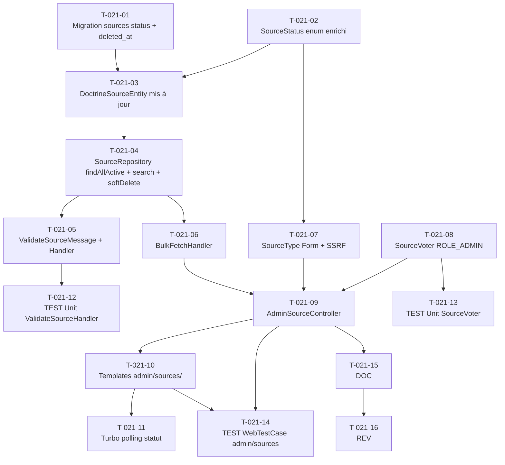

# US-021 — Tâches techniques : CRUD des sources RSS (back-office admin)

**User Story** : En tant que P-004 Sophie (ROLE_ADMIN), je veux ajouter, modifier, supprimer et rechercher des sources RSS/Atom depuis l'interface d'administration, avec validation automatique du flux avant activation.
**Story Points** : 5 | **Sprint** : sprint-002-enrichissement
**EPIC** : EPIC-003 Gestion des Sources & Indexation
**Dépendances** : US-020 (entités Source + SourceStatus + DoctrineSourceEntity + DoctrineSourceRepository existants), sprint 1 mergé

---

## Tâches

| ID | Type | Description | Heures | Dépend de | Statut |
|----|------|-------------|--------|-----------|--------|
| T-021-01 | [DB] | Migration enrichissement table `sources` : ajout colonne `status ENUM('pending_validation','active','validation_failed','deleted') NOT NULL DEFAULT 'active'` (les sources existantes sont actives), `deleted_at TIMESTAMPTZ NULL`, contrainte `UNIQUE ON url` si absente, index sur `(status)` et `(deleted_at)` | 1h | — | 🔲 |
| T-021-02 | [BE] | Mise à jour `SourceStatus` enum (`src/Domain/Feed/SourceStatus.php`) : ajout cases `PENDING_VALIDATION`, `VALIDATION_FAILED`, `DELETED` si non présents ; méthode `label(): string` (libellé badge UI) et `badgeClass(): string` (classe CSS badge statut) | 0.5h | — | 🔲 |
| T-021-03 | [BE] | Mise à jour `DoctrineSourceEntity` (`src/Infrastructure/Feed/Persistence/`) : mapping Doctrine champs `status` (EnumType) et `deleted_at` (nullable DateTimeImmutable) ; colonne UNIQUE sur `url` au niveau Doctrine ; mise à jour `Source` domaine si nécessaire | 0.5h | T-021-01, T-021-02 | 🔲 |
| T-021-04 | [BE] | Enrichissement `DoctrineSourceRepository` (`src/Infrastructure/Feed/Persistence/`) : `findAllActive(): Source[]` (status=active, deleted_at IS NULL, paginé 50/page), `search(string $query, int $page): array` (ILIKE `%query%` sur name et url, filtre soft-delete), `softDelete(Source $source): void` (status=DELETED, deleted_at=now()) | 1.5h | T-021-03 | 🔲 |
| T-021-05 | [BE] | `ValidateSourceMessage` + `ValidateSourceHandler` (`src/Application/Feed/ValidateSource/`) : HEAD HTTP vers l'URL (Symfony HttpClient, timeout 10s), vérification Content-Type contient 'rss', 'xml' ou 'atom', mise à jour `status` → `active` si OK ou `validation_failed` si KO (404, timeout, Content-Type incorrect) ; log ERROR `{source_id, url, reason}` sans PII | 2h | T-021-04 | 🔲 |
| T-021-06 | [BE] | `BulkFetchHandler` (`src/Application/Feed/`) : reçoit `BulkFetchMessage`, itère les sources `findAllActive()`, publie un `FetchSourceMessage` par source dans la queue Messenger (asynchrone, pas de blocage UI) | 1h | T-021-04 | 🔲 |
| T-021-07 | [BE] | `SourceType` Symfony Form (`src/Presentation/Form/`) : champs `name` (TextType, NotBlank), `url` (UrlType, HTTPS uniquement — contrainte custom `SsrfSafeUrlConstraint` : schéma https, résolution hostname rejette IPs RFC-1918 10.x, 192.168.x, 172.16-31.x, loopback 127.x), `feed_type` (ChoiceType: rss/atom), `fetch_interval_minutes` (IntegerType, min=5) ; CSRF activé | 2h | T-021-02 | 🔲 |
| T-021-08 | [BE] | `SourceVoter` (`src/Infrastructure/User/Security/`) : vérifie `ROLE_ADMIN` pour toutes les opérations admin (CREATE, EDIT, DELETE, BULK_UPDATE) sur `Source` ; HTTP 403 pour tout utilisateur non ROLE_ADMIN | 1h | — | 🔲 |
| T-021-09 | [BE] | `AdminSourceController` (`src/Presentation/Web/Admin/`) : action `index` (GET `/admin/sources?q=`) liste + recherche + pagination 50/page, avec filtre soft-delete ; action `new` (GET/POST `/admin/sources/new`) : formulaire + persist status=pending_validation + dispatch `ValidateSourceMessage` + flash Turbo ; action `edit` (GET/POST `/admin/sources/{id}/edit`) ; action `delete` (POST `/admin/sources/{id}/delete`) : softDelete + flash ; action `bulkUpdate` (POST `/admin/sources/bulk-update`) : dispatch `BulkFetchMessage` + flash "N sources mises en file" | 2.5h | T-021-06, T-021-07, T-021-08 | 🔲 |
| T-021-10 | [FE-WEB] | Templates Twig `templates/admin/sources/` : `index.html.twig` (tableau liste avec badge statut, champ recherche, pagination, bouton "TOUT METTRE À JOUR" + "AJOUTER"), `_source_row.html.twig` (ligne tableau avec badge statut coloré via `badgeClass()`), `new.html.twig`, `edit.html.twig`, `_form.html.twig` (formulaire partagé) ; flash messages via Turbo Frames | 2.5h | T-021-09 | 🔲 |
| T-021-11 | [FE-WEB] | Turbo polling statut source : dans `_source_row.html.twig`, un `<turbo-frame>` avec `src` et `refresh="morph"` interroge `/admin/sources/{id}/status` (endpoint JSON léger) pour mettre à jour le badge statut après validation asynchrone Messenger | 1h | T-021-10 | 🔲 |
| T-021-12 | [TEST] | Tests unitaires `ValidateSourceHandler` : nominal URL valide → status `active` (mock HEAD 200 + Content-Type 'application/rss+xml'), URL 404 → status `validation_failed`, Content-Type HTML → `validation_failed`, ConnectException → `validation_failed` + log ERROR ; 0 PII dans les logs | 1.5h | T-021-05 | 🔲 |
| T-021-13 | [TEST] | Tests unitaires `SourceVoter` : ROLE_ADMIN → accès CREATE/EDIT/DELETE/BULK, ROLE_USER → refus (403), non authentifié → refus (403) | 1h | T-021-08 | 🔲 |
| T-021-14 | [TEST] | `WebTestCase` admin/sources (authentifié ROLE_ADMIN) : liste affichée (GET 200), création nominal → source en base status=pending_validation, URL http (non-HTTPS) → formulaire renvoyé + message "Seules les sources HTTPS sont autorisées" + 0 INSERT, édition → mis à jour, soft delete → status=DELETED + deleted_at non null + absent de la liste, recherche "tech" → 3 sources filtrées, bulk-update → flash "N sources mises en file" ; CSRF invalide → 422 ; non-admin ROLE_USER → 403 | 2h | T-021-09, T-021-10 | 🔲 |
| T-021-15 | [DOC] | PHPDoc `AdminSourceController`, `ValidateSourceHandler`, `SourceVoter`, `SourceType`, `SsrfSafeUrlConstraint` (note SSRF blocklist RFC-1918) | 0.5h | T-021-09 | 🔲 |
| T-021-16 | [REV] | Code review US-021 : validation SSRF (blocklist IPs privées testée), soft delete (deleted_at + status=DELETED), CSRF actif sur tous les POST/DELETE, SourceVoter ROLE_ADMIN, Messenger asynchrone (0 blocage UI), UNIQUE url en base | 1.5h | T-021-15 | 🔲 |

**Total US-021 : 16 tâches — 21h**

---

## Graphe de dépendances

---

## Notes techniques

- **SSRF protection** (critique OWASP A10:2025 consolidé) : `SsrfSafeUrlConstraint` résout le hostname via `gethostbyname()` ou `dns_get_record()` et rejette : toute IP RFC-1918 (10.0.0.0/8, 192.168.0.0/16, 172.16.0.0/12), loopback (127.0.0.0/8), lien-local (169.254.0.0/16), schémas non-HTTP(S). La contrainte s'applique côté formulaire Symfony (T-021-07) et dans `ValidateSourceHandler` (T-021-05) en défense en profondeur.
- **Soft delete** : `status=DELETED` + `deleted_at` non null. Les articles ingérés depuis cette source sont conservés. La source n'apparaît plus dans la liste admin par défaut ni dans les cycles d'ingestion.
- **Messenger transport** : `ValidateSourceMessage` → transport `async` (Redis ou AMQP selon config). Le worker est déjà configuré en sprint 1 (`FetchSourceHandler`).
- **Pagination** : 50 sources par page (paramètre `?page=`). La pagination s'applique également aux résultats de recherche.
- **Existant sprint 1** : `DoctrineSourceEntity`, `DoctrineSourceRepository`, `FetchSourceMessage/Handler` existent déjà. T-021-03 et T-021-04 sont des enrichissements, pas des créations from scratch.
- **Flash messages Turbo** : utiliser `$this->addFlash('success', '...')` + `<turbo-frame id="flash-messages">` dans le layout pour l'affichage sans rechargement complet.
