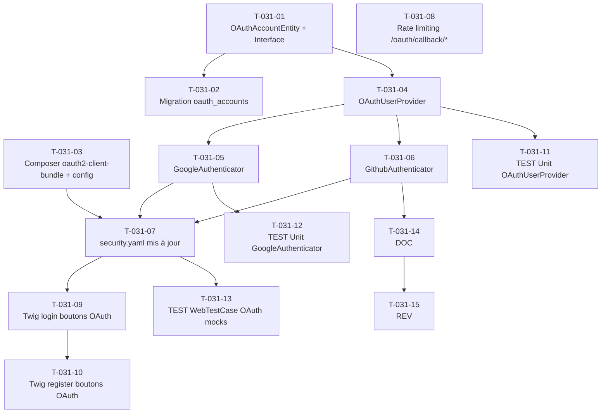

# US-031 — Tâches techniques : Authentification OAuth Google / GitHub

**User Story** : En tant que P-001 Thomas, je veux me connecter à Briefly AI avec mon compte Google ou GitHub en un seul clic, afin d'accéder rapidement à la plateforme sans créer ni mémoriser un mot de passe supplémentaire.
**Story Points** : 5 | **Sprint** : sprint-002-enrichissement
**EPIC** : EPIC-004 Comptes Utilisateurs & Premium
**Dépendances** : US-030 (table `users`, `DoctrineUserEntity`, `UserRepository`, `security.yaml` existants) — sprint 1 mergé

---

## Tâches

| ID | Type | Description | Heures | Dépend de | Statut |
|----|------|-------------|--------|-----------|--------|
| T-031-01 | [DB] | Entité Doctrine `OAuthAccountEntity` (`src/Infrastructure/User/Persistence/`) : id UUID v4, user_id UUID FK → users.id ON DELETE CASCADE, provider ENUM('google','github') NOT NULL, provider_id VARCHAR255 NOT NULL, email_provider VARCHAR255 NOT NULL, created_at TIMESTAMPTZ NOT NULL ; contrainte UNIQUE sur `(provider, provider_id)` + `OAuthAccountRepositoryInterface` dans le domaine (`src/Domain/User/`) | 2h | — | 🔲 |
| T-031-02 | [DB] | Migration table `oauth_accounts` : FK `user_id` CASCADE DELETE, UNIQUE `(provider, provider_id)`, index sur `provider` et `email_provider` | 0.5h | T-031-01 | 🔲 |
| T-031-03 | [BE] | Composer : `composer require knpuniversity/oauth2-client-bundle league/oauth2-google league/oauth2-github` + configuration `config/packages/knpu_oauth2_client.yaml` (client_id/secret depuis `%env(GOOGLE_CLIENT_ID)%` etc., redirect URIs `/oauth/callback/google` et `/oauth/callback/github`) ; routes déclarées dans `config/routes/oauth.yaml` | 1.5h | — | 🔲 |
| T-031-04 | [BE] | `OAuthUserProvider` (`src/Infrastructure/User/Security/OAuthUserProvider.php`) : `loadOAuthUser(string $provider, string $providerId, string $email): User` — 1) lookup `oauth_accounts` par (provider, provider_id) → User existant ; 2) sinon lookup `users` par email → liaison compte + création `OAuthAccount` (fusion sans doublon) ; 3) sinon création `User` + `OAuthAccount` ; stocke les access_token provider **non persistés** en session uniquement (pas en base — exigence RGPD) | 2h | T-031-01 | 🔲 |
| T-031-05 | [BE] | `GoogleAuthenticator` (`src/Infrastructure/User/Security/`) implements `OAuth2Authenticator` : paramètre `state` généré aléatoirement + vérifié en session (protection CSRF OAuth) ; échange code → access_token via `knpu/oauth2-client` ; récupération email Google ; appel `OAuthUserProvider` ; session HttpOnly ouverte (même mécanique US-030) ; gestion `error=access_denied` → redirect `/login` + flash "Connexion annulée" ; state absent/invalide → HTTP 400 + log WARN `{ip, user_agent, timestamp}` (sans email) | 2h | T-031-04 | 🔲 |
| T-031-06 | [BE] | `GithubAuthenticator` (`src/Infrastructure/User/Security/`) implements `OAuth2Authenticator` : identique à GoogleAuthenticator + gestion email noreply GitHub (`*@users.noreply.github.com`) → compte créé avec cet email + flash "Pour recevoir les notifications, renseignez votre email dans votre profil" ; provider_id = GitHub user ID | 1.5h | T-031-04 | 🔲 |
| T-031-07 | [BE] | Mise à jour `config/packages/security.yaml` : ajout `custom_authenticators: [GoogleAuthenticator, GithubAuthenticator]` dans le firewall `main` ; routes `/oauth/connect/google`, `/oauth/connect/github` (génèrent le state + redirigent vers provider), `/oauth/callback/google`, `/oauth/callback/github` (traitées par les authenticators) ; access_control `ROLE_USER` sur `/dashboard` (déjà en place) | 1h | T-031-05, T-031-06 | 🔲 |
| T-031-08 | [BE] | Rate limiting Redis sur `/oauth/callback/*` (10 req/5min/IP) via `RateLimiterFactory` — réutiliser le pattern US-030 ; HTTP 429 + `Retry-After` en cas de dépassement | 0.5h | — | 🔲 |
| T-031-09 | [FE-WEB] | Mise à jour `templates/security/login.html.twig` : ajout section "Ou continuer avec" avec boutons "Continuer avec Google" (icône SVG Google) et "Continuer avec GitHub" (icône SVG GitHub) ; href vers `/oauth/connect/google` et `/oauth/connect/github` ; style boutons OAuth (fond blanc, bordure, couleurs officielles providers) | 1.5h | T-031-07 | 🔲 |
| T-031-10 | [FE-WEB] | Mise à jour `templates/registration/register.html.twig` : ajout identique des boutons OAuth (section "Inscription rapide avec") au-dessus du formulaire email ; cohérence visuelle avec la page login | 0.5h | T-031-09 | 🔲 |
| T-031-11 | [TEST] | Tests unitaires `OAuthUserProvider` : user nouveau Google → 1 INSERT `users` + 1 INSERT `oauth_accounts` + 0 doublon ; user existant (email = compte email/password) → 1 INSERT `oauth_accounts` + 0 INSERT `users` ; GitHub email noreply → compte créé, fonctionnel ; `(provider, provider_id)` existant → même User retourné, 0 INSERT | 2h | T-031-04 | 🔲 |
| T-031-12 | [TEST] | Tests unitaires `GoogleAuthenticator` : state valide → authentification réussie + session ouverte ; state invalide/absent → HTTP 400, log WARN, 0 session ; `error=access_denied` → redirect `/login` + flash "Connexion annulée" ; 0 données personnelles dans les logs des incidents | 1.5h | T-031-05 | 🔲 |
| T-031-13 | [TEST] | `WebTestCase` OAuth avec mocks providers (mode test KnpU) : connexion Google réussie → session HttpOnly + redirect `/dashboard` + flash "Bienvenue sur Briefly AI !" ; fusion compte email existant → 0 doublon `users`, `oauth_accounts` créé ; callback state invalide → HTTP 400 ; refus utilisateur → redirect `/login` + flash attendu | 1.5h | T-031-07 | 🔲 |
| T-031-14 | [DOC] | PHPDoc `GoogleAuthenticator`, `GithubAuthenticator`, `OAuthUserProvider`, `OAuthAccountEntity` ; note sur les secrets en variables d'environnement (jamais loggués), gestion email noreply GitHub, access_token non persisté en base | 0.5h | T-031-06 | 🔲 |
| T-031-15 | [REV] | Code review US-031 : paramètre `state` valide (protection CSRF OAuth), secrets en `%env()%` jamais loggués, session HttpOnly + secure + sameSite=strict, 0 doublon `users` (fusion email), email noreply GitHub géré, access_token non persisté en base, log WARN incidents sans PII, 0 HS256 (JWT mobile si introduit = EdDSA/ES256 uniquement) | 1h | T-031-14 | 🔲 |

**Total US-031 : 15 tâches — 20h**

---

## Graphe de dépendances

---

## Notes techniques

- **Prérequis pré-sprint** (voir pre-sprint-checklist.md) : credentials Google OAuth (Client ID + Client Secret, redirect URI `http://localhost:8000/oauth/callback/google` whitelisté) et GitHub OAuth App (App ID + Secret, callback URL) doivent être disponibles dès J1.
- **Access token provider** : NON persisté en base (exigence RGPD). Stocké uniquement en session pour la durée de la session. Si révocation côté provider → la session Symfony existante reste valide jusqu'à expiration naturelle.
- **Fusion de compte** : si email OAuth = email d'un compte email/password existant → lie automatiquement (crée `OAuthAccount`, pas de `User` supplémentaire). Pas de confirmation utilisateur en v1.
- **GitHub email noreply** : format `123456+username@users.noreply.github.com`. Le compte est créé avec cet email. Flash info affiché. Compte pleinement fonctionnel.
- **Sécurité CSRF OAuth** : le `state` est un token aléatoire cryptographiquement sûr (`bin2hex(random_bytes(16))`) stocké en session avant le redirect vers le provider, vérifié au callback. State absent ou invalide → HTTP 400.
- **Session desktop** : httpOnly=true, secure=true (HTTPS en prod), sameSite=strict — identique à US-030.
- **JWT mobile** : si introduit dans un sprint futur, utiliser uniquement EdDSA (Ed25519) ou ES256. JAMAIS HS256 (cf. règle sécurité 11-security.md).
- **Logs incidents** : uniquement `{ip, user_agent, timestamp}` — JAMAIS l'email OAuth ni le code d'autorisation.
