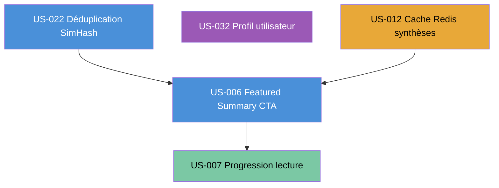

# Sprint 003 — Consolidation

## Sprint Goal

> **Consolider l'expérience du Daily Brief (featured summary + CTA « Lire le brief complet », indicateur de progression de lecture, cache Redis des synthèses, déduplication SimHash) et enrichir le profil utilisateur, tout en déployant un environnement de staging instrumenté pour mesurer la rétention réelle J+1/J+7.**

---

## Dates

| Événement | Date |
|-----------|------|
| Début Sprint | 2026-08-25 |
| Fin Sprint | 2026-09-07 |
| Review / Rétro | 2026-09-07 |

---

## Périmètre (User Stories en scope)

| ID | Titre | EPIC | Points | Persona |
|----|-------|------|--------|---------|
| US-022 | Déduplication avancée par SimHash de titre | EPIC-003 | 3 | P-001 Thomas |
| US-032 | Gestion du profil utilisateur | EPIC-004 | 3 | P-002 Priya |
| US-012 | Cache Redis 24h des synthèses générées | EPIC-002 | 3 | P-001 Thomas |
| US-006 | Featured Summary desktop + CTA « Lire le brief complet » | EPIC-001 | 5 | P-001 Thomas |
| US-007 | Indicateur de progression de lecture | EPIC-001 | 2 | P-001 Thomas |

**Total Sprint 3 : 16 story points**

### Ordre de réalisation recommandé

**Justification de l'ordre :**
- US-022 en premier : la déduplication SimHash est indépendante de toutes les autres US du sprint ; elle améliore la qualité du corpus d'articles en amont, ce qui bénéficie directement au Featured Summary (US-006).
- US-032 en parallèle de US-022 : la gestion du profil utilisateur est complètement indépendante ; elle peut être développée simultanément sur une branche dédiée.
- US-012 après ou en parallèle de US-022/032 : le cache Redis des synthèses étend l'infrastructure existante sans bloquer les autres US ; à livrer avant US-006 pour que le Featured Summary bénéficie immédiatement du cache.
- US-006 après US-012 et US-022 : la featured summary exploite les synthèses déjà générées (US-004, Sprint 2) et profite du cache Redis (US-012) et d'un corpus dédupliqué (US-022). Dépend également de la page `/brief` livrée en Sprint 2.
- US-007 en dernier : l'indicateur de progression de lecture est une enhancement purement UI qui s'ajoute sur la page de brief existante ; dépend de la page complète (US-006 livrée).

---

## Cérémonies

### Sprint Planning — Part 1 (QUOI) — 2h

**Animateur** : Tech Lead (Scrum Master)
**Participants** : PO + équipe dev

- Présentation et validation du Sprint Goal par le PO
- Revue de chaque US : critères d'acceptance Gherkin, questions de clarification
- Confirmation que les US respectent la Definition of Ready (INVEST + 3C + 5 scénarios Gherkin)
- Engagement collectif sur le périmètre (16 pts)

**Questions à lever en Part 1 :**
- Bibliothèque SimHash choisie (php-simhash ou implémentation maison) — licence et maintenance vérifiées ?
- Quota Mistral Sprint 2 : taux de consommation observé — suffit-il pour les synthèses Featured Summary (US-006) ?
- Variables d'environnement staging (DSN PostgreSQL, Redis URL, Mistral key) disponibles pour l'environnement staging ?
- Budget GitHub Actions (billing) débloqué pour le pipeline CI ?
- Compte admin provisioning prod confirmé ?
- Templates Stitch sprint-003 référencés et accessibles (projet `7076573032400883843`) pour US-006 et US-007 ?

### Sprint Planning — Part 2 (COMMENT) — 2h

**Animateur** : Tech Lead
**Participants** : équipe dev

- Décomposition de chaque US en tâches techniques (`/project:decompose-tasks 003`)
- Estimation des tâches en heures (0,5h — 8h max)
- Graphe de dépendances inter-tâches (Mermaid)
- Identification des risques techniques (voir section Risques)
- Construction du Task Board initial

### Daily Scrum — 15 min (chaque jour ouvré)

**Format** : Stand-up synchrone (ou asynchrone écrit si équipe distribuée)

1. Qu'ai-je fait hier qui fait avancer le Sprint Goal ?
2. Que vais-je faire aujourd'hui ?
3. Quels obstacles m'en empêchent ?

**Rôle Tech Lead** : observer, noter les blocages, supprimer les impediments dans l'heure.

### Sprint Review — 2h (2026-09-07)

**Participants** : équipe + PO + stakeholders

Démonstrations livrées :
1. Déduplication SimHash : ajout de deux articles de même titre → seul un apparaît dans le Brief (US-022)
2. Profil utilisateur : modification du prénom, de l'email de notification et des topics suivis, sauvegarde persistée (US-032)
3. Cache Redis 24h : génération d'une synthèse, rechargement de page → log Redis HIT visible, temps de réponse < 50 ms (US-012)
4. Featured Summary desktop : paragraphe narratif en haut du Brief + CTA « Lire le brief complet » fixe au scroll (US-006)
5. Indicateur de progression de lecture : barre émeraude 2px progressant à la lecture du Brief (US-007)
6. Staging instrumenté : dashboard rétention J+1/J+7 visible (0 PII), alerte quota Mistral opérationnelle

**Critère de succès** : toute la chaîne fonctionne de bout en bout en live demo, sans scripts de contournement. Le Daily Brief post-Sprint 3 doit offrir une entrée éditoriale immédiate (Featured Summary) et un sentiment de progression de lecture mesurable.

### Rétrospective — 1h30 (2026-09-07, après la Review)

**Animateur** : Tech Lead (Scrum Master)
**Technique** : Étoile de Mer (Starfish)

**Directive Fondamentale :**
> "Peu importe ce que nous découvrons, nous comprenons et croyons sincèrement
> que tout le monde a fait le meilleur travail possible, compte tenu de ce qu'il
> savait à ce moment-là, de ses compétences et aptitudes, des ressources
> disponibles et de la situation du moment."
> — Norm Kerth, *Project Retrospectives*

Format :
- 5 min : rappel de la directive, création de la sécurité psychologique
- 15 min : chacun complète l'Étoile de Mer (Start / Stop / Continue / Plus de / Moins de)
- 20 min : regroupement et lecture collective
- 30 min : vote par points (dot voting) sur les 2-3 thèmes prioritaires
- 20 min : plan d'action SMART pour Sprint 4 (responsable + échéance)

**Actions minimales à définir en rétro :**
- 1 action sur la qualité des synthèses IA (ex. : revue éditoriale des Featured Summaries générés)
- 1 action sur l'outillage infra (ex. : automatisation du provisioning staging)
- 1 action sur la mesure produit (ex. : revue des métriques rétention J+1/J+7 récoltées)

### Affinage Backlog (Backlog Refinement) — en continu

**Durée** : max 10% de la capacité du sprint (environ 4h sur 2 semaines)
**Timing recommandé** : deux sessions de 2h en milieu de sprint (J+4 et J+8)

Objectif pour Sprint 4 :
- Raffiner les US de l'EPIC-002 (optimisation flux RSS) et EPIC-004 (préférences avancées)
- Vérifier INVEST + 5 scénarios Gherkin min sur chaque US candidate
- Estimer les US non estimées ou à re-découper

---

## Objectifs infra transverses Sprint 3

Les points suivants sont des tâches techniques transverses (hors story points) à planifier dans `technical-tasks.md` (étape de décomposition) :

- **Déblocage CI GitHub Actions** : résolution du problème de billing — pipeline CI doit être opérationnelle avant J+2 du sprint
- **Provisioning admin prod** : création du compte administrateur en base de production (P-004 Sophie) avec `ROLE_ADMIN`
- **Déploiement environnement staging** : serveur staging opérationnel, variables d'environnement injectées (DSN, Redis, Mistral), accessible sur URL dédiée
- **Instrumentation analytics rétention** : implémentation des événements `brief_opened` / `brief_completed` anonymisés (0 PII, 0 email, 0 IP — RGPD), stockés en base pour calcul J+1/J+7 en staging
- **Monitoring quota Mistral** : alerte Slack ou email quand le quota restant passe sous 20% — évite les interruptions de service silencieuses
- **Garde-fou charge Docker** : limites mémoire et CPU déclarées dans `compose.yaml` pour éviter les saturations lors des générations LLM en staging

---

## Definition of Done — Sprint 3

> Pour être marquée DONE, chaque US du Sprint 3 doit satisfaire TOUS les critères suivants (DoD Sprint 2 reconduite + critère UI Stitch reconduit).

### Code
- [ ] Code écrit et fonctionnel (pas de stub vide)
- [ ] PSR-12 respecté (PHP CS Fixer : 0 diff)
- [ ] PHPStan niveau max : 0 erreur
- [ ] Architecture hexagonale : pas de fuite d'infrastructure dans le domaine
- [ ] Pas de code mort, pas de TODO non ticketé
- [ ] UUID v4 non séquentiels sur toutes les nouvelles entités (cf ADR-006)

### Tests
- [ ] Couverture de code >= 80% (unitaires + intégration)
- [ ] PHPUnit : Unit + Integration + ApiTestCase pour les endpoints
- [ ] Tests passants en CI (GitHub Actions)
- [ ] 0 test commenté, 0 test skip non justifié

### Sécurité OWASP (reconduit Sprint 3)
- [ ] Voters Symfony sur chaque opération protégée
- [ ] CSRF actif sur tous les formulaires Twig
- [ ] Rate limiting Redis sur les endpoints sensibles
- [ ] Headers sécurité : CSP, HSTS, X-Frame-Options, X-Content-Type-Options
- [ ] 0 donnée personnelle (email, nom, IP) dans les prompts Mistral (assert CI bloquant) — INV-6
- [ ] Cache Redis keyed sur sha256(url) uniquement — aucun identifiant utilisateur
- [ ] 0 secret en dur (variables d'environnement uniquement)

### Vertical Slice
- [ ] Symfony Controller → Service domaine → Repository Doctrine → PostgreSQL
- [ ] Turbo Frames/Streams fonctionnels sur les actions dynamiques
- [ ] API Platform endpoint(s) documenté(s) (OpenAPI générée sans erreur)

### UI Stitch (critère additionnel — INV-7 / ADR-011)
- [ ] Toute US comportant une interface visuelle correspond à l'écran Stitch référencé (projet `7076573032400883843`)
- [ ] Conformité WCAG 2.1 AA (indicateur de progression : texte alternatif + rôle ARIA, jamais couleur seule — INV-4)
- [ ] Lighthouse Performance >= 90 sur les pages modifiées (Chrome headless en CI)
- [ ] Aucune valeur de design (couleur, typographie, espacement) codée en dur hors des tokens versionnés (`design/design-tokens.md`)

### RGPD (reconduit Sprint 3)
- [ ] 0 email, nom ou identifiant utilisateur transmis aux LLM (Mistral / OpenAI)
- [ ] Quota Redis sans FK utilisateur dans les clés (UUID uniquement)
- [ ] Données de profil (US-032) chiffrées au repos si sensibles (email de notification)
- [ ] Événements analytics rétention anonymisés : 0 PII stocké (brief_opened / brief_completed)

### Documentation
- [ ] PHPDoc sur les services et interfaces publics
- [ ] Critères d'acceptance Gherkin passés en revue (US marquée DONE = scénarios validés)

### Review
- [ ] Code review approuvée par >= 1 pair
- [ ] Pas de commentaire bloquant ouvert

### CI/CD
- [ ] Pipeline CI verte (test + PHPStan + CS Fixer + Lighthouse)
- [ ] Pas de régression sur les US précédemment DONE (Sprint 1 + Sprint 2)

---

## Hypothèse Produit Validée par ce Sprint

> **Hypothèse** : Un utilisateur (P-001 Thomas) qui accède au Daily Brief consolidé — featured summary narratif en haut de page, CTA « Lire le brief complet » visible en permanence, indicateur de progression émeraude, articles dédupliqués et synthèses servies depuis le cache Redis — et qui peut gérer son profil (P-002 Priya), percevra une expérience significativement plus fluide et engageante, mesurable par un taux de rétention J+1 >= 40% et J+7 >= 20% observé sur l'environnement de staging instrumenté.

**Métriques de validation (à mesurer en Review) :**
- Featured Summary généré et affiché en < 4 s (P95) sur la page `/brief`
- Cache Redis hit rate >= 70% sur les synthèses lors de la démo (articles re-consultés)
- SimHash déduplication : 0 doublon de titre détecté dans le Brief de démo
- Profil utilisateur : modification sauvegardée en < 1 s, persistée après rechargement
- Indicateur de progression : barre mise à jour à chaque scroll sans rechargement de page
- Staging opérationnel : dashboard rétention J+1/J+7 affichant des données (même simulées)
- Lighthouse Performance >= 90 sur `/brief` après les ajouts Sprint 3

---

## Risques Identifiés Sprint 3

| Risque | Probabilité | Impact | Mitigation |
|--------|-------------|--------|------------|
| Bibliothèque SimHash PHP indisponible ou mal maintenue (US-022) | Moyen | Moyen | Évaluer `misterion/simhash` vs implémentation maison 64-bit avant J1 ; prévoir 4h buffer |
| Charge LLM Featured Summary : génération coûteuse en tokens Mistral (US-006) | Moyen | Élevé | Prompt concis (< 300 tokens input) ; cache Redis 24h obligatoire avant merge US-006 |
| Staging non prêt à J+2 (billing CI, provisioning secrets) | Moyen | Élevé | Checklist pré-sprint infra obligatoire dès J0 ; responsable désigné pour le provisioning |
| Gestion des secrets staging exposés en logs Docker | Faible | Critique | Variables d'environnement injectées via `.env.staging` non committé ; scan secrets en CI |
| Régression Sprint 2 lors des refactorings cache Redis (US-012 vs US-004/011) | Moyen | Moyen | Tests de régression PHPUnit complets + CI bloquante avant merge ; clés Redis namespaced |
| Indicateur progression lecture (US-007) non conforme WCAG 2.1 AA | Faible | Moyen | Revue a11y sur l'écran Stitch avant implémentation ; attribut `role="progressbar"` + `aria-valuenow` |
| Capacité équipe (16 pts + objectifs infra transverses) | Faible | Moyen | US-007 (2 pts) retirable en dernier recours sans casser les autres US du sprint |
