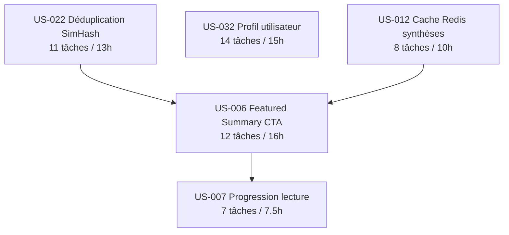

# Tâches — Sprint 003 Consolidation

> **Sprint Goal** : Consolider l'expérience du Daily Brief (featured summary + CTA "Lire le brief complet", indicateur de progression de lecture, cache Redis des synthèses, déduplication SimHash) et enrichir le profil utilisateur, tout en déployant un environnement de staging instrumenté pour mesurer la rétention réelle J+1/J+7.

**Période** : 2026-08-25 → 2026-09-07 | **Vélocité cible** : 16 points

---

## Vue d'ensemble par US

| US | Titre | Points | Tâches | Heures | Ordre |
|----|-------|--------|--------|--------|-------|
| [US-022](./US-022-tasks.md) | Déduplication SimHash de titre | 3 | 11 | 13h | 1er (indépendant, améliore corpus US-006) |
| [US-032](./US-032-tasks.md) | Gestion du profil utilisateur | 3 | 14 | 15h | Parallèle dès J1 |
| [US-012](./US-012-tasks.md) | Cache Redis 24h des synthèses | 3 | 8 | 10h | Après US-022 ou parallèle |
| [US-006](./US-006-tasks.md) | Featured Summary desktop + CTA | 5 | 12 | 16h | Après US-012 + US-022 |
| [US-007](./US-007-tasks.md) | Indicateur de progression de lecture | 2 | 7 | 7.5h | En dernier (après US-006 stable) |

**Total Sprint 3 features : 52 tâches — 61.5h estimées — 16 story points**

---

## Tâches techniques transverses

| Fichier | Tâches | Heures |
|---------|--------|--------|
| [technical-tasks.md](./technical-tasks.md) | 6 | 16h |

**Grand total : 58 tâches — 77.5h (features + infra transverse)**

---

## Répartition par type de tâche (features uniquement)

| Type | Tâches | Heures | % heures |
|------|--------|--------|----------|
| [DB] | 6 | 4h | 6.5% |
| [BE] | 24 | 32h | 52% |
| [FE-WEB] | 8 | 9.5h | 15.5% |
| [TEST] | 10 | 15.5h | 25% |
| [DOC] | 2 | 2h | 3% |
| [REV] | 5 | 5h | 8% |
| **TOTAL** | **52** (+3 [DOC]) | **61.5h** | **100%** |

> Note : Les [DOC] et [REV] sont comptés par US mais regroupés ici pour clarté. Aucune tâche [FE-MOB] (projet web-only, pas de Flutter).

---

## Dépendances inter-US

> **US-032 est totalement indépendante** — développable en parallèle sur une branche dédiée dès J1.
> **US-022 et US-012** peuvent démarrer simultanément le J1 (pas de dépendance entre elles).
> **US-006** attend US-012 (cache Redis opérationnel) et US-022 (corpus dédupliqué).
> **US-007** attend US-006 (section `#brief-stories` créée par US-006 T-006-07).

---

## Fichiers de tâches

- [US-022 — Déduplication SimHash](./US-022-tasks.md) — 11 tâches, 13h
- [US-032 — Profil utilisateur](./US-032-tasks.md) — 14 tâches, 15h
- [US-012 — Cache Redis synthèses](./US-012-tasks.md) — 8 tâches, 10h
- [US-006 — Featured Summary + CTA](./US-006-tasks.md) — 12 tâches, 16h
- [US-007 — Progression de lecture](./US-007-tasks.md) — 7 tâches, 7.5h
- [Tâches techniques transverses](./technical-tasks.md) — 6 tâches, 16h

---

## Conventions

| Élément | Format | Exemple |
|---------|--------|---------|
| ID tâche feature | T-[US]-[Numéro 2 chiffres] | T-006-03 |
| ID tâche transverse | T-TECH-[Numéro 2 chiffres] | T-TECH-01 |
| Taille | 0.5h – 8h max | 2h |
| Statut | 🔲 / 🔄 / 👀 / ✅ / 🚫 | 🔲 À faire |
| Type | [DB] / [BE] / [FE-WEB] / [TEST] / [DOC] / [REV] / [OPS] | [BE] |

> Aucune tâche `[FE-MOB]` dans ce sprint — projet web-only (Symfony, pas Flutter).

---

## Risques techniques identifiés

| Risque | US | Tâche(s) concernée(s) | Mitigation |
|--------|----|-----------------------|------------|
| Bibliothèque SimHash PHP inexistante ou mal maintenue | US-022 | T-022-04 | Implémentation interne 64-bit (< 50 lignes) si pas de lib satisfaisante — buffer 4h inclus dans T-022-04 |
| `BIT_COUNT` XOR PostgreSQL : syntaxe `#` vs `XOR` selon version | US-022 | T-022-05 | Tester sur PostgreSQL 15+ staging avant merge ; fallback calcul Hamming en PHP si nécessaire |
| Génération Featured Summary coûteuse en tokens Mistral (prompt multi-articles) | US-006 | T-006-03, T-006-04 | Prompt < 300 tokens input ; cache Redis 24h obligatoire avant merge US-006 (US-012 en pré-requis) |
| Régression SynthesisService lors de l'ajout URL normalizer (US-012) | US-012 | T-012-01, T-012-02 | Tests unitaires existants + nouveaux cas bords ; CI bloquante avant merge |
| Email pending non vidé après expiration → email_pending incohérent | US-032 | T-032-05, T-032-07 | Cron de nettoyage ou vérification TTL à chaque GET /profile/edit ; test expiration inclus T-032-11 |
| CI GitHub Actions non opérationnelle à J+2 (billing) | Toutes | T-TECH-01 | Checklist pré-sprint dès J0 ; responsable désigné pour la résolution billing |
| Staging non prêt → impossible de valider les métriques rétention | Infra | T-TECH-03, T-TECH-04 | Priorité T-TECH-01 → T-TECH-03 dès J1 ; demo avec données simulées si nécessaire |

---

## Definition of Done rappel (Sprint 3)

Chaque tâche `[REV]` valide que son US satisfait :

- Code fonctionnel + PSR-12 (PHP CS Fixer : 0 diff) + PHPStan max (0 erreur)
- Architecture hexagonale (pas d'import Infrastructure dans Domain)
- Couverture >= 80% (unit + intégration)
- 0 PII dans les prompts Mistral (`assertNotContains` user_id/email/ip — CI bloquant)
- Cache Redis keyed sans UUID utilisateur (sha256 URL normalisée + level, ou date)
- CSRF actif sur tous les formulaires POST
- `ProfileVoter::EDIT` testé (403 + log WARN si autre utilisateur)
- Twig `| e` / PHP `htmlspecialchars` sur tout contenu IA (XSS)
- Design tokens CSS (pas de valeurs codées en dur hors `designTokensCss()`)
- Pipeline CI verte (PHPStan + CS Fixer + Tests + Lighthouse >= 90 sur /brief)
- ARIA correct sur les nouveaux composants (progressbar, bio counter)
- 0 tâche `[FE-MOB]` dans les livrables (web-only confirmé)
