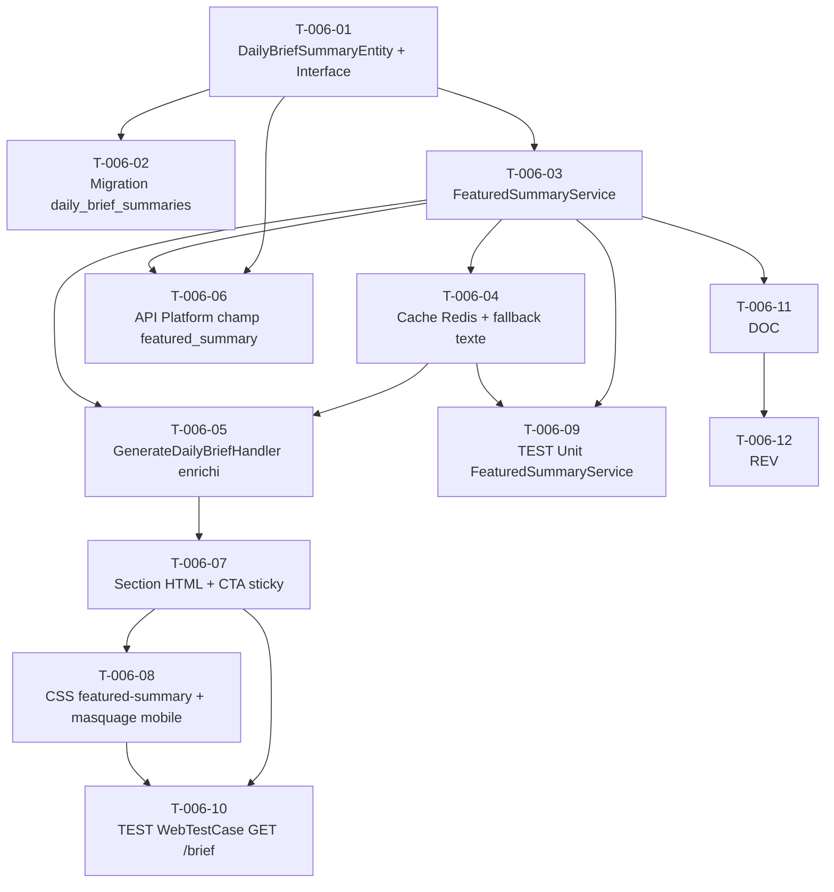

# US-006 — Tâches techniques : Featured Summary desktop + CTA "Lire le brief complet"

**User Story** : En tant que P-001 Thomas, je veux voir une synthèse narrative "Featured Summary" du Daily Brief en haut de la page (desktop uniquement), avec un CTA "Lire le brief complet" visible en permanence, afin d'obtenir en 2 minutes une vue d'ensemble éditoriale du brief avant de décider quelles histoires approfondir.
**Story Points** : 5 | **Sprint** : sprint-003-consolidation
**EPIC** : EPIC-001 Daily Brief Core
**Dépendances** : US-004 (MistralApiClient existant, ArticleSummaryService pattern), US-012 (cache Redis opérationnel avant merge US-006), US-022 (corpus dédupliqué bénéficie à la qualité du summary)

---

## Tâches

| ID | Type | Description | Heures | Dépend de | Statut |
|----|------|-------------|--------|-----------|--------|
| T-006-01 | [DB] | Entité Doctrine `DailyBriefSummaryEntity` (id UUID v4, brief_id UUID FK UNIQUE → daily_briefs.id, content TEXT, model_version VARCHAR(64), generated_at TIMESTAMPTZ, is_fallback BOOLEAN DEFAULT FALSE) + `DailyBriefSummaryRepositoryInterface` dans `src/Domain/Brief/` | 1.5h | — | 🔲 |
| T-006-02 | [DB] | Migration table `daily_brief_summaries` + index UNIQUE sur `brief_id` | 0.5h | T-006-01 | 🔲 |
| T-006-03 | [BE] | `FeaturedSummaryService` dans `src/Application/Brief/FeaturedSummary/` : prompt agrégé multi-articles (titre + extrait des 3 articles, < 300 tokens input, 0 PII — assert `assertNotContains` user_id/email/ip en CI) via `MistralClientInterface` réutilisé ; retour `FeaturedSummaryDTO` (text string, modelVersion string, generatedAt DateTimeImmutable, isFallback bool) ; 80-120 mots comptés côté service | 2h | T-006-01 | 🔲 |
| T-006-04 | [BE] | Cache Redis `briefly:featured_summary:{date}` TTL 86400s dans `FeaturedSummaryService` : cache-aside pattern (hit → retour immédiat, miss → appel Mistral + set) ; fallback texte `"Voici les 3 histoires majeures du {date}."` avec `is_fallback=TRUE` si Mistral KO ; log WARNING `{"event": "featured_summary.fallback_used", "date": "YYYY-MM-DD"}` | 1h | T-006-03 | 🔲 |
| T-006-05 | [BE] | Enrichissement `GenerateDailyBriefHandler` : après sélection des top stories, appel `FeaturedSummaryService::generateForBrief(briefId, stories[])`, persistance via `DailyBriefSummaryRepositoryInterface::save()` + mise en cache Redis ; mode dégradé (exception Mistral → fallback persisté, pas de blocage du handler) | 1.5h | T-006-03, T-006-04 | 🔲 |
| T-006-06 | [BE] | Champ `featured_summary` dans la réponse `GET /api/brief/today` (API Platform) : enrichir la ressource `BriefResource` avec `?string $featuredSummary = null` + `bool $isFeaturedSummaryFallback = false` ; charger depuis `DailyBriefSummaryRepositoryInterface::findByBriefId()` dans le StateProvider existant | 1h | T-006-01, T-006-03 | 🔲 |
| T-006-07 | [FE-WEB] | Section HTML dans `BriefController::renderBriefHtml()` : `<section class="featured-summary" aria-label="Synthèse éditoriale du brief">` avec badge "BRIEFLY AI:" émeraude (si `isFallback=FALSE`) ou texte sans badge (fallback) + `id="brief-stories"` sur `<ol class="stories-list">` (ancre CTA) ; CTA `<a href="#brief-stories">Lire le brief complet</a>` dans la nav (sticky) | 2h | T-006-05 | 🔲 |
| T-006-08 | [FE-WEB] | CSS featured summary dans `BriefController` : `.featured-summary { background: linear-gradient(135deg, rgba(16,185,129,0.04), transparent); border: 1px solid var(--color-emerald-accent); border-radius: var(--radius); padding: 1.5rem; margin-bottom: 2rem; }` + `.cta-read-brief { position: sticky; top: 0; }` + masquage mobile `@media (max-width: 767px) { .featured-summary { display: none; } }` | 1h | T-006-07 | 🔲 |
| T-006-09 | [TEST] | Tests unitaires `FeaturedSummaryService` : prompt PII-free (`assertNotContains` user_id/email/ip/session_id) ; cache hit → 0 appel Mistral ; cache miss → appel Mistral + cache set ; Mistral KO → fallback texte + `is_fallback=TRUE` + log WARNING enregistré ; contenu 80-120 mots validé | 2h | T-006-03, T-006-04 | 🔲 |
| T-006-10 | [TEST] | `WebTestCase` GET `/brief` : `.featured-summary` présent dans le DOM (brief avec featured_summary) ; badge `.ai-summary__badge-text` avec texte "BRIEFLY AI:" ; ancre `#brief-stories` existante dans le HTML ; fallback sans badge émeraude si `is_fallback=TRUE` ; test viewport mobile → `.featured-summary` CSS `display:none` vérifié | 2h | T-006-07, T-006-08 | 🔲 |
| T-006-11 | [DOC] | PHPDoc `FeaturedSummaryService`, `FeaturedSummaryDTO`, `DailyBriefSummaryRepositoryInterface` ; note RGPD sur absence de PII dans le prompt (uniquement article.title + article.excerpt + brief.date) | 0.5h | T-006-03 | 🔲 |
| T-006-12 | [REV] | Code review US-006 : PII-free vérifié en CI (assert bloquant), fallback texte persisté et testé, cache Redis keyed sur date (jamais user_id), CSS masquage mobile correct, ancre `#brief-stories` intacte, lien CTA non-bloquant | 1h | T-006-11 | 🔲 |

**Total US-006 : 12 tâches — 16h**

---

## Graphe de dépendances

---

## Notes techniques

- **Architecture** : `FeaturedSummaryService` dans `src/Application/Brief/FeaturedSummary/` — couche Application, dépend uniquement de Domain. `MistralClientInterface` réutilisé depuis `src/Domain/Synthesis/` (pas de nouveau client).
- **Prompt agrégé** : `"Tu es un éditeur de contenu. Rédige en français un paragraphe narratif de 80 à 120 mots résumant les 3 histoires suivantes du Daily Brief du {date} : [titre1 - extrait1] / [titre2 - extrait2] / [titre3 - extrait3]. Ton : informatif, éditorial, sans liste à puces."` — PII-safe : uniquement titres publics + extraits publics + date.
- **Cache Redis** : clé `briefly:featured_summary:{Y-m-d}`, TTL 86400s. Clé sans UUID utilisateur (RGPD). Implémentation via `SynthesisCacheInterface` déjà en place.
- **Fallback** : texte stocké en base avec `is_fallback=TRUE` pour traçabilité. Affiché sans badge émeraude (#10B981 réservé à l'IA — INV-2).
- **BriefController** : rendu inline PHP (pas de Twig en Sprint 3) — ajouter méthodes `featuredSummaryCss()` et `renderFeaturedSummary()` sur le modèle des méthodes existantes.
- **CTA sticky** : le bouton "Lire le brief complet" est dans la `<nav>` existante (sticky grâce au `position: sticky` de `.site-header`). Sur desktop uniquement.
- **Test PII-free CI** : `assertNotContains($prompt, 'user_id')` + `assertNotContains($prompt, '@')` + `assertNotContains($prompt, 'session')` — test bloquant dans `FeaturedSummaryServiceTest`.
