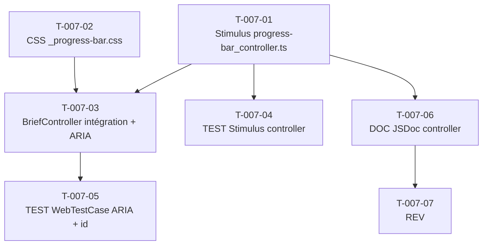

# US-007 — Tâches techniques : Indicateur de progression de lecture (ligne émeraude 2px)

**User Story** : En tant que P-001 Thomas, je veux voir une ligne de progression de lecture émeraude (#10B981, 2px) en haut de la page /brief qui avance proportionnellement à mon scroll, afin de savoir où j'en suis dans ma lecture et ressentir un sentiment d'accomplissement.
**Story Points** : 2 | **Sprint** : sprint-003-consolidation
**EPIC** : EPIC-001 Daily Brief Core
**Dépendances** : US-001 (page /brief existante avec BriefController), US-006 (section `#brief-stories` créée — ancre utilisée par ce sprint)

---

## Tâches

| ID | Type | Description | Heures | Dépend de | Statut |
|----|------|-------------|--------|-----------|--------|
| T-007-01 | [FE-WEB] | Stimulus controller `assets/controllers/progress-bar_controller.ts` : `connect()` → `addEventListener('scroll', this.onScroll)` avec throttle `requestAnimationFrame` (50ms) → calcul `pct = scrollY / (scrollHeight - innerHeight) * 100` arrondi 0-100 → `element.style.width = pct + '%'` + `element.setAttribute('aria-valuenow', pct)` ; cas division par zéro (`scrollHeight <= innerHeight`) → width=100% ; `disconnect()` → `removeEventListener` (anti-fuite mémoire Turbo) ; reset sur `turbo:load` event → width=0% | 2h | — | 🔲 |
| T-007-02 | [FE-WEB] | CSS `assets/styles/components/_progress-bar.css` : `.progress-bar { position: fixed; top: 0; left: 0; height: 2px; width: 0%; background: var(--color-emerald, #10B981); z-index: 100; transition: width 0.1s linear; }` ; dark mode : `@media (prefers-color-scheme: dark)` conserve la même couleur émeraude (token partagé) | 0.5h | — | 🔲 |
| T-007-03 | [FE-WEB] | Intégration dans `BriefController::renderBriefHtml()` : insérer `

` en première balise dans `<body>` ; ajouter `id="brief-stories"` sur `<ol class="stories-list">` (ancre CTA US-006) ; import Stimulus + AssetMapper dans `<head>` | 1h | T-007-01, T-007-02 | 🔲 |
| T-007-04 | [TEST] | Tests Stimulus controller (vitest ou Jest si disponible, sinon test manuel documenté) : `connect()` enregistre le listener scroll ; `disconnect()` supprime le listener (pas de fuite) ; position 0 → width 0% ; position 50% → width ±2% ; position max → width 100% ; page non-scrollable → width 100% (division par zéro gérée) ; `turbo:load` → width réinitialisé à 0% | 2h | T-007-01 | 🔲 |
| T-007-05 | [TEST] | `WebTestCase` GET `/brief` : présence de `
` ; pas d'erreur de structure HTML | 1h | T-007-03 | 🔲 |
| T-007-06 | [DOC] | Documentation `progress-bar_controller.ts` : JSDoc avec description du throttle rAF, de la logique anti-fuite `disconnect()`, du cas division par zéro, des attributs ARIA mis à jour dynamiquement ; note sur la compatibilité Turbo Drive (reset `turbo:load`) | 0.5h | T-007-01 | 🔲 |
| T-007-07 | [REV] | Code review US-007 : ARIA `role="progressbar"` + `aria-valuenow` mis à jour dynamiquement (WCAG 2.1 AA), absence de listener orphelin (disconnect testé), couleur uniquement via token CSS (pas de valeur codée en dur hors `_progress-bar.css`), réinitialisation Turbo Drive, pas de régression BriefController | 0.5h | T-007-06 | 🔲 |

**Total US-007 : 7 tâches — 7.5h**

---

## Graphe de dépendances

---

## Notes techniques

- **Backend : AUCUN** — US purement frontend. Pas de requête serveur, pas de persistence. Exception documentée au principe de vertical slicing (US-007 Vertical Slicing §Backend).
- **Stimulus + AssetMapper** : le controller est compilé via Symfony AssetMapper (pas de Webpack Encore requis). Fichier `assets/controllers/progress-bar_controller.ts` auto-découvert par le bundle Stimulus Bridge.
- **Token CSS** : `--color-emerald` = `#10B981` déjà défini dans `BriefController::designTokensCss()`. Le CSS de la barre utilise `var(--color-emerald, #10B981)` (fallback en cas d'absence du token). INV-2 : émeraude réservé à l'IA/progression.
- **Anti-fuite Turbo** : `disconnect()` est appelé automatiquement par Stimulus lors de la navigation Turbo Drive. L'écoute de `turbo:load` dans `connect()` réinitialise width=0% pour les SPA-like navigations.
- **Division par zéro** : `if (document.documentElement.scrollHeight <= window.innerHeight) { this.element.style.width = '100%'; return; }` — cas brief incomplet (1 seule histoire tient dans le viewport).
- **WCAG 2.1 AA** : `role="progressbar"` + `aria-valuenow` mis à jour à chaque scroll (throttled). `aria-valuemin="0"` et `aria-valuemax="100"` statiques. La couleur n'est jamais le seul indicateur (la largeur est l'indicateur principal).
- **z-index 100** : la barre passe au-dessus du header (z-index 10) mais ne cache aucun contenu lisible (hauteur 2px uniquement).
