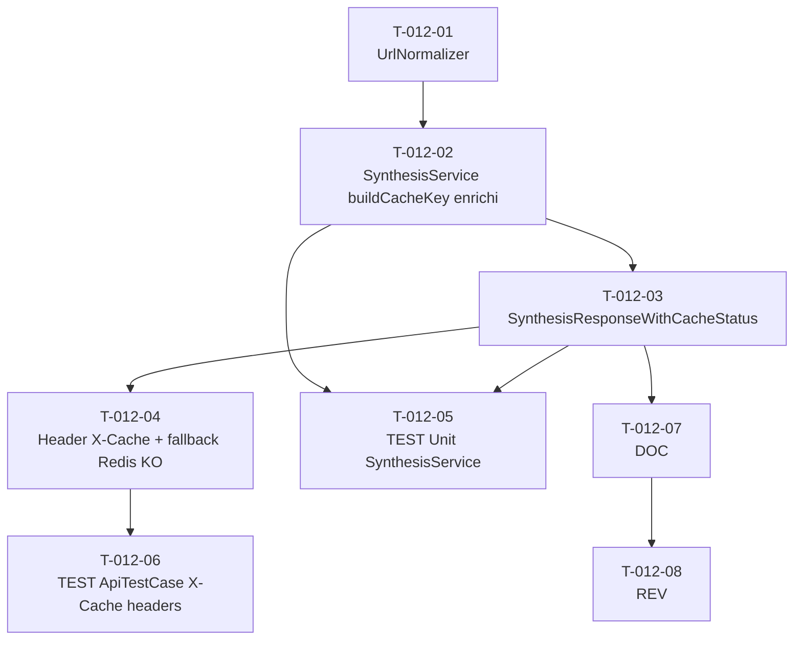

# US-012 — Tâches techniques : Cache Redis 24h des synthèses générées

**User Story** : En tant que P-001 Thomas, je veux que les synthèses déjà générées soient servies instantanément lors d'une deuxième consultation, afin de ne pas attendre 5+ secondes à chaque ouverture d'un article déjà analysé et réduire les coûts d'appels API Mistral.
**Story Points** : 3 | **Sprint** : sprint-003-consolidation
**EPIC** : EPIC-002 Moteur de Synthèse IA
**Dépendances** : US-010 (`SynthesisService` existant avec `SynthesisCacheInterface`), US-011 (clé de cache incluant le niveau — déjà partiellement implémentée)

---

## Tâches

| ID | Type | Description | Heures | Dépend de | Statut |
|----|------|-------------|--------|-----------|--------|
| T-012-01 | [BE] | `UrlNormalizer` dans `src/Application/Synthesis/` : `normalize(string $url): string` — lowercase scheme+host (`strtolower(parse_url($url, PHP_URL_SCHEME))`, `strtolower(parse_url($url, PHP_URL_HOST))`), tri alphabétique des query params (`parse_str` + `ksort` + `http_build_query`), strip caractères de contrôle (`\r`, `\n`, `\0`) ; lève `InvalidSynthesisUrlException` si l'URL reste invalide après nettoyage (`filter_var` final) | 1.5h | — | 🔲 |
| T-012-02 | [BE] | Intégration `UrlNormalizer` dans `SynthesisService::buildCacheKey()` : utiliser `$normalizedUrl = $this->normalizer->normalize($request->url)` avant `hash('sha256', ...)` ; remonter l'exception `InvalidSynthesisUrlException` vers le processor (422 côté API) ; log structuré enrichi `synthesis.cache_hit` / `synthesis.cache_miss` avec champ `url_hash` (sha256 normalisée) et `level` | 1h | T-012-01 | 🔲 |
| T-012-03 | [BE] | Enrichissement de `SynthesisService::synthesize()` : retourner un `SynthesisResponseWithCacheStatus` (VO wrappant `SynthesisResponse` + `string $cacheStatus: 'HIT'|'MISS'|'BYPASS'`) ; status HIT si `$this->cache->get()` non null, BYPASS si `SynthesisCacheInterface::get()` lève une exception (Redis KO), MISS sinon | 1h | T-012-02 | 🔲 |
| T-012-04 | [BE] | Header `X-Cache: HIT|MISS|BYPASS` dans `UrlSynthesisProcessor` : récupérer `$cacheStatus` depuis `SynthesisResponseWithCacheStatus` ; injecter `'X-Cache' => $cacheStatus` dans les headers de réponse via le contexte API Platform (pattern analogue à `X-Quota-Remaining` déjà présent) ; fallback Redis KO dans l'implémentation cache concrète : catch `CacheException` → log WARNING `synthesis.cache_unavailable` → retour BYPASS (pas d'exception propagée, synthèse générée normalement) | 1.5h | T-012-03 | 🔲 |
| T-012-05 | [TEST] | Tests unitaires `SynthesisService` : URL `HTTPS://TechCrunch.COM/article?z=1&a=2` → même clé cache que `https://techcrunch.com/article?a=2&z=1` (canonicalisation) ; URL avec `\r\n` → `InvalidSynthesisUrlException` → HTTP 422 ; BYPASS si mock Redis lève `CacheException` → Mistral appelé normalement ; 3 niveaux (concise/detailed/narrative) = 3 clés distinctes sur la même URL normalisée ; cache HIT → 0 appel Mistral (`MistralClientInterface` mock non appelé) | 2h | T-012-02, T-012-03 | 🔲 |
| T-012-06 | [TEST] | `ApiTestCase` POST `/api/v1/synthesis` : 1er appel → header `X-Cache: MISS` + synthèse générée ; 2e appel identique → header `X-Cache: HIT` + réponse identique + 0 appel Mistral (spy) ; Redis KO (mock CacheException) → header `X-Cache: BYPASS` + synthèse générée ; injection Redis key sanitization : URL avec `\r\n` → HTTP 422 | 1.5h | T-012-04 | 🔲 |
| T-012-07 | [DOC] | PHPDoc `UrlNormalizer` (algorithme de canonicalisation, cas bords), enrichissement `SynthesisService::buildCacheKey()` (note sur URL normalisée, PII-safe), `SynthesisResponseWithCacheStatus` (valeurs possibles HIT/MISS/BYPASS), header X-Cache dans `UrlSynthesisProcessor` | 0.5h | T-012-03 | 🔲 |
| T-012-08 | [REV] | Code review US-012 : clé Redis sans UUID utilisateur ni email (sha256 URL normalisée + level uniquement) ; fallback BYPASS non bloquant (synthèse toujours retournée) ; URL canonicalisée testée avec cas bords ; header X-Cache présent sur tous les status codes 200 ; logs structurés url_hash + level uniquement (jamais l'URL brute) | 1h | T-012-07 | 🔲 |

**Total US-012 : 8 tâches — 10h**

---

## Graphe de dépendances

---

## Notes techniques

- **Aucune nouvelle table** : la table `synthesis_results` (PostgreSQL) reste inchangée, source de vérité. Redis est une couche de rapidité uniquement.
- **Normalisation URL** : `https://TechCrunch.COM/article?z=1&a=2` et `https://techcrunch.com/article?a=2&z=1` doivent produire la même clé. L'algorithme est : `scheme_lowercase + "://" + host_lowercase + path + "?" + sorted_query`. Le fragment (#anchor) est ignoré.
- **BYPASS** : Redis indisponible ne bloque pas le service. `SynthesisCacheInterface::get()` catch l'exception → log WARNING `synthesis.cache_unavailable` → retourne `null` (traité comme MISS pour l'appel Mistral, mais le status est BYPASS pour le header).
- **Pattern header** : `UrlSynthesisProcessor` ajoute déjà `X-Quota-Remaining` via `headers: ['X-Quota-Remaining' => '0']` dans `TooManyRequestsHttpException`. Le header `X-Cache` est injecté de façon similaire dans la réponse normale (200) via `$context['response_headers']` ou un EventSubscriber `kernel.response`.
- **SynthesisService existant** : les méthodes `buildCacheKey()`, `validateUrlForSsrf()`, et les étapes cache (étapes 2 et 7) sont déjà codées (Sprint 2). US-012 étend cette logique sans la réécrire.
- **Clé cache PII-safe** : `synthesis:{sha256(normalized_url + '_' + level.value)}` — jamais d'UUID utilisateur dans la clé (RGPD, invariant INV-6).
