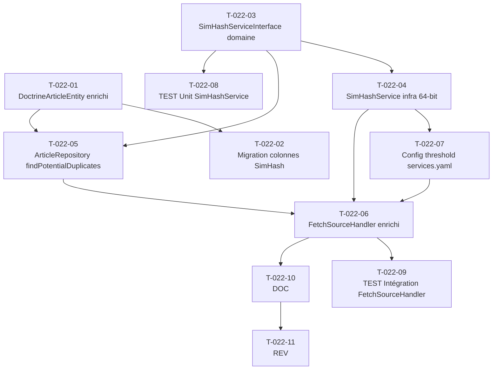

# US-022 — Tâches techniques : Déduplication avancée par SimHash de titre

**User Story** : En tant que P-001 Thomas, je veux ne jamais voir le même article en doublon dans mon Daily Brief, même lorsqu'il est couvert par des sources différentes avec des titres légèrement reformulés, afin de gagner du temps de lecture et ne recevoir que des signaux réellement nouveaux.
**Story Points** : 3 | **Sprint** : sprint-003-consolidation
**EPIC** : EPIC-003 Gestion des Sources & Indexation
**Dépendances** : US-020 (pipeline RSS FetchSourceHandler existant), sprint 2 mergé (ArticleRepositoryInterface, DoctrineArticleEntity)

---

## Tâches

| ID | Type | Description | Heures | Dépend de | Statut |
|----|------|-------------|--------|-----------|--------|
| T-022-01 | [DB] | Enrichissement `DoctrineArticleEntity` : `title_simhash BIGINT NULLABLE`, `is_duplicate BOOLEAN NOT NULL DEFAULT FALSE`, `duplicate_of UUID NULLABLE FK articles(id) ON DELETE SET NULL` (self-referential) + getters/setters correspondants | 1h | — | 🔲 |
| T-022-02 | [DB] | Migration Doctrine : colonnes `title_simhash` (BIGINT NULLABLE), `is_duplicate` (BOOLEAN NOT NULL DEFAULT FALSE), `duplicate_of` (UUID NULLABLE FK self-ref `articles(id)`) + index B-tree sur `published_at` (si absent) ; contrainte FK ON DELETE SET NULL pour conserver la traçabilité si l'original est supprimé | 0.5h | T-022-01 | 🔲 |
| T-022-03 | [BE] | Interface domaine `SimHashServiceInterface` dans `src/Domain/Feed/` : `compute(string $title): ?int` (null si titre vide ou erreur), `distance(int $a, int $b): int` (`BIT_COUNT($a XOR $b)` en PHP pur) ; `SimHashThresholdInterface::getThreshold(): int` pour injecter le seuil configurable | 0.5h | — | 🔲 |
| T-022-04 | [BE] | `SimHashService` dans `src/Infrastructure/Feed/SimHash/` implémentant `SimHashServiceInterface` : `compute()` — `mb_strtolower()`, suppression stopwords FR/EN (`array_diff(tokens, ['le','la','les','un','une','des','de','du','en','the','a','an','of','in','is','it','to','and','or'])`) , tokenisation (`preg_split('/[\s\p{P}]+/u', $title)`), calcul SimHash 64-bit (pour chaque token : hash fnv1a 64-bit → contribution bit par bit pondérée → somme → signe = bit SimHash) ; `compute("") → null` ; RuntimeException catchée → null ; seuil `briefly.simhash.threshold` injecté depuis `services.yaml` (défaut 3) | 1.5h | T-022-03 | 🔲 |
| T-022-05 | [BE] | `ArticleRepositoryInterface::findPotentialDuplicates(int $simhash, \DateTimeImmutable $publishedAt, int $threshold): list<array{id: string, title: string, simhash: int}>` dans le domain + implémentation Doctrine DBAL : `WHERE is_duplicate = FALSE AND title_simhash IS NOT NULL AND BIT_COUNT(title_simhash # :simhash) <= :threshold AND ABS(EXTRACT(EPOCH FROM published_at - :pub)) <= 7200` ; `BIT_COUNT` natif PostgreSQL 15+ (`#` = XOR bit à bit en PostgreSQL) ; index `published_at` utilisé pour le filtre temporel | 1.5h | T-022-03, T-022-01 | 🔲 |
| T-022-06 | [BE] | Enrichissement `FetchSourceHandler` : après `saveIgnoringDuplicate($dto)` retourne TRUE → (1) calcul SimHash via `SimHashServiceInterface::compute($dto->title)` dans un `try/catch RuntimeException` → si exception : `title_simhash=null`, log ERROR + continuation ; (2) si simhash non null → appel `findPotentialDuplicates()` → si doublon trouvé → `articleRepository->markAsDuplicate($newArticleId, $duplicateOfId)` + log DEBUG (title_a, title_b, distance, window_min, source_ids) ; jamais de suppression d'article ; filtre `is_duplicate=FALSE` ajouté dans `BriefSelectorService` pour la sélection des top stories | 2h | T-022-04, T-022-05 | 🔲 |
| T-022-07 | [BE] | Paramètre `briefly.simhash.threshold: 3` dans `config/services.yaml` ; binding `$simhashThreshold: '%briefly.simhash.threshold%'` dans `SimHashService` ; validation que `$threshold >= 1 && $threshold <= 10` (IllegalArgumentException si invalide) | 0.5h | T-022-04 | 🔲 |
| T-022-08 | [TEST] | Tests unitaires `SimHashService` : titre vide `""` → null ; titre avec espaces uniquement → null ; titre normal `"Apple annonce iPhone"` → int 64-bit non null ; deux titres proches → distance ≤ 3 ; deux titres distincts → distance > 3 ; titre CJK pur (caractères U+4E00-U+9FFF uniquement) → RuntimeException catchée → null ; stopwords supprimés : `"le grand prix"` et `"grand prix"` → distance = 0 | 2h | T-022-04 | 🔲 |
| T-022-09 | [TEST] | Tests intégration `FetchSourceHandler` avec fixtures pré-chargées : (1) article B titre proche (distance=2) + ≤2h → `is_duplicate=TRUE` + `duplicate_of=A.id` + log DEBUG ; (2) article similaire mais distance=6 → `is_duplicate=FALSE` ; (3) article similaire + ≥2h d'écart → `is_duplicate=FALSE` ; (4) exception `SimHashService` → article inséré `is_duplicate=FALSE` + log ERROR ; (5) titre vide → `title_simhash=NULL` + log WARNING + ingestion continue | 2h | T-022-06 | 🔲 |
| T-022-10 | [DOC] | PHPDoc `SimHashService` (algorithme 64-bit, stopwords FR/EN, cas bords), `ArticleRepositoryInterface::findPotentialDuplicates` (format SQL BIT_COUNT XOR, fenêtre ±2h), enrichissement `FetchSourceHandler` (try/catch SimHash, jamais de suppression, filtre is_duplicate) | 0.5h | T-022-06 | 🔲 |
| T-022-11 | [REV] | Code review US-022 : pas de suppression d'article (traçabilité garantie), try/catch autour du calcul SimHash (pipeline non bloqué), threshold configurable et validé, FK self-referential ON DELETE SET NULL, filtre `is_duplicate=FALSE` dans BriefSelectorService, logs DEBUG pour monitoring, clé SimHash sans PII | 1h | T-022-10 | 🔲 |

**Total US-022 : 11 tâches — 13h**

---

## Graphe de dépendances

---

## Notes techniques

- **Algorithme SimHash 64-bit** : pour chaque token normalisé, calculer `hash('fnv1a64', $token)` (64-bit), itérer sur les 64 bits, incrémenter/décrémenter un tableau `$bits[64]`, signe(bit) = 1 si positif else 0. Résultat : entier 64-bit PHP (stocké en BIGINT PostgreSQL signé).
- **BIT_COUNT en PostgreSQL** : `BIT_COUNT(col # :simhash)` — `#` = XOR bit à bit en PostgreSQL (pas `XOR` keyword). PostgreSQL 15+ a `BIT_COUNT()` natif sur valeurs bit. Sur `BIGINT` : utiliser `bit_count((col # :simhash)::bigint::bit(64))` si nécessaire selon version.
- **Fenêtre temporelle** : `ABS(EXTRACT(EPOCH FROM published_at - :pub)) <= 7200` = ±2 heures. L'article entrant utilise son `published_at` du flux RSS (pas `fetch_at`).
- **Jamais de suppression** : un doublon est inséré en base avec `is_duplicate=TRUE`. La traçabilité est garantie. Seule la sélection du Brief filtre `is_duplicate=FALSE`.
- **Coexistence SHA-256 + SimHash** : SHA-256 sur URL canonique (barrière primaire, même URL) reste actif dans `saveIgnoringDuplicate()`. SimHash est la barrière secondaire (même article, source différente).
- **Bibliothèque** : implémentation interne légère (< 50 lignes). Évaluation de `serafins/simhash` ou `misterion/simhash` en Sprint Planning Part 1 (risque bibliothèque tiers — sprint-goal.md).
- **Article domaine** : les champs `title_simhash`, `is_duplicate`, `duplicate_of` sont sur `DoctrineArticleEntity` (infra) seulement en v1. `Article` (domain) reçoit un enrichissement minimal si `BriefSelectorService` en a besoin (DIP respecté).
