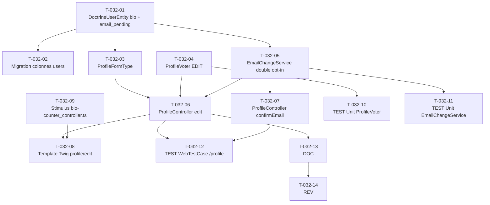

# US-032 — Tâches techniques : Gestion du profil utilisateur

**User Story** : En tant que P-002 Priya, je veux modifier mon nom complet, mon adresse email et ma bio professionnelle et enregistrer explicitement mes changements, afin que mon profil reflète mon identité professionnelle et que mes exports soient correctement attribués.
**Story Points** : 3 | **Sprint** : sprint-003-consolidation
**EPIC** : EPIC-004 Comptes Utilisateurs & Premium
**Dépendances** : US-030 (inscription email, `DoctrineUserEntity` existant avec `full_name`), US-031 (authentification OAuth, sécurité Symfony active)

---

## Tâches

| ID | Type | Description | Heures | Dépend de | Statut |
|----|------|-------------|--------|-----------|--------|
| T-032-01 | [DB] | Enrichissement `DoctrineUserEntity` : champ `bio VARCHAR(280) NULLABLE` (`#[ORM\Column(length: 280, nullable: true)]`) + champ `email_pending VARCHAR(255) NULLABLE` (`#[ORM\Column(length: 255, nullable: true)]`) ; `full_name` est déjà présent (vérifier longueur 255) + getters `getBio(): ?string`, `getEmailPending(): ?string` ; setters internes `setBio(?string $bio)`, `setEmailPending(?string $email)` | 0.5h | — | 🔲 |
| T-032-02 | [DB] | Migration Doctrine : colonnes `bio VARCHAR(280) NULLABLE` + `email_pending VARCHAR(255) NULLABLE` sur table `users` | 0.5h | T-032-01 | 🔲 |
| T-032-03 | [BE] | `ProfileFormType` dans `src/Presentation/Form/` : champs `full_name` (`TextType`, `NotBlank`, `Length(min:1, max:255)`), `bio` (`TextareaType`, `Length(max:280, message:"La bio ne peut pas dépasser 280 caractères")`, nullable), `email` (`EmailType`, `NotBlank`, `Email(mode:html5)`), `UniqueEntity(fields:['email'], message:"Cette adresse email est déjà associée à un compte Briefly AI", ignoreNull:false)` ; token CSRF activé (default Symfony) | 1h | T-032-01 | 🔲 |
| T-032-04 | [BE] | `ProfileVoter` dans `src/Presentation/Security/` : attribut `EDIT` ; `voteOnAttribute()` — `$token->getUser() instanceof IdentifiableUserInterface && $subject instanceof DoctrineUserEntity && $token->getUser()->getUserUuid() === $subject->getUserUuid()` → GRANT sinon DENY ; `supportsAttribute(EDIT)` + `supportsType(DoctrineUserEntity)` ; log WARN si DENY : `{"event": "profile.unauthorized_edit_attempt", "requester_id": "[uuid]", "target_id": "[uuid]", "timestamp": "..."}` (jamais d'email dans les logs — RGPD) | 1h | — | 🔲 |
| T-032-05 | [BE] | `EmailChangeService` dans `src/Application/User/Profile/` : `requestChange(DoctrineUserEntity $user, string $newEmail, bool $newEmailAlreadyUsed): void` — génère token `Uuid::v4()->toRfc4122()`, stocke `email_pending = $newEmail` + token dans `user_email_tokens` ou directement dans `DoctrineUserEntity` via un champ `email_pending_token VARCHAR(36) NULLABLE + email_pending_expires_at TIMESTAMPTZ NULLABLE` ; envoie email de confirmation avec lien `/profile/confirm-email/{token}` (TTL 24h via `$expiresAt = new DateTimeImmutable('+24 hours')`) via `MailerInterface` Symfony ; log INFO `{"event": "profile.email_change_requested", "user_id": "[uuid]"}` | 1.5h | T-032-01 | 🔲 |
| T-032-06 | [BE] | `ProfileController::edit()` GET/POST `/profile/edit` dans `src/Presentation/Controller/` : `#[Route('/profile/edit')]` ; `$this->denyAccessUnlessGranted(ProfileVoter::EDIT, $user)` ; `ProfileFormType` sur l'utilisateur courant ; si form valide → si email changé (`$form->get('email')->getData() !== $user->getEmail()`) → `EmailChangeService::requestChange()` + flash "Un email de confirmation a été envoyé..." ; sinon → persist `full_name` + `bio` via `EntityManagerInterface` + flash "Profil mis à jour avec succès" ; Turbo Frame `profile-form` | 1.5h | T-032-03, T-032-04, T-032-05 | 🔲 |
| T-032-07 | [BE] | `ProfileController::confirmEmail()` GET `/profile/confirm-email/{token}` : valide token (lookup `email_pending_token`, vérification `email_pending_expires_at > now()`) → met à jour `users.email = email_pending` + vide `email_pending`, `email_pending_token`, `email_pending_expires_at` → flash "Email mis à jour avec succès" → redirect `/profile/edit` ; token invalide/expiré → flash error + redirect | 1h | T-032-05 | 🔲 |
| T-032-08 | [FE-WEB] | Template Twig `templates/profile/edit.html.twig` : Turbo Frame `<turbo-frame id="profile-form">` wrappant `{{ form_start(form) }}` ; champ `full_name` avec label ; champ `bio` avec `data-controller="bio-counter" data-bio-counter-max-value="280"` + span compteur `0 / 280` ; champ `email` avec note "Un email de confirmation sera envoyé" ; bouton submit "Enregistrer les modifications" + token CSRF inclus automatiquement ; flash messages en dehors du Turbo Frame (persistance navigation) | 2h | T-032-06 | 🔲 |
| T-032-09 | [FE-WEB] | Stimulus controller `assets/controllers/bio-counter_controller.ts` : targets `counter`, values `max: Number` ; `connect()` + `input()` sur textarea `bio` → `this.counterTarget.textContent = "${len} / ${this.maxValue}"` → si `len > this.maxValue` : `this.counterTarget.style.color = 'var(--color-error, #DC2626)'` sinon `var(--color-on-surface-variant)` | 0.5h | — | 🔲 |
| T-032-10 | [TEST] | Tests unitaires `ProfileVoter` : propriétaire (même UUID) → GRANT ; autre utilisateur authentifié (UUID différent) → DENY + log WARN enregistré ; utilisateur non authentifié (AnonymousToken) → DENY ; attribut inconnu → abstain | 1h | T-032-04 | 🔲 |
| T-032-11 | [TEST] | Tests unitaires `EmailChangeService` : génération token UUID v4 valide ; `email_pending` stocké + `email_pending_expires_at` dans +24h ; email de confirmation envoyé (spy `MailerInterface`) ; `confirmEmail(validToken)` → `email` mis à jour + champs vidés ; token expiré → exception/flash error ; `email_pending` = email déjà utilisé par autre user → `UniqueEntityException` propagée | 1.5h | T-032-05 | 🔲 |
| T-032-12 | [TEST] | `WebTestCase` `/profile/edit` : GET → 200 formulaire pré-rempli (full_name, email) ; POST valid (full_name + bio) → 302 + flash succès + `users.bio` mis à jour en base ; POST bio 295 chars → HTTP 422 + message erreur "280 caractères" ; POST email déjà utilisé → 422 + message UniqueEntity ; POST autre user_id (manipulation URL) → 403 Forbidden ; POST sans token CSRF → 422/400 ; GET `/profile/confirm-email/{validToken}` → 302 + email mis à jour | 2h | T-032-06, T-032-07 | 🔲 |
| T-032-13 | [DOC] | PHPDoc `ProfileController` (routes GET/POST + confirmEmail, Voter utilisé), `ProfileVoter` (attribut EDIT, stratégie de log WARN), `EmailChangeService` (flux double opt-in, TTL 24h, champs vidés à confirmation), `ProfileFormType` (contraintes UniqueEntity + Length) ; note RGPD : emails non loggués, UUID uniquement dans les logs | 0.5h | T-032-06 | 🔲 |
| T-032-14 | [REV] | Code review US-032 : CSRF actif sur le formulaire POST (test WebTestCase dédié) ; Voter `ProfileVoter::EDIT` testé + log WARN ; double opt-in email (email_pending tant que non confirmé) ; bio max 280 chars côté serveur (pas seulement JS) ; email non loggué dans les events security (RGPD) ; Turbo Frame `profile-form` fonctionnel | 1h | T-032-13 | 🔲 |

**Total US-032 : 14 tâches — 15h**

---

## Graphe de dépendances

---

## Notes techniques

- **full_name déjà présent** : `DoctrineUserEntity.full_name` (`VARCHAR(255)`) existe déjà en base (Sprint 1). T-032-01 ajoute uniquement `bio` et `email_pending` (+ champs token/expiry pour EmailChangeService).
- **Email pending** : tant que `email_pending IS NOT NULL` et non expiré, l'email courant est `users.email` (inchangé). La confirmation met à jour `users.email = users.email_pending` + vide les champs temporaires. Impacte `getUserIdentifier()` → Symfony Security invalide la session après changement d'email (comportement attendu).
- **Turbo Frame** : `<turbo-frame id="profile-form">` wrap le formulaire. Les flashes sont rendus hors du frame (dans le layout base) pour persister lors de la navigation Turbo.
- **CSRF** : activé par défaut dans `ProfileFormType` (Symfony génère `_token` automatiquement). Test WebTestCase vérifie le rejet sans token.
- **ProfileVoter** : log WARN format `{"event": "profile.unauthorized_edit_attempt", "requester_uuid": "<uuid>", "target_uuid": "<uuid>"}` — jamais d'email dans les logs (RGPD INV-6). UUID seulement.
- **Architecture hexagonale** : `ProfileController` dans `src/Presentation/Controller/` → `EmailChangeService` dans `src/Application/User/Profile/` → `DoctrineUserEntity` dans `src/Infrastructure/User/Persistence/`. `ProfileVoter` dans `src/Presentation/Security/` (Presentation layer — accès Infrastructure autorisé via deptrac Presentation:[Infrastructure]).
- **Stimulus bio-counter** : valeur `max` injectée via `data-bio-counter-max-value="280"`. Pas de valeur codée en dur dans le controller JS (YAGNI + réutilisable).
