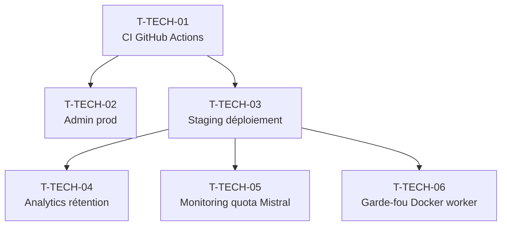

# Tâches Techniques Transverses — Sprint 003 Consolidation

> Ces tâches sont hors story points. Elles débloquent les US du sprint ou instrumentent l'infrastructure pour la mesure produit. Plusieurs nécessitent des **actions humaines / credentials** impossibles à automatiser par un agent de code — le responsable désigné est indiqué pour chacune.

---

## Tâches

| ID | Type | Description | Heures | Dépend de | Statut |
|----|------|-------------|--------|-----------|--------|
| T-TECH-01 | [OPS] | **Déblocage CI GitHub Actions + pipeline vert** : résolution du problème de billing GitHub Actions (activation d'un moyen de paiement ou utilisation du plan gratuit adapté) ; vérification du pipeline `.github/workflows/ci.yml` ; s'assurer que Pest, PHPStan niveau max, deptrac, PHP CS Fixer et Docker build passent tous en vert ; corriger les éventuelles erreurs de pipeline résiduelles. **REQUIS action humaine : credentials GitHub Billing + accès paramètres du repo. Non automatisable par un worker de code.** | 4h | — | 🔲 |
| T-TECH-02 | [OPS] | **Provisioning compte admin prod** : créer le compte administrateur P-004 Sophie en base de production (rôles `ROLE_USER`, `ROLE_ADMIN`) via commande Symfony ou fixture prod ; remplacer le provider `in_memory` vide par le provider `entity` dans `security.yaml` si ce n'est pas déjà fait ; vérifier l'accès aux routes `/admin/*`. **REQUIS action humaine : accès SSH prod + credentials DB prod. Non automatisable par un worker de code.** | 2h | T-TECH-01 | 🔲 |
| T-TECH-03 | [OPS] | **Déploiement environnement staging** : serveur staging opérationnel (Docker Compose avec services `php`, `postgres`, `redis`, `messenger-worker`) ; variables d'environnement injectées (DATABASE_URL, REDIS_URL, MISTRAL_API_KEY, APP_SECRET, MAILER_DSN) via `.env.staging` non commité ou secrets CI ; URL dédiée (ex : `staging.briefly.ai`) accessible ; migration Doctrine exécutée ; brief de test généré. **REQUIS action humaine : accès serveur staging + secrets Mistral/mailer. Non automatisable par un worker de code.** | 4h | T-TECH-01 | 🔲 |
| T-TECH-04 | [BE] | **Instrumentation analytics rétention J+1/J+7** : table `analytics_events` (`id UUID, event_type VARCHAR(50), session_hash VARCHAR(64), occurred_at TIMESTAMPTZ`) — `session_hash = sha256(random_salt + session_id)` recalculé à chaque session (0 PII permanent, 0 IP, 0 email) ; migration + entité ; events `brief_opened` et `brief_completed` dispatchés depuis `BriefController` ; requête calcul rétention J+1 (`COUNT(DISTINCT session_hash WHERE event brief_opened à J+1 après first brief_opened à J0)`) et J+7 ; endpoint admin `/admin/analytics/retention` affichant les métriques ; test unitaire CI : `assertNotContains('@', $event->sessionHash)` (assertion 0 PII bloquante) | 3h | T-TECH-03 | 🔲 |
| T-TECH-05 | [OPS] | **Monitoring quota Mistral + alerte** : job cron ou Messenger periodic (via Scheduler Symfony) vérifiant le quota restant Mistral via l'API Mistral (`GET /v1/usage`) ; si quota < 20% → envoi alerte (email via Mailer ou log CRITICAL) avec `{"event": "mistral.quota_low", "remaining_pct": X}` ; configuration via env `MISTRAL_QUOTA_ALERT_THRESHOLD_PCT=20` et `MISTRAL_ALERT_EMAIL=ops@briefly.ai`. **REQUIS action humaine : clé API Mistral avec permission usage + adresse email d'alerte configurée. Non automatisable sans credentials.** | 2h | T-TECH-03 | 🔲 |
| T-TECH-06 | [OPS] | **Garde-fou charge Docker (action rétro Sprint 2)** : ajouter limites mémoire et CPU dans `compose.yaml` pour le service messenger-worker (exécute les générations LLM) : `mem_limit: 512m`, `cpus: '0.5'` ; ajouter `restart: unless-stopped` ; documenter dans `docs/infrastructure/worker-limits.md` le choix des limites et la justification (worker séquentiel, pas de concurrence LLM) ; vérifier que le worker ne sature pas le serveur staging lors de la génération du Featured Summary | 1h | T-TECH-03 | 🔲 |

**Total technique transverse : 6 tâches — 16h** (dont 4 tâches nécessitant des actions humaines / credentials)

---

## Notes importantes

### Actions nécessitant une intervention humaine

Les tâches T-TECH-01, T-TECH-02, T-TECH-03 et T-TECH-05 **ne peuvent pas être réalisées par un agent de code** — elles requièrent un accès à des systèmes externes sécurisés, des credentials ou des décisions de facturation :

| Tâche | Blocage | Responsable |
|-------|---------|-------------|
| T-TECH-01 | Billing GitHub Actions (carte de paiement ou plan upgrade) | Admin repo GitHub |
| T-TECH-02 | Accès SSH prod + credentials DB production | DevOps / Tech Lead |
| T-TECH-03 | Serveur staging à provisionner + secrets Mistral/mailer | DevOps / Tech Lead |
| T-TECH-05 | Clé API Mistral avec permission usage + email d'alerte | Tech Lead |

**Checklist pré-sprint (à valider dès J0)** :
- [ ] Billing GitHub Actions débloqué
- [ ] Serveur staging provisionné et accessible
- [ ] Variables d'environnement staging disponibles (DSN, Redis URL, Mistral key, Mailer DSN)
- [ ] Compte admin prod P-004 Sophie créé
- [ ] Adresse email d'alerte quota Mistral configurée

### Analytics rétention (T-TECH-04)

**RGPD — 0 PII absolu** :
- `session_hash` = `sha256(salt_rotatif + browser_fingerprint_partiel)` — non réversible, non persistant au-delà de la session
- Jamais d'email, d'IP, de prénom, d'UUID utilisateur dans `analytics_events`
- Assertion CI bloquante : `assertNotContains('@', $sessionHash)` — si un email passe, le build fail
- Les métriques de rétention sont agrégées (COUNT) — pas de suivi individuel
- Données supprimables via `DELETE FROM analytics_events WHERE occurred_at < NOW() - INTERVAL '90 days'` (rétention max 90j)

### Ordre de réalisation recommandé

T-TECH-01 est le premier déblocage critique — sans CI opérationnelle, les US du sprint ne peuvent pas atteindre le statut DONE (DoD : "pipeline CI verte").
