# Dépendances — Sprint 004 Monétisation Premium

---

## Dépendances amont (Sprints 1, 2, 3 — déjà livrés)

| US / Composant livré | Consommé par | Détail |
|----------------------|-------------|--------|
| US-010 `SynthesisService`, `ArticleSynthesisProcessor`, `UrlSynthesisProcessor` | US-013 | Les processors existants sont modifiés pour brancher le quota réel et retourner HTTP 402 |
| US-011 `SynthesisLevel` enum, prompts Mistral | US-013 | Aucune modification — quota s'applique quel que soit le niveau |
| US-033 `QuotaService`, `QuotaCounterInterface`, `RedisQuotaCounter`, `PaywallModalController`, `QuotaController` | US-013 | US-013 étend `QuotaService` (ajout `isPremium()`, `refund()`) et active le paywall placeholder |
| US-030 `DoctrineUserEntity`, `UserRepository`, `security.yaml` | US-034a | La table `users.id` est la FK de `subscriptions.user_id` |
| US-032 `ProfileController` (GET/POST /profile/edit) | US-034b | `manageSubscription()` est ajouté au `ProfileController` existant |
| US-031 `GithubAuthenticator`, `GoogleAuthenticator` | US-034a | Aucune modification — OAuth coexiste avec Stripe |

---

## Dépendances intra-Sprint 4

```mermaid
graph TD
    subgraph "Tâches transverses [T-TECH]"
        TECH01[T-TECH-01<br/>stripe/stripe-php SDK]
        TECH02[T-TECH-02<br/>Variables env Stripe<br/>.env.dist + .env.test]
        TECH03[T-TECH-03<br/>security.yaml<br/>route webhook publique]
        TECH04[T-TECH-04<br/>Stripe CLI<br/>docs test local]
    end

    subgraph "US-034a — Stripe Checkout"
        A01[T-034a-01<br/>DoctrineSubscriptionEntity]
        A02[T-034a-02<br/>Migration subscriptions]
        A03[T-034a-03<br/>Domain Subscription + enums]
        A04[T-034a-04<br/>DoctrineSubscriptionRepository]
        A05[T-034a-05<br/>SubscriptionService::createCheckoutSession]
        A06[T-034a-06<br/>StripeCheckoutController<br/>GET /premium + /checkout/plan]
        A07[T-034a-07<br/>StripeWebhookController<br/>HMAC-SHA256]
        A08[T-034a-08<br/>StripeWebhookMessage +<br/>SubscriptionActivatedHandler]
        A09[T-034a-09<br/>Template /premium pricing]
        A10[T-034a-10<br/>Flash messages + badge Premium]
        A11[T-034a-11<br/>TEST Unit Handler idempotence]
        A12[T-034a-12<br/>TEST Unit HMAC webhook]
        A13[T-034a-13<br/>TEST WebTestCase /premium]
        A14[T-034a-14<br/>DOC]
        A15[T-034a-15<br/>REV]
    end

    subgraph "US-013 — Quota + paywall réel"
        B01[T-013-01<br/>Domain SubscriptionRepositoryInterface]
        B02[T-013-02<br/>QuotaService::isPremium]
        B03[T-013-03<br/>QuotaService::refund]
        B04[T-013-04<br/>QuotaCounterInterface::decrement<br/>RedisQuotaCounter DECR]
        B05[T-013-05<br/>HTTP 402 + X-Quota-Remaining<br/>dans les processors]
        B06[T-013-06<br/>Refund quota sur erreur Mistral<br/>dans les processors]
        B07[T-013-07<br/>Quota indicator header Twig]
        B08[T-013-08<br/>PaywallModal CTA actif]
        B09[T-013-09<br/>synthesis_controller.js HTTP 402]
        B10[T-013-10<br/>TEST Unit QuotaService]
        B11[T-013-11<br/>TEST Unit processors 402 + refund]
        B12[T-013-12<br/>TEST WebTestCase paywall]
        B13[T-013-13<br/>DOC]
        B14[T-013-14<br/>REV]
    end

    subgraph "US-034b — Customer Portal"
        C01[T-034b-01<br/>SubscriptionService::createPortalSession]
        C02[T-034b-02<br/>ProfileController::manageSubscription]
        C03[T-034b-03<br/>SubscriptionUpdatedHandler]
        C04[T-034b-04<br/>SubscriptionCancelledHandler]
        C05[T-034b-05<br/>PaymentFailedHandler]
        C06[T-034b-06<br/>QuotaService::isPremium grace period]
        C07[T-034b-07<br/>DoctrineSubscriptionRepository::update]
        C08[T-034b-08<br/>Template profile bouton manage]
        C09[T-034b-09<br/>TEST Unit 3 handlers]
        C10[T-034b-10<br/>TEST Unit isPremium state machine]
        C11[T-034b-11<br/>TEST WebTestCase portal + handlers]
        C12[T-034b-12<br/>DOC]
        C13[T-034b-13<br/>REV]
    end

    subgraph "US-035 — Réglages RGPD (indépendant)"
        D01[T-035-01<br/>DoctrineUserPrivacySettingsEntity]
        D02[T-035-02<br/>Migration user_privacy_settings]
        D03[T-035-03<br/>Domain UserPrivacySettings +<br/>PrivacySettingsRepositoryInterface]
        D04[T-035-04<br/>DoctrinePrivacySettingsRepository]
        D05[T-035-05<br/>PrivacySettingsService]
        D06[T-035-06<br/>PrivacySettingsVoter]
        D07[T-035-07<br/>PrivacySettingsController<br/>GET/PATCH/export]
        D08[T-035-08<br/>AnalyticsOptOutEventSubscriber<br/>X-Robots-Tag]
        D09[T-035-09<br/>Template settings/privacy.html.twig]
        D10[T-035-10<br/>TEST Unit Voter]
        D11[T-035-11<br/>TEST Unit Service]
        D12[T-035-12<br/>TEST WebTestCase /settings/privacy]
        D13[T-035-13<br/>DOC]
        D14[T-035-14<br/>REV]
    end

    %% Tech transverses → US-034a
    TECH01 --> A05
    TECH01 --> A07
    TECH02 --> A05
    TECH03 --> A07

    %% US-034a internal
    A01 --> A02
    A01 --> A03
    A03 --> A04
    A04 --> A05
    TECH01 --> A05
    A05 --> A06
    A04 --> A08
    TECH01 --> A07
    TECH03 --> A07
    A07 --> A08
    A06 --> A09
    A08 --> A10
    A08 --> A11
    A07 --> A12
    A06 --> A13
    A08 --> A13
    A05 --> A14
    A14 --> A15

    %% US-034a → US-013 (clé dépendance inter-US)
    A03 --> B01
    A04 --> B02

    %% US-013 internal
    B01 --> B02
    B02 --> B05
    B03 --> B04
    B04 --> B06
    B05 --> B06
    B02 --> B07
    A06 --> B08
    B05 --> B09
    B02 --> B10
    B04 --> B10
    B05 --> B11
    B06 --> B11
    B07 --> B12
    B08 --> B12
    B10 --> B13
    B13 --> B14

    %% US-034a → US-034b (infrastructure webhook partagée)
    A04 --> C01
    TECH01 --> C01
    A07 --> C03
    A07 --> C04
    A07 --> C05
    A04 --> C07

    %% US-034b internal
    C01 --> C02
    C07 --> C03
    C07 --> C04
    C07 --> C05
    C03 --> C06
    C04 --> C06
    C05 --> C06
    B02 --> C06
    C02 --> C08
    C03 --> C09
    C04 --> C09
    C05 --> C09
    C06 --> C10
    C02 --> C11
    C03 --> C11
    C06 --> C11
    C07 --> C12
    C12 --> C13

    %% US-035 internal (totalement indépendant de Stripe et quota)
    D01 --> D02
    D01 --> D03
    D03 --> D04
    D04 --> D05
    D05 --> D06
    D05 --> D07
    D06 --> D07
    D07 --> D08
    D07 --> D09
    D06 --> D10
    D05 --> D11
    D07 --> D12
    D08 --> D12
    D09 --> D12
    D05 --> D13
    D13 --> D14
```



---

## Matrice de dépendances inter-US (résumé)

| US | Dépend de | Requis par |
|----|-----------|------------|
| US-013 | US-010, US-011, US-033 (Sprint 1/2/3 done) + **US-034a** (SubscriptionRepositoryInterface + DoctrineSubscriptionRepository) | — |
| US-034a | US-030 (Sprint 1 done) | US-013, US-034b |
| US-034b | **US-034a** (infrastructure webhook + table subscriptions opérationnelle) | — |
| US-035 | US-030, US-032 (Sprint 1/3 done) | — |

---

## Point de synchronisation critique

> **T-034a-04 (`DoctrineSubscriptionRepository`) est le pivot du sprint.**
> - US-013 ne peut démarrer `isPremium()` (T-013-02) qu'après T-034a-04.
> - US-034b ne peut démarrer les handlers (T-034b-03/04/05) qu'après T-034a-07 + T-034a-04.
> - US-035 est totalement découplée : développable dès J1 sur une branche séparée.

**Ordre de déverrouillage recommandé :**

```
J1-J2 : T-TECH-01/02/03/04 + T-034a-01/02/03 + T-035-01/02/03 (deux équipes en parallèle)
J3-J5 : T-034a-04 (pivot) → déblocage T-013-02 et T-034b-01
J5-J8 : US-013 complet + US-034b handlers + US-035 complet
J8-J10 : Tests d'intégration + review + CI verte
```
