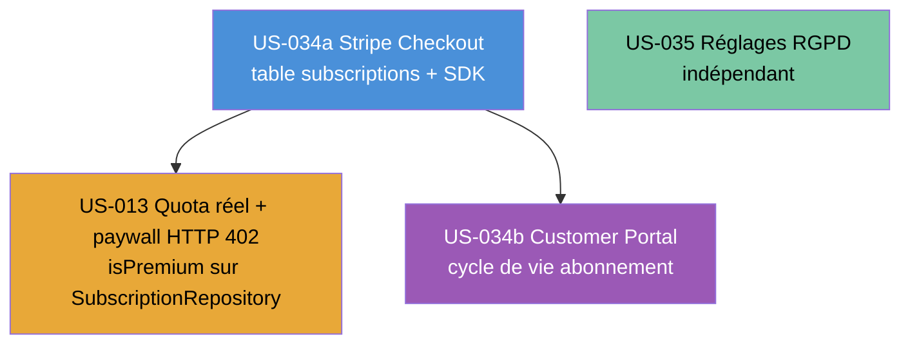

# Sprint 004 — Monétisation Premium

## Sprint Goal

> **Activer la monétisation de Briefly AI : quota free réel (3 synthèses/jour avec paywall HTTP 402), souscription Stripe Checkout + webhook activation Premium, gestion du cycle de vie de l'abonnement via Customer Portal Stripe, et réglages de confidentialité RGPD autonomes — le tout web-only, aucune tâche mobile.**

---

## Dates

| Événement | Date |
|-----------|------|
| Début Sprint | 2026-09-08 |
| Fin Sprint | 2026-09-21 |
| Review / Rétro | 2026-09-21 |

---

## Périmètre (User Stories en scope)

| ID | Titre | EPIC | Points | Persona |
|----|-------|------|--------|---------|
| US-013 | Quota gratuit (3 synthèses/jour) et paywall progressif | EPIC-002 | 5 | P-001 Thomas |
| US-034a | Stripe Checkout et activation abonnement Premium | EPIC-004 | 5 | P-001 Thomas |
| US-034b | Customer Portal Stripe + gestion cycle de vie | EPIC-004 | 3 | P-001 Thomas |
| US-035 | Réglages confidentialité et préférences RGPD | EPIC-004 | 3 | P-003 Marc |

**Total Sprint 4 : 16 story points | WEB-ONLY — aucune tâche [FE-MOB]**

### Ordre de réalisation recommandé

**Justification de l'ordre :**
- **US-034a en premier** : crée la table `subscriptions`, le SDK Stripe, `SubscriptionRepositoryInterface` et `DoctrineSubscriptionRepository`. US-013 en dépend pour `isPremium()`. Également prérequis de US-034b.
- **US-013 après US-034a** : le `SubscriptionRepositoryInterface` défini dans US-034a permet d'implémenter `QuotaService::isPremium()` sur une base réelle ; le paywall HTTP 402 et le refund quota se branchent sur l'infrastructure Stripe.
- **US-034b après US-034a** : le Customer Portal requiert un abonnement actif en base et réutilise l'infrastructure webhook `POST /stripe/webhook`. Les 3 handlers (cancelled/updated/payment_failed) étendent `SubscriptionActivatedHandler`.
- **US-035 en parallèle** : la gestion des préférences RGPD est totalement indépendante — aucune dépendance avec Stripe ou le quota. Développable sur une branche dédiée dès J1.

---

## Cérémonies

### Sprint Planning — Part 1 (QUOI) — 2h

**Animateur** : Tech Lead (Scrum Master)
**Participants** : PO + équipe dev

- Présentation et validation du Sprint Goal par le PO
- Revue de chaque US : critères Gherkin, questions de clarification
- Confirmation INVEST + 3C + 5 scénarios Gherkin min par US
- Engagement collectif sur le périmètre (16 pts)

**Questions à lever en Part 1 :**
- Compte Stripe créé et vérifié (production) ? Clés test `sk_test_xxx` disponibles dès J1 ?
- Produits Stripe configurés : "Briefly Premium Mensuel" (price_monthly) + "Briefly Premium Annuel" (price_yearly) + Stripe Tax activé ?
- Clé `STRIPE_WEBHOOK_SECRET` générée et disponible pour les tests locaux (Stripe CLI) ?
- URL de succès et d'annulation Checkout définitives (`/dashboard?checkout=success`, `/premium?checkout=cancelled`) ?
- `return_url` du Customer Portal confirmée (`/profile`) ?
- Plausible/Matomo installé et accessible pour valider l'opt-out analytics US-035 ?

### Sprint Planning — Part 2 (COMMENT) — 2h

**Animateur** : Tech Lead
**Participants** : équipe dev

- Décomposition des US en tâches (ce document + tasks/)
- Estimation heures (0,5h — 8h max)
- Graphe de dépendances inter-tâches (Mermaid)
- Identification des risques techniques (voir section Risques)
- Construction du Task Board initial

### Daily Scrum — 15 min (chaque jour ouvré)

**Format** : Stand-up synchrone

1. Qu'ai-je fait hier qui fait avancer le Sprint Goal ?
2. Que vais-je faire aujourd'hui ?
3. Quels obstacles m'en empêchent ?

**Rôle Tech Lead** : observer, noter les blocages, lever les impediments dans l'heure.

### Sprint Review — 2h (2026-09-21)

**Participants** : équipe + PO + stakeholders

Démonstrations livrées :
1. **Quota free réel** : Thomas (Free) génère 3 synthèses → compteur décroît ; 4e → HTTP 402 + modale paywall avec CTA actif vers Stripe Checkout (US-013)
2. **Stripe Checkout mensuel** : clic "Passer à Premium" → Stripe Checkout → paiement carte test 4242 → webhook `checkout.session.completed` → badge "Premium" dans le header → synthèses illimitées (US-034a)
3. **Customer Portal** : Thomas clique "Gérer mon abonnement" dans /profile → Stripe Customer Portal → annulation fin de période → statut DB mis à jour → badge toujours visible jusqu'à `current_period_end` (US-034b)
4. **Réglages RGPD** : Marc bascule "Analytique anonyme" OFF → PATCH /settings/privacy → toast "Préférences enregistrées" → page suivante sans script Plausible ; export JSON `privacy_settings` téléchargé (US-035)

**Critère de succès** : la chaîne Free → Stripe Checkout → Premium → Customer Portal → downgrade fonctionne de bout en bout en live demo sans contournement.

### Rétrospective — 1h30 (2026-09-21, après la Review)

**Animateur** : Tech Lead (Scrum Master)
**Technique** : Start / Stop / Continue

**Directive Fondamentale :**
> "Peu importe ce que nous découvrons, nous comprenons et croyons sincèrement
> que tout le monde a fait le meilleur travail possible, compte tenu de ce qu'il
> savait à ce moment-là, de ses compétences et aptitudes, des ressources
> disponibles et de la situation du moment."
> — Norm Kerth, *Project Retrospectives*

Format :
- 5 min : directive + sécurité psychologique
- 20 min : chacun remplit Start/Stop/Continue (post-its)
- 20 min : lecture + regroupement par thème
- 25 min : dot voting + sélection des 3 thèmes prioritaires
- 20 min : plan d'action SMART (responsable + deadline)

**Actions minimales à définir en rétro :**
- 1 action sur la sécurité Stripe (rotation des clés, monitoring webhooks)
- 1 action sur la qualité des tests (couverture Stripe en test mode)
- 1 action sur la conformité RGPD (audit des exports de données)

### Affinage Backlog (Backlog Refinement) — en continu

**Durée** : max 10% de la capacité (environ 4h sur 2 semaines)
**Timing** : deux sessions de 2h en milieu de sprint (J+4 et J+8)

Objectif pour Sprint 5 :
- Raffiner les US de EPIC-003 (flux RSS avancé) et EPIC-002 (niveaux de synthèse sur mobile)
- Préparer les US Flutter/mobile (première apparition mobile dans le backlog)
- Estimer les US candidates selon INVEST

---

## Objectifs techniques transverses Sprint 4

Les points suivants sont planifiés dans `tasks/technical-tasks.md` (hors story points) :

- **SDK Stripe** : `composer require stripe/stripe-php:^13.0` + configuration services.yaml
- **Variables d'env Stripe** : `.env.dist` + `.env.test` (sk_test_xxx) — jamais de clé réelle committée
- **Route webhook publique** : `security.yaml` — `POST /stripe/webhook` en accès public, CSRF désactivé, validation HMAC uniquement
- **Stripe CLI** : documenter `stripe listen --forward-to` pour tests locaux

---

## Definition of Done — Sprint 4

> Pour être marquée DONE, chaque US du Sprint 4 doit satisfaire TOUS les critères suivants (DoD Sprint 3 reconduite + critères Stripe/RGPD).

### Code
- [ ] Code écrit et fonctionnel (pas de stub vide)
- [ ] PSR-12 respecté (PHP CS Fixer : 0 diff)
- [ ] PHPStan niveau max : 0 erreur
- [ ] Architecture hexagonale : pas de fuite Infrastructure dans Domain
- [ ] Pas de code mort, pas de TODO non ticketé
- [ ] UUID v4 non séquentiels sur toutes les nouvelles entités

### Tests
- [ ] Couverture de code >= 80% (unitaires + intégration)
- [ ] PHPUnit : Unit + Integration + WebTestCase/ApiTestCase
- [ ] CI verte (GitHub Actions)
- [ ] 0 test commenté, 0 test skip non justifié

### Sécurité OWASP (reconduit + Stripe-specific)
- [ ] Voters Symfony sur chaque opération protégée
- [ ] CSRF actif sur tous les formulaires Twig (sauf `/stripe/webhook` — HMAC Stripe à la place)
- [ ] Rate limiting Redis sur les endpoints sensibles
- [ ] Headers sécurité : CSP, HSTS, X-Frame-Options
- [ ] `STRIPE_SECRET_KEY`, `STRIPE_WEBHOOK_SECRET` en variables d'environnement UNIQUEMENT — jamais dans le code ni les logs
- [ ] Signature HMAC-SHA256 vérifiée avant tout traitement du webhook Stripe
- [ ] Idempotence webhooks : `INSERT ... ON CONFLICT (stripe_event_id) DO NOTHING`
- [ ] Log WARNING sur signature invalide : IP + raison, JAMAIS le payload Stripe brut
- [ ] Quota Redis : UUID uniquement dans les clés (jamais email/IP)
- [ ] Date UTC côté serveur uniquement (header client `X-Date` ignoré — scénario manipulation US-013)

### Stripe / Paiement
- [ ] Stripe Tax configuré (TVA automatique)
- [ ] Webhook `POST /stripe/webhook` : HTTP 200 systématique (même sur événements inconnus) pour éviter les retries Stripe
- [ ] Handlers Messenger idempotents (not-found → log WARNING + return sans erreur)
- [ ] `cancel_at_period_end = true` → Premium maintenu jusqu'à `current_period_end`
- [ ] Grace period `past_due` : `isPremium()` retourne true si `current_period_end > NOW()`

### RGPD
- [ ] `user_privacy_settings` créé avec valeurs par défaut opt-in pour tout nouveau compte
- [ ] Export JSON portabilité inclut `privacy_settings` (Article 20 RGPD)
- [ ] `X-Robots-Tag: noindex, nofollow` injecté côté serveur si `search_engine_indexing = false`
- [ ] `PrivacySettingsVoter` : propriétaire uniquement (HTTP 403 si autre utilisateur)
- [ ] Log WARNING accès non autorisé : UUID demandeur + UUID cible, JAMAIS les emails

### Vertical Slice
- [ ] Symfony Controller → Service domaine → Repository Doctrine → PostgreSQL
- [ ] Turbo Frames/Streams fonctionnels (modale paywall, toast privacy)
- [ ] Aucune tâche [FE-MOB] (WEB-ONLY confirmé)

### Documentation
- [ ] PHPDoc sur les services et interfaces publics
- [ ] Critères Gherkin validés pour chaque US

### Review
- [ ] Code review approuvée >= 1 pair
- [ ] Pas de commentaire bloquant ouvert

### CI/CD
- [ ] Pipeline CI verte
- [ ] 0 régression Sprint 1 + 2 + 3

---

## Hypothèse Produit Validée par ce Sprint

> **Hypothèse** : En activant un quota free réel (3 synthèses/jour) avec paywall HTTP 402 vers Stripe Checkout, Briefly AI génère ses premiers revenus récurrents. P-001 Thomas, bloqué par le paywall lors de sa 4e synthèse quotidienne, souscrit à Premium (12€/mois) et peut immédiatement gérer son abonnement en autonomie (Customer Portal). P-003 Marc, sensible à la vie privée, configure ses préférences RGPD sans contacter le support.

**Métriques de validation (Sprint Review) :**
- Quota free : 4e synthèse → HTTP 402 + modale paywall CTA actif en < 500 ms
- Stripe Checkout : souscription mensuelle complète (test mode) en < 2 min
- Webhook activation : badge "Premium" visible dans les 5 s après `checkout.session.completed`
- Customer Portal : annulation → DB mise à jour + Premium maintenu jusqu'à `current_period_end`
- Privacy settings : PATCH /settings/privacy → DB mise à jour en < 200 ms + toast visible

---

## Risques Identifiés Sprint 4

| Risque | Probabilité | Impact | Mitigation |
|--------|-------------|--------|------------|
| Clés Stripe test indisponibles à J1 | Moyen | Élevé | Checklist pré-sprint : compte Stripe + produits configurés + CLI installée avant J0 |
| Webhook Stripe non reçu en local (tunnel manquant) | Moyen | Élevé | Stripe CLI `stripe listen` ; documenter dans README ; fallback Stripe test fixtures |
| Race condition INCR/DECR sur quota Redis | Faible | Moyen | Script Lua atomique en follow-up ; le pré-débit seul (sans DECR concurrent) est acceptable Sprint 4 |
| `isPremium()` retourne stale si webhook delayed | Faible | Faible | TTL acceptable (webhook Stripe < 5 s en prod) ; pas de polling côté client en v1 |
| RGPD : export JSON contient données autres utilisateurs | Faible | Critique | `PrivacySettingsVoter::EDIT` + test assertNot (autre user_id dans l'export) |
| CSRF sur `/stripe/webhook` bloqué par Symfony | Moyen | Élevé | Exclure la route du CSRF dans security.yaml (validation HMAC-SHA256 suffit) |
| Capacité équipe : 4 US simultanées | Moyen | Moyen | US-035 développable en parallèle dès J1 ; US-034b débloquée seulement après US-034a T-034a-06 |
