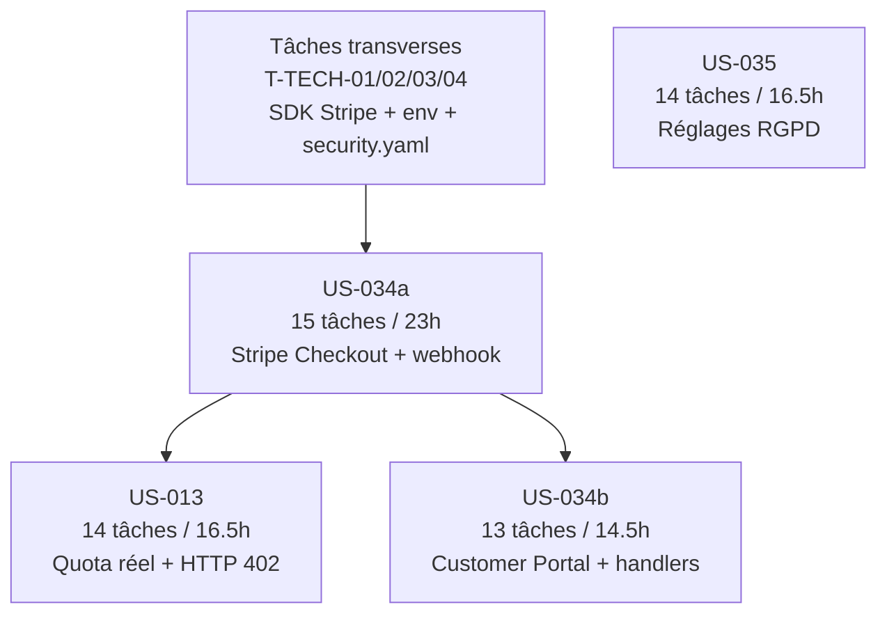

# Tâches — Sprint 004 Monétisation Premium

> **Sprint Goal** : Activer la monétisation de Briefly AI : quota free réel (3 synthèses/jour avec paywall HTTP 402), souscription Stripe Checkout + webhook activation Premium, gestion du cycle de vie via Customer Portal Stripe, et réglages de confidentialité RGPD autonomes — web-only, aucune tâche mobile.

**Période** : 2026-09-08 → 2026-09-21 | **Vélocité cible** : 16 points

---

## Vue d'ensemble par US

| US | Titre | Points | Tâches | Heures | Ordre |
|----|-------|--------|--------|--------|-------|
| [US-034a](./US-034a-tasks.md) | Stripe Checkout + webhook activation Premium | 5 | 15 | 23h | 1er — pivot du sprint |
| [US-013](./US-013-tasks.md) | Quota gratuit (3/jour) et paywall progressif | 5 | 14 | 16.5h | Après T-034a-04 (SubscriptionRepository) |
| [US-034b](./US-034b-tasks.md) | Customer Portal + gestion cycle de vie | 3 | 13 | 14.5h | Après T-034a-07 (webhook infra) |
| [US-035](./US-035-tasks.md) | Réglages confidentialité RGPD | 3 | 14 | 16.5h | Parallèle dès J1 |

**Total Sprint 4 features : 56 tâches — 70.5h estimées — 16 story points**

---

## Tâches techniques transverses

| Fichier | Tâches | Heures |
|---------|--------|--------|
| [technical-tasks.md](./technical-tasks.md) | 4 | 2.5h |

**Grand total : 60 tâches — 73h (features + transverses)**

---

## Répartition par type de tâche (features uniquement)

| Type | Tâches | Heures | % heures |
|------|--------|--------|----------|
| [DB] | 6 | 5h | 7% |
| [BE] | 32 | 45.5h | 64% |
| [FE-WEB] | 8 | 10h | 14% |
| [TEST] | 7 | 12h | 17% |
| [DOC] | 4 | 2h | 3% |
| [REV] | 4 | 4h | 6% |
| **TOTAL** | **56** | **70.5h** | **100%** |

> Aucune tâche `[FE-MOB]` dans ce sprint — WEB-ONLY confirmé (Flutter différé).

---

## Dépendances inter-US (résumé)

> **US-035 est totalement indépendante** — développable en parallèle sur une branche dédiée dès J1.
> **US-034a** doit démarrer en premier : elle crée l'infrastructure Stripe (SDK, table `subscriptions`, `SubscriptionRepositoryInterface`) dont dépendent US-013 et US-034b.
> **US-013** démarre dès que T-034a-04 (`DoctrineSubscriptionRepository`) est mergé.
> **US-034b** démarre dès que T-034a-07 (webhook infrastructure) est opérationnel.

---

## Fichiers de tâches

- [US-034a — Stripe Checkout + webhook activation](./US-034a-tasks.md) — 15 tâches, 23h
- [US-013 — Quota free réel + paywall HTTP 402](./US-013-tasks.md) — 14 tâches, 16.5h
- [US-034b — Customer Portal + cycle de vie](./US-034b-tasks.md) — 13 tâches, 14.5h
- [US-035 — Réglages confidentialité RGPD](./US-035-tasks.md) — 14 tâches, 16.5h
- [Tâches techniques transverses](./technical-tasks.md) — 4 tâches, 2.5h

---

## Conventions

| Élément | Format | Exemple |
|---------|--------|---------|
| ID tâche feature | T-[US]-[Numéro 2 chiffres] | T-034a-05 |
| ID tâche transverse | T-TECH-[Numéro 2 chiffres] | T-TECH-01 |
| Taille | 0.5h – 8h max | 2h |
| Statut | 🔲 / 🔄 / 👀 / ✅ / 🚫 | 🔲 À faire |
| Type | [DB] / [BE] / [FE-WEB] / [TEST] / [DOC] / [REV] / [OPS] | [OPS] |

> Aucune tâche `[FE-MOB]` dans ce sprint — projet web-only (Symfony uniquement, pas Flutter).

---

## Risques techniques identifiés

| Risque | US | Tâche(s) | Mitigation |
|--------|----|-----------| -----------|
| Clés Stripe indisponibles à J1 | US-034a, US-013 | T-TECH-01, T-034a-05 | Checklist pré-sprint obligatoire ; compte Stripe + produits configurés avant J0 |
| Stripe CLI non installée en local | US-034a, US-034b | T-TECH-04 | Documenter installation + `make stripe-listen` ; fallback : `stripe trigger` CLI |
| Race condition Redis INCR/DECR (quota) | US-013 | T-013-04 | Script Lua atomique pour DECR planché ; INCR avant appel Mistral (pré-débit) est le comportement attendu |
| Webhook Stripe réçu avant activation de la session Symfony | US-034a | T-034a-07, T-034a-08 | HTTP 200 systématique même si traitement asynchrone delayed ; Messenger queue |
| `isPremium()` stale si webhook retardé | US-013, US-034b | T-013-02, T-034b-06 | Acceptable (< 5 s en prod) ; pas de polling client en v1 |
| CSRF bloqué sur `/stripe/webhook` | US-034a | T-034a-07, T-TECH-03 | Exclure la route du middleware CSRF dans security.yaml (T-TECH-03) dès J1 |
| `DoctrineSubscriptionRepository::isPremium()` N+1 queries | US-013 | T-034a-04 | Index composé `(status, current_period_end)` en migration T-034a-02 |
| Export RGPD contenant données autres users | US-035 | T-035-07, T-035-12 | `PrivacySettingsVoter::EDIT` + test WebTestCase assertion (0 autre user_id dans JSON) |

---

## Definition of Done rappel (Sprint 4)

Chaque tâche `[REV]` valide que son US satisfait :

- Code fonctionnel + PSR-12 (0 diff CS Fixer) + PHPStan max (0 erreur)
- Architecture hexagonale (0 import Infrastructure dans Domain)
- Couverture >= 80% (unit + intégration)
- HMAC-SHA256 vérifié avant tout traitement webhook Stripe
- Secrets Stripe en `%env()%` JAMAIS en dur
- Idempotence webhooks : `ON CONFLICT (stripe_event_id) DO NOTHING`
- HTTP 402 (pas 429) sur quota épuisé — corps JSON `{error: "quota_exceeded"}`
- `PrivacySettingsVoter` : UUID (jamais email) dans les logs WARNING
- Export RGPD Article 20 : JSON `privacy_settings` + 0 données autres utilisateurs
- CI verte (GitHub Actions) — 0 régression Sprint 1/2/3
- 0 tâche `[FE-MOB]` — WEB-ONLY
