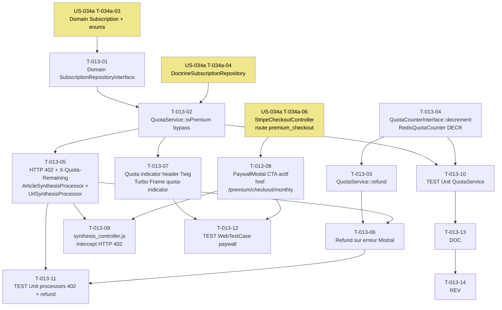

# US-013 — Tâches techniques : Quota gratuit (3 synthèses/jour) et paywall progressif

**User Story** : En tant que P-001 Thomas en compte Free, je veux accéder à 3 synthèses gratuites par jour avant qu'un paywall s'affiche, afin d'évaluer concrètement la valeur du service avant de décider de souscrire.
**Story Points** : 5 | **Sprint** : sprint-004-monetisation
**EPIC** : EPIC-002 Moteur de Synthèse IA
**Dépendances** :
- US-010, US-011, US-033 (Sprint 1/2/3 mergés) — `ArticleSynthesisProcessor`, `UrlSynthesisProcessor`, `QuotaService`, `RedisQuotaCounter`, `PaywallModalController` existants
- **US-034a T-034a-03/04** (Sprint 4) — `SubscriptionRepositoryInterface` + `DoctrineSubscriptionRepository` requis avant T-013-02

---

## Tâches

| ID | Type | Description | Heures | Dépend de | Statut |
|----|------|-------------|--------|-----------|--------|
| T-013-01 | [BE] | Interface domaine `SubscriptionRepositoryInterface` (`src/Domain/Subscription/SubscriptionRepositoryInterface.php`) : méthode unique `isPremium(string $userUuid): bool` ; PHP pur, 0 import Symfony/Doctrine ; PHPDoc RGPD (UUID uniquement, pas d'email) ; deptrac : Domain layer | 0.5h | T-034a-03 | 🔲 |
| T-013-02 | [BE] | Ajout `isPremium(string $userUuid): bool` à `QuotaService` (`src/Application/Quota/QuotaService.php`) : injecter `SubscriptionRepositoryInterface` via constructeur ; `isPremium()` délègue à l'interface ; modifier `consumeOrDeny()` — si `isPremium()` retourne true → retourne true sans appel Redis, sans header `X-Quota-Remaining` ; modifier `getRemaining()` / `getUsed()` — idem bypass Premium | 1h | T-013-01, T-034a-04 | 🔲 |
| T-013-03 | [BE] | Ajout `refund(string $userUuid): void` à `QuotaService` : décrémente le compteur Redis via `QuotaCounterInterface::decrement()` si erreur Mistral côté serveur après pré-débit (scénario de remboursement US-013) ; plancher à 0 (DECR sous 0 interdit) | 0.5h | T-013-04 | 🔲 |
| T-013-04 | [BE] | Ajout `decrement(string $userUuid, string $dateUtc): void` à `QuotaCounterInterface` (`src/Domain/Quota/QuotaCounterInterface.php`) ; implémentation Redis DECR planché à 0 dans `RedisQuotaCounter` (`src/Infrastructure/Quota/RedisQuotaCounter.php`) : `max(0, DECR key)` via Lua script atomique ou GET+DECR conditonnel ; throws `QuotaServiceUnavailableException` si Redis KO | 1h | — | 🔲 |
| T-013-05 | [BE] | Correction `ArticleSynthesisProcessor` et `UrlSynthesisProcessor` (`src/Presentation/StateProcessor/`) : remplacer `TooManyRequestsHttpException` (429) par `HttpException(402, ...)` + corps JSON `{"error": "quota_exceeded", "remaining": 0, "resets_at": "<ISO8601 prochaine minuit UTC>"}` ; ajouter header `X-Quota-Remaining: N` sur les réponses HTTP 200 post-consommation ; date `resets_at` calculée par `QuotaService::nextMidnightUtcIso()` (nouvelle méthode private exposée via méthode publique) ; NOTE sécurité : date UTC serveur uniquement — le header client `X-Date` est explicitement ignoré et l'incident loggé en WARNING | 2h | T-013-02 | 🔲 |
| T-013-06 | [BE] | Refund quota sur échec Mistral dans `ArticleSynthesisProcessor` et `UrlSynthesisProcessor` : catch `SynthesisUnavailableException` → appeler `QuotaService::refund($userUuid)` avant de propager l'exception HTTP 503 ; uniquement si l'erreur est côté serveur IA (pas sur `InvalidSynthesisUrlException` — erreur client) | 1h | T-013-03, T-013-05 | 🔲 |
| T-013-07 | [FE-WEB] | Indicateur quota dans le header : partial Twig `templates/quota/_quota_indicator.html.twig` inclus dans `templates/base.html.twig` ; Turbo Frame `quota-indicator` ; `` → affiche "X / 3 synthèses restantes" chargé depuis `GET /api/v1/quota` via Turbo ; `` → badge "Premium" ; accessible (`aria-live="polite"`, `role="status"`) | 1.5h | T-013-02 | 🔲 |
| T-013-08 | [FE-WEB] | Activation CTA paywall modal : migrer `PaywallModalController` (`src/Presentation/Controller/PaywallModalController.php`) vers template Twig `templates/quota/paywall_modal.html.twig` ; CTA "Passer à Briefly Premium — 12€/mois" → `href="{{ path('premium_checkout', {plan: 'monthly'}) }}"` (route US-034a) ; supprimer `aria-disabled="true"` et `cursor: not-allowed` ; conserver la modale Turbo Frame `paywall-modal` ; déclencher sur HTTP 402 (pas HTTP 429) | 1.5h | T-034a-06 | 🔲 |
| T-013-09 | [FE-WEB] | Mise à jour `assets/controllers/synthesis_controller.js` : intercepter HTTP 402 (quota_exceeded) pour afficher `paywall-modal` via `GET /quota/paywall-modal` ; intercepter HTTP 503 séparément (message d'erreur service) ; mettre à jour le Turbo Frame `quota-indicator` après chaque synthèse réussie avec la valeur `X-Quota-Remaining` du header de réponse | 1h | T-013-08 | 🔲 |
| T-013-10 | [TEST] | Tests unitaires `QuotaService` : `isPremium()` true → `consumeOrDeny()` retourne true, 0 appel Redis (mock `QuotaCounterInterface`) ; `refund()` appelle `decrement()` une fois ; compteur déjà à 0 → `refund()` ne passe pas en négatif ; `getRemaining()` retourne `DAILY_LIMIT` si Premium | 1.5h | T-013-02, T-013-03 | 🔲 |
| T-013-11 | [TEST] | Tests unitaires `ArticleSynthesisProcessor` + `UrlSynthesisProcessor` : 4e synthèse Free → `HttpException` code 402 + body JSON `quota_exceeded` + `resets_at` présent ; compte Premium → synthèse sans limite (0 appel `counter`) ; erreur Mistral après pré-débit → `refund()` appelé + HTTP 503 ; `InvalidSynthesisUrlException` → 0 refund ; log WARNING sur header `X-Date` client détecté | 2h | T-013-05, T-013-06 | 🔲 |
| T-013-12 | [TEST] | `WebTestCase` : `GET /api/v1/quota` → JSON `{used, limit, remaining}` + `X-Quota-Remaining` header correct ; 3 synthèses → remaining = 0 ; 4e synthèse → HTTP 402 + `resets_at` = prochaine minuit UTC ; compte Premium → HTTP 200 quel que soit le compteur ; log WARNING si header `X-Date` présent dans la requête | 1.5h | T-013-05, T-013-07 | 🔲 |
| T-013-13 | [DOC] | PHPDoc `SubscriptionRepositoryInterface` (contrat UUID, RGPD), `QuotaService::isPremium()` (bypass total quota), `QuotaService::refund()` (remboursement sur erreur serveur), `QuotaCounterInterface::decrement()` (plancher 0), note dans `ArticleSynthesisProcessor` sur HTTP 402 vs 429 | 0.5h | T-013-06 | 🔲 |
| T-013-14 | [REV] | Code review US-013 : date UTC serveur (jamais header client `X-Date`), UUID dans les clés Redis (pas email), HTTP 402 remplace 429, `X-Quota-Remaining` absent pour Premium, `refund()` uniquement sur erreur serveur IA (pas erreur client), `resets_at` en ISO8601 UTC, log WARNING sur tentative de manipulation de date | 1h | T-013-13 | 🔲 |

**Total US-013 : 14 tâches — 16.5h**

---

## Graphe de dépendances

---

## Notes techniques

- **HTTP 402 vs 429** : US-033 (Sprint 1) levait `TooManyRequestsHttpException` (429). US-013 corrige en HTTP 402 Payment Required — sémantique correcte pour un paywall. Le Symfony `HttpException(402, ...)` accepte un corps JSON custom.
- **`resets_at`** : timestamp ISO8601 UTC de la prochaine minuit. Calculé par `QuotaService::nextMidnightUtcIso(): string` (méthode privée promue en publique pour les processors). Jamais exposer la date du client.
- **Sécurité header `X-Date`** : si une requête entrante contient un header `X-Date`, le logguer en WARNING `{ip, user_agent, header_value}` sans PII puis ignorer. La date quota est TOUJOURS `new DateTimeImmutable('now', UTC)`.
- **Bypass Premium dans `QuotaService`** : injecter `SubscriptionRepositoryInterface` via le constructeur. `consumeOrDeny()` appelle `isPremium()` en premier (avant `getCount`) — un compte Premium ne génère jamais d'appel Redis pour le quota.
- **DECR planché** : `QuotaCounterInterface::decrement()` doit garantir que le compteur ne descend pas en dessous de 0. Utiliser un script Lua Redis : `local v = redis.call('DECR', KEYS[1]); if v < 0 then redis.call('SET', KEYS[1], 0) end; return math.max(0, v)`.
- **Dépendance US-034a** : T-013-01 et T-013-02 ne peuvent pas démarrer avant que US-034a ait livré `SubscriptionRepositoryInterface` (T-034a-03) et `DoctrineSubscriptionRepository` (T-034a-04). Prévoir en planning Sprint 4 que US-034a commence à J1.
