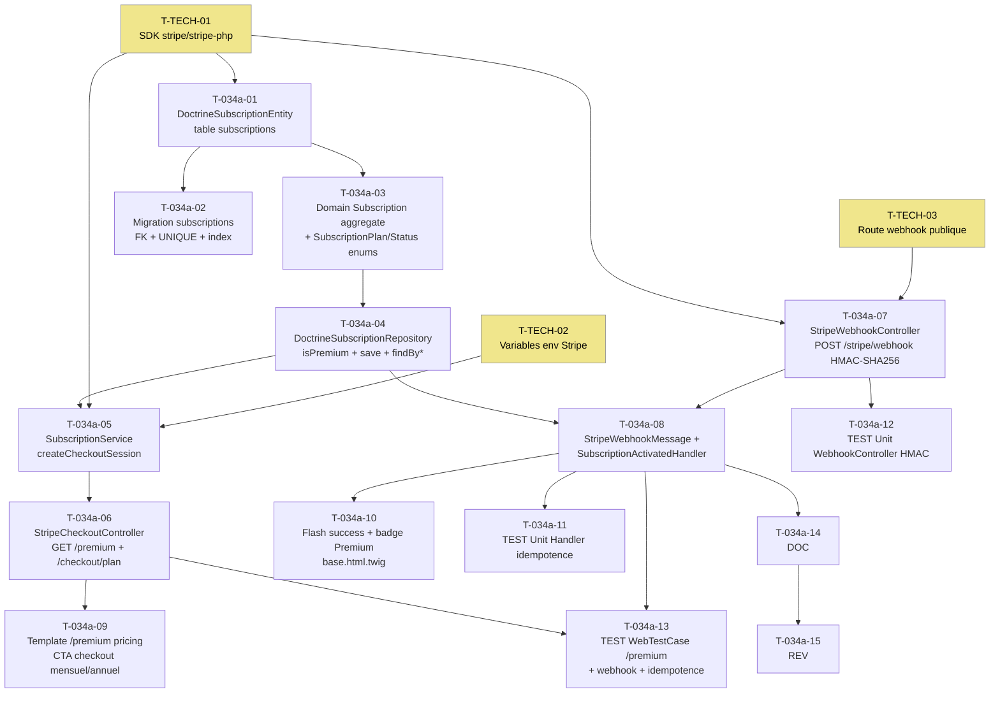

# US-034a — Tâches techniques : Stripe Checkout et activation Premium (webhook subscription.created)

**User Story** : En tant que P-001 Thomas, je veux souscrire à Briefly Premium via Stripe Checkout sécurisé, afin d'accéder immédiatement aux synthèses illimitées.
**Story Points** : 5 | **Sprint** : sprint-004-monetisation
**EPIC** : EPIC-004 Comptes Utilisateurs & Premium
**Dépendances** :
- US-030 `DoctrineUserEntity`, `users.id` FK cible (Sprint 1 mergé)
- US-033 `PaywallModalController` placeholder — sera activé par US-013 T-013-08
- **T-TECH-01** (SDK stripe/stripe-php), **T-TECH-02** (variables d'env), **T-TECH-03** (route webhook publique)
**Requis par** : US-013 T-013-01/02, US-034b T-034b-01/03/04/05

---

## Tâches

| ID | Type | Description | Heures | Dépend de | Statut |
|----|------|-------------|--------|-----------|--------|
| T-034a-01 | [DB] | Entité Doctrine `DoctrineSubscriptionEntity` (`src/Infrastructure/Subscription/Persistence/DoctrineSubscriptionEntity.php`) : attributs ORM — id UUID PK, user_id UUID FK → users.id ON DELETE CASCADE, stripe_customer_id VARCHAR(255) UNIQUE NOT NULL, stripe_subscription_id VARCHAR(255) UNIQUE NOT NULL, plan ENUM('monthly','yearly') NOT NULL, status ENUM('active','past_due','cancelled') NOT NULL, current_period_end TIMESTAMPTZ NOT NULL, stripe_event_id VARCHAR(255) UNIQUE NOT NULL (clé d'idempotence), created_at TIMESTAMPTZ DEFAULT NOW() ; mapping Doctrine complet | 1.5h | T-TECH-01 | 🔲 |
| T-034a-02 | [DB] | Migration `subscriptions` : CREATE TABLE avec toutes les colonnes ; FK `user_id` REFERENCES users(id) ON DELETE CASCADE ; UNIQUE sur stripe_customer_id, stripe_subscription_id, stripe_event_id ; index composé sur `(status, current_period_end)` pour la requête `isPremium()` | 0.5h | T-034a-01 | 🔲 |
| T-034a-03 | [BE] | Domain : `Subscription` aggregate (`src/Domain/Subscription/Subscription.php`) PHP pur — constructeur avec id, userId, stripeCustomerId, stripeSubscriptionId, plan (`SubscriptionPlan` enum), status (`SubscriptionStatus` enum), currentPeriodEnd (`DateTimeImmutable`), stripeEventId ; `isActive(): bool` (status=active AND currentPeriodEnd > now) ; `SubscriptionPlan` enum (`src/Domain/Subscription/SubscriptionPlan.php`) : MONTHLY='monthly', YEARLY='yearly' ; `SubscriptionStatus` enum (`src/Domain/Subscription/SubscriptionStatus.php`) : ACTIVE='active', PAST_DUE='past_due', CANCELLED='cancelled' | 2h | — | 🔲 |
| T-034a-04 | [BE] | Infrastructure : `DoctrineSubscriptionRepository` (`src/Infrastructure/Subscription/Persistence/DoctrineSubscriptionRepository.php`) implémentant `SubscriptionRepositoryInterface` (`src/Domain/Subscription/SubscriptionRepositoryInterface.php`) : `isPremium(string $userUuid): bool` → requête DQL `status = 'active' AND current_period_end > NOW()` ; `save(Subscription $sub): void` → INSERT via EntityManager ; `findByStripeEventId(string $eventId): ?Subscription` ; `findByStripeSubscriptionId(string $subId): ?Subscription` ; `findByStripeCustomerId(string $customerId): ?Subscription` | 1.5h | T-034a-01, T-034a-03 | 🔲 |
| T-034a-05 | [BE] | Application : `SubscriptionService::createCheckoutSession(string $userUuid, string $plan): string` (`src/Application/Subscription/SubscriptionService.php`) : appelle Stripe SDK `Checkout\Session::create()` avec `mode='subscription'`, `line_items=[{price: $priceId, quantity: 1}]`, `success_url='/dashboard?checkout=success'`, `cancel_url='/premium?checkout=cancelled'`, `customer_email=$userEmail`, `automatic_tax={enabled: true}` (Stripe Tax) ; `$priceId` résolu depuis `%env(STRIPE_PRICE_MONTHLY)%` ou `%env(STRIPE_PRICE_YEARLY)%` selon `$plan` ; retourne `$session->url` | 2h | T-034a-04, T-TECH-01, T-TECH-02 | 🔲 |
| T-034a-06 | [BE] | Presentation : `StripeCheckoutController` (`src/Presentation/Controller/Stripe/StripeCheckoutController.php`) : `GET /premium` → `render('premium/index.html.twig')` ; `GET /premium/checkout/{plan}` (route `premium_checkout`) → valider `$plan` ∈ {monthly, yearly} (HTTP 400 sinon) → `SubscriptionService::createCheckoutSession()` → `redirect($checkoutUrl)` 302 ; `#[IsGranted('ROLE_USER')]` ; route `premium_checkout` utilisée par US-013 T-013-08 | 1.5h | T-034a-05 | 🔲 |
| T-034a-07 | [BE] | Presentation : `StripeWebhookController` (`src/Presentation/Controller/Stripe/StripeWebhookController.php`) : `POST /stripe/webhook` (route `stripe_webhook`) ; lire payload brut `$request->getContent()` ; récupérer header `Stripe-Signature` ; vérifier HMAC-SHA256 via `\Stripe\Webhook::constructEvent($payload, $sigHeader, $secret)` → `SignatureVerificationException` → HTTP 400 + log WARNING `{ip, reason: 'invalid_signature'}` (JAMAIS logguer le payload brut) ; événement valide → dispatch `StripeWebhookMessage` via `MessageBusInterface` ; retourner HTTP 200 systématiquement (même événement inconnu) pour éviter les retries Stripe inutiles ; route exclue du CSRF (voir T-TECH-03) | 2h | T-TECH-01, T-TECH-03 | 🔲 |
| T-034a-08 | [BE] | Messenger : `StripeWebhookMessage` (`src/Infrastructure/Subscription/Messenger/StripeWebhookMessage.php`) : value object `readonly` — `eventType: string`, `eventId: string`, `payload: array` ; `SubscriptionActivatedHandler` (`src/Infrastructure/Subscription/Messenger/SubscriptionActivatedHandler.php`) : `#[AsMessageHandler]` ; traite uniquement `checkout.session.completed` (ignore les autres types silencieusement) ; extrait `stripe_customer_id`, `stripe_subscription_id`, `plan` du payload ; construit `Subscription` domain object ; appelle `SubscriptionRepositoryInterface::save()` → Doctrine `INSERT ... ON CONFLICT (stripe_event_id) DO NOTHING` (idempotence garantie) ; log INFO sur activation réussie | 2h | T-034a-04, T-034a-07 | 🔲 |
| T-034a-09 | [FE-WEB] | Template `templates/premium/index.html.twig` : page `/premium` avec design system existant ; section tarifaire : offre mensuelle (12€/mois) + offre annuelle (99€/an, badge "Économisez 17% — 45€/an") ; liste avantages (synthèses illimitées, tous niveaux, ...) ; deux CTA `<a href="{{ path('premium_checkout', {plan: 'monthly'}) }}">` et `<a href="{{ path('premium_checkout', {plan: 'yearly'}) }}">` ; flash message sur `checkout=cancelled` : "Le paiement n'a pas pu être traité" (non bloquant) ; `#[IsGranted('ROLE_USER')]` si l'utilisateur est déjà Premium → afficher message "Vous êtes déjà abonné" | 2h | T-034a-06 | 🔲 |
| T-034a-10 | [FE-WEB] | Flash messages + badge Premium : `templates/dashboard/index.html.twig` flash `checkout_success` "Bienvenue dans Briefly Premium !" via Turbo ; badge "Premium" dans `templates/base.html.twig` header → visible si `app.user` + `QuotaService::isPremium()` ; badge "Premium Annuel" si plan=yearly ; intégré dans le Turbo Frame `quota-indicator` (T-013-07) — Premium remplace le compteur | 1h | T-034a-08, T-013-07 | 🔲 |
| T-034a-11 | [TEST] | Tests unitaires `SubscriptionActivatedHandler` : `checkout.session.completed` valide → `save()` appelé une fois, Subscription créée avec status=active ; même `stripe_event_id` en double → `save()` appelé mais `ON CONFLICT DO NOTHING` → 0 doublon en base (tester via mock repository qui raise sur doublon) ; autre type d'événement (`invoice.paid`) → handler termine sans appel `save()` | 1.5h | T-034a-08 | 🔲 |
| T-034a-12 | [TEST] | Tests unitaires `StripeWebhookController` : signature HMAC valide → HTTP 200 + `dispatch()` appelé 1 fois ; signature invalide (header corrompu) → HTTP 400 + log WARNING + 0 dispatch ; header `Stripe-Signature` absent → HTTP 400 ; payload vide → HTTP 400 ; vérifier que le payload brut n'apparaît JAMAIS dans les logs | 1.5h | T-034a-07 | 🔲 |
| T-034a-13 | [TEST] | `WebTestCase` : GET /premium → HTTP 200 avec tarifs 12€/mois et 99€/an ; GET /premium/checkout/monthly → redirect 302 vers Stripe (mock `SubscriptionService`) ; GET /premium/checkout/invalid → HTTP 400 ; POST /stripe/webhook HMAC valide + payload `checkout.session.completed` → HTTP 200 + 1 `Subscription` en base ; POST même event en double → HTTP 200 + toujours 1 seul enregistrement (idempotence) ; GET /dashboard?checkout=success → flash "Bienvenue dans Briefly Premium !" visible | 2h | T-034a-06, T-034a-08 | 🔲 |
| T-034a-14 | [DOC] | PHPDoc `StripeWebhookController` (HMAC obligatoire, payload jamais loggué, HTTP 200 systématique), `SubscriptionActivatedHandler` (idempotence `ON CONFLICT DO NOTHING`, événements ignorés), `SubscriptionService::createCheckoutSession()` (secrets en `%env()%`, Stripe Tax), `DoctrineSubscriptionRepository::isPremium()` (index composé) | 0.5h | T-034a-08 | 🔲 |
| T-034a-15 | [REV] | Code review US-034a : HMAC-SHA256 vérifié avant tout traitement, `STRIPE_SECRET_KEY` et `STRIPE_WEBHOOK_SECRET` en `%env()%` JAMAIS en dur ni dans les logs, `ON CONFLICT (stripe_event_id) DO NOTHING` implémenté, log WARNING signature invalide (IP + raison, 0 payload), HTTP 200 sur événements inconnus, route webhook exclue CSRF, dispatch Messenger uniquement après signature valide | 1h | T-034a-14 | 🔲 |

**Total US-034a : 15 tâches — 23h**

---

## Graphe de dépendances

---

## Notes techniques

- **Sécurité webhook** : `\Stripe\Webhook::constructEvent()` lève `UnexpectedValueException` si payload malformé, `SignatureVerificationException` si HMAC invalide. Capturer les deux → HTTP 400. Ne JAMAIS logguer le payload Stripe brut (peut contenir des données client).
- **Idempotence** : `stripe_event_id` est l'id de l'événement Stripe (ex: `evt_1ABCDEF`). Le `UNIQUE` sur cette colonne + `ON CONFLICT ... DO NOTHING` garantit qu'un doublon n'est jamais créé même si Stripe re-envoie l'événement.
- **Stripe Tax** : activer `automatic_tax: {enabled: true}` dans `Checkout\Session::create()`. Stripe calcule la TVA automatiquement selon la localisation de l'acheteur.
- **Route `/stripe/webhook` publique** : cette route doit être accessible sans `ROLE_USER` (Stripe appelle depuis ses serveurs, pas depuis un navigateur authentifié). Voir T-TECH-03 pour la configuration `security.yaml`.
- **`isPremium()` dans cette US** : vérifie uniquement `status = 'active'`. US-034b étendra à `IN ('active', 'past_due')` pour le grace period.
- **Prix Stripe** : les Price IDs sont des variables d'env (`STRIPE_PRICE_MONTHLY`, `STRIPE_PRICE_YEARLY`) — jamais hardcodés. Configurer les Prix dans le Dashboard Stripe avant J1.
