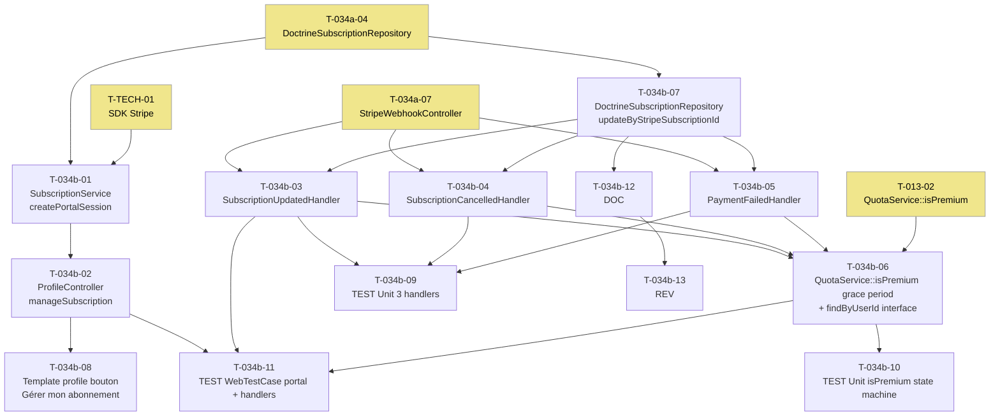

# US-034b — Tâches techniques : Customer Portal Stripe et gestion du cycle de vie de l'abonnement

**User Story** : En tant que P-001 Thomas, je veux gérer mon abonnement Briefly Premium depuis un Customer Portal Stripe dédié, afin de contrôler mon abonnement en toute autonomie et que les changements soient immédiatement reflétés dans mon accès.
**Story Points** : 3 | **Sprint** : sprint-004-monetisation
**EPIC** : EPIC-004 Comptes Utilisateurs & Premium
**Dépendances** :
- **US-034a** (infrastructure webhook `POST /stripe/webhook` + table `subscriptions` + `DoctrineSubscriptionRepository`) — T-034a-04, T-034a-07 obligatoires avant de démarrer
- **US-013 T-013-02** (`QuotaService::isPremium()`) — T-034b-06 en est une mise à jour directe
- T-TECH-01 (SDK Stripe)

---

## Tâches

| ID | Type | Description | Heures | Dépend de | Statut |
|----|------|-------------|--------|-----------|--------|
| T-034b-01 | [BE] | Application : `SubscriptionService::createPortalSession(string $userUuid): string` (`src/Application/Subscription/SubscriptionService.php`) : récupère `stripe_customer_id` via `SubscriptionRepositoryInterface::findByUserId($userUuid)` (nouvelle méthode à ajouter) ; appelle Stripe SDK `BillingPortal\Session::create(['customer' => $customerId, 'return_url' => '/profile'])` ; retourne `$session->url` ; lève `SubscriptionNotFoundException` si pas d'abonnement actif | 1.5h | T-034a-04, T-TECH-01 | 🔲 |
| T-034b-02 | [BE] | Presentation : `ProfileController::manageSubscription()` (`src/Presentation/Controller/ProfileController.php`) : route `GET /profile/manage-subscription` (nom `app_profile_manage_subscription`) ; `#[IsGranted('ROLE_USER')]` ; appelle `SubscriptionService::createPortalSession()` → `redirect($portalUrl)` 302 ; si `SubscriptionNotFoundException` → flash error "Aucun abonnement actif trouvé" + redirect `/premium` ; log INFO `{user_uuid, action: 'portal_session_created'}` (sans l'URL Stripe) | 1h | T-034b-01 | 🔲 |
| T-034b-03 | [BE] | Messenger : `SubscriptionUpdatedHandler` (`src/Infrastructure/Subscription/Messenger/SubscriptionUpdatedHandler.php`) : `#[AsMessageHandler]` ; traite `customer.subscription.updated` ; extrait `stripe_subscription_id`, `status`, `plan`, `current_period_end`, `cancel_at_period_end` du payload ; appelle `DoctrineSubscriptionRepository::updateByStripeSubscriptionId($subId, $fields)` ; idempotent : si `stripe_subscription_id` inconnu → log WARNING `{stripe_subscription_id, action: "skip-not-found"}` + return (0 erreur) | 1.5h | T-034a-04, T-034a-07 | 🔲 |
| T-034b-04 | [BE] | Messenger : `SubscriptionCancelledHandler` (`src/Infrastructure/Subscription/Messenger/SubscriptionCancelledHandler.php`) : `#[AsMessageHandler]` ; traite `customer.subscription.deleted` ; met `subscriptions.status = 'cancelled'` via `updateByStripeSubscriptionId()` ; idempotent : stripe_subscription_id inconnu → log WARNING `{stripe_subscription_id: "sub_UNKNOWN", action: "skip-not-found"}` + return ; HTTP 200 garanti (idempotence Stripe) | 1h | T-034a-04, T-034a-07 | 🔲 |
| T-034b-05 | [BE] | Messenger : `PaymentFailedHandler` (`src/Infrastructure/Subscription/Messenger/PaymentFailedHandler.php`) : `#[AsMessageHandler]` ; traite `invoice.payment_failed` ; met `subscriptions.status = 'past_due'` via `updateByStripeSubscriptionId()` ; log WARNING `{user_uuid, event_id, action: "past_due"}` (UUID uniquement, jamais email) ; idempotent : inconnu → log WARNING + return | 1h | T-034a-04, T-034a-07 | 🔲 |
| T-034b-06 | [BE] | Mise à jour `QuotaService::isPremium()` (`src/Application/Quota/QuotaService.php`) + `SubscriptionRepositoryInterface` (`src/Domain/Subscription/SubscriptionRepositoryInterface.php`) : passer la condition de `status = 'active'` à `status IN ('active', 'past_due') AND current_period_end > NOW()` ; grace period 3 jours `past_due` inclus ; ajouter méthode `findByUserId(string $userUuid): ?Subscription` à l'interface + implémentation dans `DoctrineSubscriptionRepository` | 1h | T-034b-03, T-034b-04, T-034b-05, T-013-02 | 🔲 |
| T-034b-07 | [BE] | Infrastructure : `DoctrineSubscriptionRepository::updateByStripeSubscriptionId(string $stripeSubscriptionId, array $fields): void` (`src/Infrastructure/Subscription/Persistence/DoctrineSubscriptionRepository.php`) : UPDATE WHERE stripe_subscription_id = $stripeSubscriptionId ; champs autorisés : status, plan, current_period_end, cancel_at_period_end ; retourne false si 0 lignes modifiées (le handler gère le not-found) | 1h | T-034a-04 | 🔲 |
| T-034b-08 | [FE-WEB] | Template `templates/profile/edit.html.twig` : ajout section "Mon abonnement" visible si `isPremium()` → bouton `<a href="{{ path('app_profile_manage_subscription') }}">Gérer mon abonnement</a>` (Turbo compatible) ; badge état : "Actif" / "Annulé — accès maintenu jusqu'au {{ currentPeriodEnd|date }}" (si cancel_at_period_end=true) / "Paiement en échec" (si past_due) ; section masquée si compte Free | 1h | T-034b-02 | 🔲 |
| T-034b-09 | [TEST] | Tests unitaires handlers (3 en 1 fichier de test) : `SubscriptionCancelledHandler` — sub trouvé → status=cancelled en base ; sub inconnu → 0 erreur + log WARNING `skip-not-found` ; `SubscriptionUpdatedHandler` — cancel_at_period_end=true → champ mis à jour ; status inconnu → ignoré silencieusement ; `PaymentFailedHandler` — status=past_due + log WARNING UUID (0 email) | 2h | T-034b-03, T-034b-04, T-034b-05 | 🔲 |
| T-034b-10 | [TEST] | Tests unitaires `QuotaService::isPremium()` state machine complète : status=active + currentPeriodEnd futur → true ; status=past_due + currentPeriodEnd dans 2 jours → true (grace period) ; status=past_due + currentPeriodEnd passé → false ; status=cancelled → false ; 0 abonnement en base → false (Free) | 1h | T-034b-06 | 🔲 |
| T-034b-11 | [TEST] | `WebTestCase` : GET /profile/manage-subscription avec abonnement actif → redirect 302 vers URL Stripe Customer Portal (mock `SubscriptionService`) ; GET /profile/manage-subscription sans abonnement → flash error + redirect /premium ; POST /stripe/webhook `customer.subscription.updated` cancel_at_period_end=true → DB mise à jour, HTTP 200 ; POST /stripe/webhook `customer.subscription.deleted` sub_UNKNOWN → HTTP 200 + log WARNING (0 erreur) | 1.5h | T-034b-02, T-034b-03, T-034b-04 | 🔲 |
| T-034b-12 | [DOC] | PHPDoc `SubscriptionCancelledHandler` (idempotence skip-not-found, log WARNING sans PII), `SubscriptionUpdatedHandler` (champs mis à jour, idempotence), `PaymentFailedHandler` (grace period 3 jours, UUID dans log), `ProfileController::manageSubscription()` (SubscriptionNotFoundException → redirect /premium) | 0.5h | T-034b-05 | 🔲 |
| T-034b-13 | [REV] | Code review US-034b : grace period `past_due` correct (currentPeriodEnd > NOW()), handlers idempotents (not-found → log WARNING + return sans erreur + HTTP 200), `createPortalSession()` utilise `stripe_customer_id` depuis DB (JAMAIS en dur), log WARNING sans PII (UUID uniquement), `cancel_at_period_end = true` → Premium maintenu jusqu'à expiration, 0 `[FE-MOB]` | 1h | T-034b-12 | 🔲 |

**Total US-034b : 13 tâches — 14.5h**

---

## Graphe de dépendances

---

## Notes techniques

- **`cancel_at_period_end = true`** : quand Thomas annule depuis le portail, Stripe envoie `customer.subscription.updated` avec `cancel_at_period_end=true` (pas encore annulé). L'abonnement reste actif jusqu'à `current_period_end`. `SubscriptionUpdatedHandler` persiste ce champ. `isPremium()` reste true jusqu'à l'expiration.
- **Grace period `past_due`** : 3 jours — `PaymentFailedHandler` met `status=past_due`. `isPremium()` retourne true si `status IN ('active','past_due') AND current_period_end > NOW()`. Au-delà de `current_period_end`, accès Free automatiquement.
- **Session Customer Portal** : expire après 5 min (comportement Stripe natif). L'utilisateur peut régénérer une session depuis /profile. Aucun stockage en DB de l'URL.
- **Idempotence des handlers** : un `stripe_subscription_id` inconnu ne doit JAMAIS lever d'exception — juste log WARNING + return. Le webhook controller retourne HTTP 200 systématiquement (voir T-034a-07).
- **`updateByStripeSubscriptionId()`** : méthode interne Infrastructure — pas exposée dans l'interface Domain (détail d'implémentation). Elle est appelée depuis les handlers qui sont eux-mêmes dans la couche Infrastructure.
