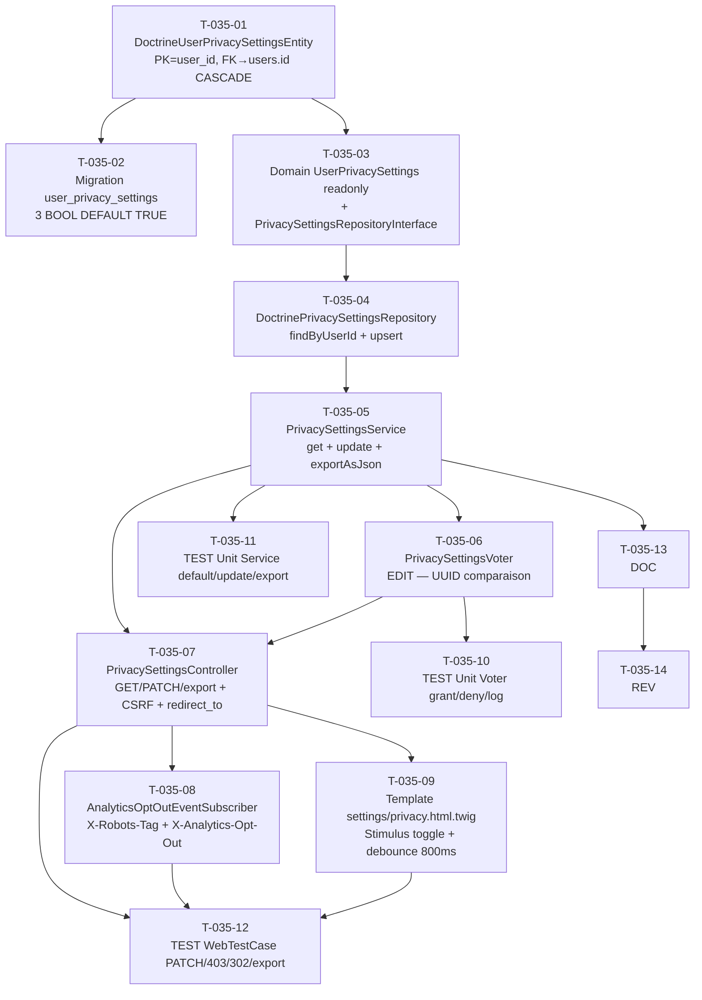

# US-035 — Tâches techniques : Réglages de confidentialité et préférences RGPD

**User Story** : En tant que P-003 Marc, développeur indépendant privacy-first, je veux contrôler finement quelles données Briefly AI collecte via des interrupteurs clairs et persistés, afin d'exercer mes droits RGPD de façon autonome.
**Story Points** : 3 | **Sprint** : sprint-004-monetisation
**EPIC** : EPIC-004 Comptes Utilisateurs & Premium
**Dépendances** :
- US-030 `DoctrineUserEntity` + `users.id` (Sprint 1 mergé)
- US-032 `ProfileController` (Sprint 3 mergé) — le pattern Voter + Twig `/profile/edit` est le modèle de référence pour US-035
- **Totalement indépendante de Stripe** — développable en parallèle dès J1 sur une branche dédiée

---

## Tâches

| ID | Type | Description | Heures | Dépend de | Statut |
|----|------|-------------|--------|-----------|--------|
| T-035-01 | [DB] | Entité Doctrine `DoctrineUserPrivacySettingsEntity` (`src/Infrastructure/User/Privacy/DoctrineUserPrivacySettingsEntity.php`) : attributs ORM — user_id UUID PK + FK → users.id ON DELETE CASCADE, analytics_opt_in BOOLEAN DEFAULT TRUE NOT NULL, personalized_recs BOOLEAN DEFAULT TRUE NOT NULL, search_engine_indexing BOOLEAN DEFAULT TRUE NOT NULL, updated_at TIMESTAMPTZ DEFAULT NOW() NOT NULL ; pas de colonne `id` auto-increment (PK = user_id) | 1h | — | 🔲 |
| T-035-02 | [DB] | Migration table `user_privacy_settings` : PK sur user_id, FK `user_id` REFERENCES users(id) ON DELETE CASCADE, 3 colonnes BOOL avec DEFAULT TRUE (opt-in par défaut, conformité RGPD — consentement présupposé pour le fonctionnement de base) | 0.5h | T-035-01 | 🔲 |
| T-035-03 | [BE] | Domain : `UserPrivacySettings` value object PHP pur (`src/Domain/Privacy/UserPrivacySettings.php`) — constructeur `readonly` : `analyticsOptIn: bool`, `personalizedRecs: bool`, `searchEngineIndexing: bool`, `updatedAt: DateTimeImmutable` ; méthode `withUpdatedAt(DateTimeImmutable $at): self` pour immutabilité ; `PrivacySettingsRepositoryInterface` (`src/Domain/Privacy/PrivacySettingsRepositoryInterface.php`) : `findByUserId(string $userId): UserPrivacySettings` (retourne défaut opt-in si pas d'entrée), `save(string $userId, UserPrivacySettings $settings): void` | 1h | — | 🔲 |
| T-035-04 | [BE] | Infrastructure : `DoctrinePrivacySettingsRepository` (`src/Infrastructure/User/Privacy/DoctrinePrivacySettingsRepository.php`) implémentant `PrivacySettingsRepositoryInterface` : `findByUserId()` → SELECT … WHERE user_id = ? ; si 0 lignes → retourner `UserPrivacySettings` avec valeurs par défaut TRUE ; `save()` → INSERT ON CONFLICT (user_id) DO UPDATE SET … updated_at = NOW() (upsert) | 1.5h | T-035-01, T-035-03 | 🔲 |
| T-035-05 | [BE] | Application : `PrivacySettingsService` (`src/Application/Privacy/PrivacySettingsService.php`) : `getSettings(string $userId): UserPrivacySettings` → délègue au repository ; `updateSettings(string $userId, bool $analyticsOptIn, bool $personalizedRecs, bool $searchEngineIndexing): void` → construit `UserPrivacySettings` avec `updatedAt = now UTC`, appelle `save()` ; `exportAsJson(string $userId): array` → retourne `['analytics_opt_in' => …, 'personalized_recs' => …, 'search_engine_indexing' => …, 'updated_at' => ISO8601]` pour l'export RGPD Article 20 | 1.5h | T-035-04 | 🔲 |
| T-035-06 | [BE] | Security : `PrivacySettingsVoter` (`src/Presentation/Security/PrivacySettingsVoter.php`) : attribut `const EDIT = 'PRIVACY_SETTINGS_EDIT'` ; vérifie `$token->getUser()->getUserUuid() === $subject->getUserId()` ; si DENY → log WARNING `{requester_id: <uuid>, target_id: <uuid>, timestamp: <ISO8601>, action: "unauthorized_privacy_edit"}` (UUID uniquement, JAMAIS email) → HTTP 403 Forbidden ; pattern identique à `ProfileVoter` existant | 1h | T-035-05 | 🔲 |
| T-035-07 | [BE] | Presentation : `PrivacySettingsController` (`src/Presentation/Controller/PrivacySettingsController.php`) : `GET /settings/privacy` (route `app_settings_privacy`) → `render('settings/privacy.html.twig', ['settings' => …])` ; `PATCH /settings/privacy` (route `app_settings_privacy_update`) → lire body JSON, valider CSRF token `_token`, appeler `PrivacySettingsService::updateSettings()`, retourner Turbo Stream toast "Préférences enregistrées" ; `GET /settings/privacy/export` (route `app_settings_privacy_export`) → JSON download `Content-Disposition: attachment; filename="privacy.json"` ; `#[IsGranted('ROLE_USER')]` + `PrivacySettingsVoter::EDIT` ; non authentifié → 302 vers `/login?redirect_to=/settings/privacy` | 2.5h | T-035-05, T-035-06 | 🔲 |
| T-035-08 | [BE] | Infrastructure : `AnalyticsOptOutEventSubscriber` (`src/Infrastructure/Analytics/AnalyticsOptOutEventSubscriber.php`) : `kernel.response` listener ; si utilisateur authentifié + `analytics_opt_in = false` → injecter header `X-Analytics-Opt-Out: 1` dans la réponse (le template Twig `base.html.twig` lit ce header pour exclure le script Plausible/Matomo) ; si `search_engine_indexing = false` → injecter `X-Robots-Tag: noindex, nofollow` dans la réponse HTTP (pris en compte par les crawlers sur toutes les pages de l'utilisateur) ; aucune PII dans les logs | 1.5h | T-035-05 | 🔲 |
| T-035-09 | [FE-WEB] | Template `templates/settings/privacy.html.twig` : 3 interrupteurs Stimulus `data-controller="toggle"` avec labels clairs ("Analytique anonyme", "Recommandations personnalisées", "Indexation moteurs de recherche") ; `checked="{{ settings.analyticsOptIn ? 'checked' : '' }}"` ; debounce 800ms → PATCH /settings/privacy via `fetch()` JS ; toast Turbo Stream "Préférences enregistrées" (3 s) ; bouton "Exporter mes données" → GET /settings/privacy/export ; accessible (labels explicites, `role="switch"`, `aria-checked`) ; inclusion dans la navigation settings (sidebar) | 2h | T-035-07 | 🔲 |
| T-035-10 | [TEST] | Tests unitaires `PrivacySettingsVoter` : utilisateur propriétaire → GRANT ; autre utilisateur (uuid différent) → DENY + log WARNING avec UUID demandeur et cible (0 email) ; non authentifié → DENY | 1h | T-035-06 | 🔲 |
| T-035-11 | [TEST] | Tests unitaires `PrivacySettingsService` : `getSettings()` pour userId sans entrée → retourne défaut `{true, true, true}` ; `updateSettings()` analyticsOptIn=false → repository `save()` appelé avec les bonnes valeurs + `updatedAt` UTC courant ; `exportAsJson()` → array `{analytics_opt_in, personalized_recs, search_engine_indexing, updated_at}` avec ISO8601 ; 0 données d'autres utilisateurs dans l'export | 1h | T-035-05 | 🔲 |
| T-035-12 | [TEST] | `WebTestCase` : GET /settings/privacy authentifié → HTTP 200 + 3 interrupteurs ; PATCH /settings/privacy analytics_opt_in=false + CSRF valide → HTTP 200 + DB mise à jour + Turbo Stream "Préférences enregistrées" ; PATCH par Thomas ciblant UUID de Marc → HTTP 403 + log WARNING ; GET /settings/privacy sans auth → HTTP 302 vers /login?redirect_to=/settings/privacy ; GET /settings/privacy/export → JSON `{privacy_settings: {...}}` + `Content-Disposition: attachment` + 0 données Marc visible dans export Thomas | 2h | T-035-07, T-035-08, T-035-09 | 🔲 |
| T-035-13 | [DOC] | PHPDoc `PrivacySettingsVoter` (log WARNING UUID uniquement, jamais email), `PrivacySettingsController` (CSRF sur PATCH, redirect_to sur 302, export RGPD Article 20), `AnalyticsOptOutEventSubscriber` (X-Robots-Tag côté serveur, X-Analytics-Opt-Out, 0 PII dans les logs), `UserPrivacySettings` (immutabilité, valeurs par défaut opt-in) | 0.5h | T-035-08 | 🔲 |
| T-035-14 | [REV] | Code review US-035 : `PrivacySettingsVoter` comparaison UUID (pas email), log WARNING 0 PII, CSRF actif sur PATCH, export JSON 0 données d'autres utilisateurs, X-Robots-Tag injecté côté serveur (pas client), debounce 800ms implémenté, `role="switch"` + `aria-checked` sur les toggles, `#IsGranted('ROLE_USER')` présent, 0 `[FE-MOB]` | 1h | T-035-13 | 🔲 |

**Total US-035 : 14 tâches — 16.5h**

---

## Graphe de dépendances

---

## Notes techniques

- **Valeurs par défaut opt-in** : la table `user_privacy_settings` n'a pas d'entrée pour les comptes créés avant ce sprint. `DoctrinePrivacySettingsRepository::findByUserId()` retourne les valeurs par défaut `{true, true, true}` si aucune entrée — conformité RGPD (opt-in implicite pour le fonctionnement de base).
- **X-Robots-Tag côté serveur** : injecté dans les headers HTTP de la réponse Symfony (pas dans un `<meta>` HTML), ce qui est pris en compte par Googlebot sur toutes les pages, y compris les pages protégées.
- **PATCH vs POST** : le contrôleur utilise PATCH (sémantique de mise à jour partielle). Symfony par défaut ne supporte pas PATCH dans les formulaires HTML — utiliser `fetch()` JS avec `method: 'PATCH'` et body JSON. Le token CSRF est envoyé dans le body JSON `{_token: ...}`.
- **Export RGPD Article 20** : le fichier JSON doit être téléchargeable en < 10 s (pas de processing asynchrone nécessaire en v1). Format : `{"privacy_settings": {"analytics_opt_in": bool, "personalized_recs": bool, "search_engine_indexing": bool, "updated_at": "ISO8601"}}`.
- **`biometrics`** : l'interrupteur biométrie mentionné dans la US concerne uniquement le mobile (US-05x Flutter) — ne pas implémenter en Sprint 4 (web-only). La page `/settings/privacy` ne l'affiche pas.
- **Pattern Voter** : copier le pattern de `ProfileVoter` (`src/Presentation/Security/ProfileVoter.php`) — même structure `AbstractVoter`, même log WARNING avec UUID (jamais email).
