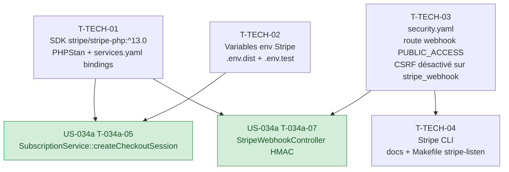

# Tâches techniques transverses — Sprint 004 Monétisation Premium

> Ces tâches sont hors story points. Elles débloquent US-034a et par cascade US-013 + US-034b.
> À réaliser en priorité dès J1 du sprint.

---

## Tâches

| ID | Type | Description | Heures | Dépend de | Statut |
|----|------|-------------|--------|-----------|--------|
| T-TECH-01 | [OPS] | SDK Stripe : `composer require stripe/stripe-php:^13.0` (version pinée — jamais `^latest`) ; vérifier compatibilité PHP 8.5 + Symfony 8 ; valider PHPStan niveau max sur les types Stripe retournés (ignorer éventuellement les stubs via `phpstan.neon` si nécessaire) ; ajouter binding dans `config/services.yaml` : `$stripeSecretKey: '%env(STRIPE_SECRET_KEY)%'` + `$stripeWebhookSecret: '%env(STRIPE_WEBHOOK_SECRET)%'` ; mise à jour `composer.lock` committée | 1h | — | 🔲 |
| T-TECH-02 | [OPS] | Variables d'environnement Stripe : ajout dans `.env.dist` (valeurs vides commentées) des 5 variables : `STRIPE_SECRET_KEY=` (sk_live_xxx en prod), `STRIPE_PUBLISHABLE_KEY=` (pk_live_xxx), `STRIPE_WEBHOOK_SECRET=` (whsec_xxx), `STRIPE_PRICE_MONTHLY=` (price_xxx), `STRIPE_PRICE_YEARLY=` (price_xxx) ; ajout dans `.env.test` des clés test Stripe (`sk_test_xxx`, `whsec_test_xxx`, `price_test_xxx`) pour les WebTestCase ; JAMAIS de valeur réelle dans `.env.dist` ou `.env.test` ; ajouter `.env` à `.gitignore` si pas déjà présent ; documenter dans README la marche à suivre pour obtenir les clés | 0.5h | — | 🔲 |
| T-TECH-03 | [OPS] | Sécurité `security.yaml` webhook route : dans `config/packages/security.yaml`, ajouter `POST /stripe/webhook` à l'`access_control` en `PUBLIC_ACCESS` (sans `ROLE_USER`) — Stripe appelle depuis ses serveurs, pas depuis un navigateur authentifié ; exclure la route `stripe_webhook` du middleware CSRF (ajout dans `framework.csrf_protection.token_manager` ou via `csrf_protection: false` sur la route) ; la validation se fait UNIQUEMENT par HMAC-SHA256 (T-034a-07) | 0.5h | — | 🔲 |
| T-TECH-04 | [OPS] | Stripe CLI dev/test : documenter dans `README.md` (section "Développement local — Stripe") la commande de forwarding : `stripe listen --forward-to http://localhost:8000/stripe/webhook` ; lister les événements à tester : `checkout.session.completed`, `customer.subscription.updated`, `customer.subscription.deleted`, `invoice.payment_failed` ; documenter `stripe trigger checkout.session.completed` pour replay ; ajouter la commande dans le `Makefile` cible `stripe-listen` | 0.5h | T-TECH-03 | 🔲 |

**Total tâches transverses : 4 tâches — 2.5h**

---

## Graphe de dépendances



---

## Notes de sécurité Stripe

> Ces points sont des **critères d'acceptance non négociables** pour les tâches T-034a-07 et T-034a-08.

### HMAC-SHA256 obligatoire

```
POST /stripe/webhook reçoit un payload brut et un header Stripe-Signature.
La vérification DOIT se faire via \Stripe\Webhook::constructEvent() AVANT tout traitement.

En cas d'échec :
  → HTTP 400 (ne pas retourner 401 ou 403 — évite de révéler que la route existe)
  → Log WARNING : { "ip": "<ip>", "reason": "invalid_stripe_signature", "timestamp": "<ISO8601>" }
  → JAMAIS logguer le payload brut (peut contenir des données client Stripe)
```

### Idempotence des webhooks

```
Stripe peut envoyer le même événement plusieurs fois (retry sur timeout ou 5xx).
Protection : UNIQUE sur stripe_event_id + INSERT ... ON CONFLICT (stripe_event_id) DO NOTHING.

Handler doit toujours retourner sans erreur si stripe_event_id déjà traité.
StripeWebhookController retourne TOUJOURS HTTP 200 (même sur événement inconnu ou doublon)
pour éviter que Stripe ne retente indéfiniment.
```

### Secrets en variables d'environnement

```
STRIPE_SECRET_KEY, STRIPE_WEBHOOK_SECRET → JAMAIS dans :
  - Le code source (pas de str_contains('sk_live_'))
  - Les logs (pas de log incluant $stripeSecretKey)
  - Git (pas dans .env, seulement dans .env.dist vide)
  - Les messages d'erreur retournés au client

Vérification CI : grep -r 'sk_live_\|sk_test_\|whsec_' src/ → 0 résultat
```

### Route webhook non CSRF

```
/stripe/webhook doit être exclue du CSRF Symfony.
Stripe envoie une requête POST sans formulaire — pas de _token CSRF.
La validation se fait UNIQUEMENT par HMAC-SHA256 (mécanisme équivalent, voire supérieur).
```
